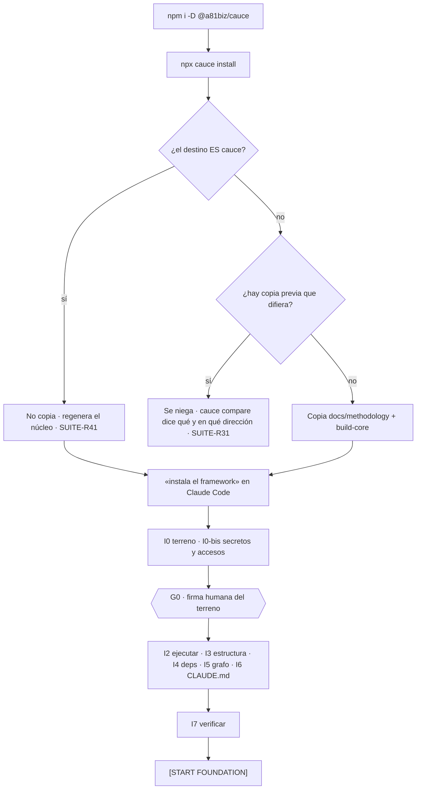
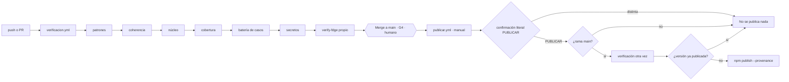

# 04-App-Flow — los flujos reales

> Foundation `PHASE 3` · 2026-08-19 · suite 9.0.0 · segunda ejecución

Cauce no tiene interfaz ni servidor: sus «flujos» son secuencias de comandos y de decisiones
humanas. Hay cuatro, y ninguno se puede completar sin una firma.

---

## F1 · Instalar en un proyecto destino



El punto de no retorno es `G0`: mientras `LAYOUT.md` esté sin firmar, `verify-fdge` bloquea la
apertura de PTs (`FND-R23`). Y `I0-bis` va **antes** de que nada se publique, porque un secreto
en la historia sigue ahí después de borrarlo del archivo.

---

## F2 · Un trabajo, de principio a fin (FDGE)

Once fases y cuatro compuertas. Lo que las compuertas tienen en común: ninguna la resuelve el
agente.

| Fase | Produce | Compuerta |
|:---|:---|:---|
| `PHASE 0` Context | `SESSION_LOG` | — |
| `PHASE 1` Intake | `changes/PT-NNN-slug/intake.md` firmado | **G1** · Definition of Ready |
| `PHASE 2` Análisis | `context.md` + `discovery`/`enrichment`/`scope` | — |
| `PHASE 3` Estrategia | `strategy.md` con al menos una alternativa evaluada | — |
| `PHASE 4` Propuesta | `design.md` · `tasks.md` · `traceability.md` | **G2** · antes: 0 líneas modificadas, 0 ramas |
| `PHASE 5` Implementación | Commits atómicos · tests primero, en rojo | — |
| `PHASE 6` Evidencia | `evidence/PT-NNN/manifest.json` | — |
| `PHASE 7` Validación | Veredicto | **G3** · un `BUG` solo lo cierra una persona |
| `PHASE 8` Persistencia | `HISTORY.log` · `HANDOFF.md` | — |
| `PHASE 9` Integración | Merge a la línea principal | **G4** · humana por definición |
| `PHASE 10` Rollback | `INCIDENTS.log` · revert | — |

`G2` es la que más ahorra: *«no se crea rama, no se modifica una sola línea de código fuente y
no comienza la implementación»* hasta resolverla (`FDGE-R13`). `G1` es la más barata:
detenerse ahí cuesta un campo del Intake; detenerse en `G3` cuesta la implementación entera.

---

## F3 · Verificar y publicar este repositorio



`verify:patrones` va primero por una razón que no es de orden estético: si un escape se degradó,
todo lo que venga después informa «sin errores» porque no encuentra nada, no porque no haya
nada.

La publicación no guarda credencial: npm confía en este repositorio y este workflow, y GitHub se
autentica con OIDC ([publicar.yml:64-72](../../.github/workflows/publicar.yml#L64-L72)). No hay
token que rotar, filtrar ni caducar — y un secreto muerto en el repositorio es exactamente lo
que había antes.

---

## F4 · Evolucionar el marco

Es el flujo que este repositorio ejecuta sobre sí mismo, y `SUITE-R06e` lo marca como
irreversible: **modificar los documentos de la propia metodología no se automatiza**.

```
1. La regla va a RULES.md · el nombre a LEXICON.md · la compuerta a EXECUTION-MODES.md
2. build-core regenera CORE.md y CORE-PTSA.md  (nunca a mano — SUITE-R16)
3. npm run verify: siete comprobaciones, todas bloqueantes
4. CHANGELOG.md lo escribe una persona: decir qué cambió y si rompe compatibilidad
   no es mecánico
5. version.mjs --aplicar alinea los 21 documentos y el package.json con el CHANGELOG
6. Merge a main = G4 · publicar.yml, manual
```

El paso 4 es el único sin automatizar, y es deliberado: `SUITE-R40` exige que la versión se
**derive** del `CHANGELOG`, lo que obliga a que alguien escriba primero qué cambió.
