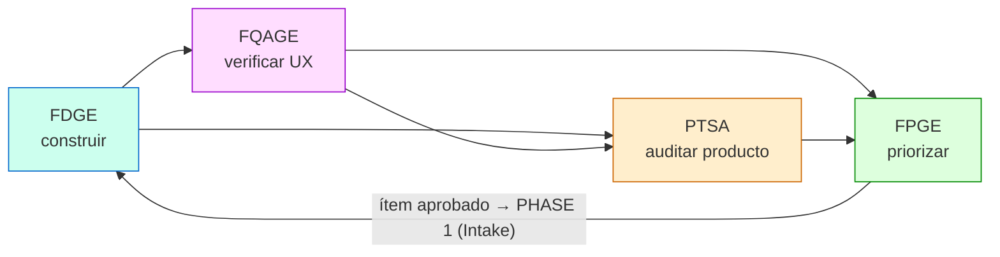

# Framework de Priorización Gobernada por Evidencia (FPGE)

> **Naturaleza de este documento: explicativo.** Explica *por qué* la priorización se
> gobierna. **No contiene obligaciones** (`LEX-R22`): las reglas viven en [RULES.md](RULES.md)
> §Parte 7 y aquí se citan por ID.
>
> Vocabulario: [LEXICON.md](LEXICON.md) · Procedimiento: [FPGE-Implementation.md](FPGE-Implementation.md)
> Prompts: [FPGE-Prompts.md](FPGE-Prompts.md)
> Marcos hermanos: [Framework-FDGE.md](Framework-FDGE.md) · [QA/Framework-QA.md](QA/Framework-QA.md) · [PTSA/PTSA-V3-Especificacion-Oficial.md](PTSA/PTSA-V3-Especificacion-Oficial.md)
>
> Suite version: **5.2.3**

---

## Filosofía

El desarrollo asistido por IA tiene un punto ciego entre actividades que ya están bien
gobernadas:

* **FDGE** gobierna *cómo se construye*.
* **QA** gobierna *si el usuario puede usarlo*.
* **PTSA** gobierna *si lo construido es válido para su dominio*.

Los tres funcionan. Pero entre el final de una auditoría y el inicio del siguiente
desarrollo hay una decisión que casi siempre se toma **sin gobierno**:

> ¿Qué construimos a continuación, y por qué eso y no otra cosa?

Esa decisión suele tomarse por intuición, por recencia («lo último que se rompió»), por la
voz más fuerte, o por el hallazgo que se recuerda — no por la evidencia agregada. El
resultado es trabajo que no ataca los problemas de mayor impacto, hallazgos críticos que
envejecen mientras se hacen mejoras cosméticas, y un Score de salud que no mejora pese a la
actividad constante.

FPGE establece el principio simétrico a los demás marcos:

### Ninguna priorización puede comenzar antes de existir evidencia suficiente. Ninguna decisión de «qué construir» puede tomarse fuera de la evidencia de auditoría, verificación e historia.

FPGE no decide *cómo* hacer el trabajo (eso es FDGE) ni *si* el producto es válido (eso es
PTSA). Decide **qué trabajo merece hacerse a continuación**, y lo justifica con evidencia
trazable.

---

## Posición en el ciclo



QA y PTSA son independientes entre sí. FPGE lee los resultados de ambos. El orden sugerido
—QA antes que PTSA— permite que los `QD-NNN` generen `H-NNN` antes de que FPGE priorice.

FPGE es la **bisagra del ciclo**: lee lo que produjeron los demás, sintetiza, prioriza y
propone. No ejecuta desarrollo ni audita.

---

## Principios

### 1. Priorización gobernada por evidencia
`FPGE-R01`

Todo ítem propuesto cita su evidencia de origen: un `H-NNN`, un `QD-NNN`, una entrada de
`HISTORY.log`, una recomendación de `HANDOFF.md`, una tendencia de un historial de scores.
Un ítem sin evidencia no es un candidato: es una opinión, y se descarta o se convierte en
investigación.

### 2. Independencia de los marcos — sin excepciones
`FPGE-R03`, `SUITE-R10`

FPGE es **read-only** sobre los artefactos ajenos. Escribe únicamente `ROADMAP.md` y
`ROADMAP_HISTORY.log`.

La v3 enunciaba este principio en dos documentos y lo violaba en un tercero: al descartar un
ítem, `FPGE-Implementation.md` ordenaba a FPGE escribir `CLOSED-WONTFIX` en un hallazgo de
PTSA y `CLOSED-ACCEPTED` en un defecto de QA. Eso violaba simultáneamente su propio
principio, la inmutabilidad auditable de PTSA (`PTSA-R19`) y la prohibición de QA de cerrar
defectos sin decisión humana (`QA-R11`) — y además inventaba tres valores de estado que no
existían en ninguna de las dos máquinas.

En v4, cuando un ítem se rechaza **FPGE emite una instrucción, no una escritura**. La ejecuta
el componente dueño bajo su propio trigger. La independencia deja de ser una aspiración y
pasa a ser una propiedad verificable.

### 3. Supremacía del dominio heredada
`FPGE-R06`

Los hallazgos de **D1 (dominio)** pesan más que los de D2/D3/D4 en igualdad de condiciones.
Un sistema con técnica impecable pero producto inválido debe ver, en su roadmap, las
correcciones de dominio por encima de las mejoras técnicas.

### 4. La IA propone, el humano dispone
`FPGE-R04`, `FPGE-R10`

FPGE jamás inicia desarrollo ni convierte hallazgos en tareas automáticamente. Y la
promoción entrega el ítem a **PHASE 1 (Intake)**, no al análisis: el trabajo nacido del
roadmap también necesita intención humana declarada y firmada.

En v3 la promoción entregaba directamente a `STATE 1`, saltándose la admisión —que en
realidad ni siquiera existía. El efecto era que todo el trabajo priorizado entraba con los
criterios de aceptación redactados por el agente a partir del racional de un hallazgo.

### 5. Reproducibilidad
`FPGE-R02`

Dos corridas sobre el mismo estado producen el mismo orden. La priorización es una función
determinista de la evidencia, no un juicio irrepetible.

### 6. Trazabilidad bidireccional

Cada ítem apunta hacia atrás (a su evidencia) y hacia adelante (al `PT-NNN` que genera).
Meses después, cualquiera puede responder «¿por qué hicimos esto?» con «porque el hallazgo
H-008 de severidad ALTA en el producto P-008 lo motivó, y se aprobó el 2026-06-20».

### 7. Confianza degradada, no ignorada
`FPGE-R05`, `FPGE-R07`, `FPGE-R08`

Un score obsoleto produce un roadmap que prioriza problemas ya resueltos. FPGE no lo ignora
ni se detiene: **degrada la confianza y lo declara**.

- PTSA `STALE`/`UNKNOWN` → se recomienda `delta PTSA` antes de decisiones irreversibles.
- QA `QA-F` vigente → los candidatos de tipo `FEATURE` se marcan `BLOCKED`.
- QA `STALE` → factor `Confidence = 0.7` sobre los candidatos cuya única evidencia sea QA.

Este último mecanismo es nuevo. La v3 afirmaba que *«FPGE considera el score QA-STALE como
baja confianza al priorizar»* y no definía ningún factor que lo consumiera: el algoritmo
solo miraba la freshness de PTSA. Era una promesa sin implementación.

---

## Entradas

FPGE consume, **sin modificarlos**, los artefactos de los demás marcos.

### Desde PTSA
| Artefacto | Qué aporta |
|:---|:---|
| `RESUMEN.md` | Health / Risk / Confidence y score por dimensión: el estado de salud base. |
| `Findings/H-NNN.md` | Hallazgos activos (`READY`, `REOPENED`) con dimensión, severidad, impacto, probabilidad → candidatos primarios. |
| `Products/P-NNN.md` | Productos en `BLOCKED_DOMAIN` o `IN_REVIEW` → candidatos de corrección. |
| `PENDIENTES.md` | Bloqueantes de auditoría → posibles precondiciones. |
| `score-history.json` | Tendencia: qué dimensión se estanca o regresa → urgencia. |

### Desde QA
| Artefacto | Qué aporta |
|:---|:---|
| `QA-DEFECTS.md` | `QD-NNN` en `READY` con severidad `CRITICAL` o `HIGH` → candidatos directos. |
| `qa-score-history.json` | Tendencia del score y su freshness → urgencia y confianza. |

### Desde FDGE
| Artefacto | Qué aporta |
|:---|:---|
| `HISTORY.log` | Qué se hizo, qué se difirió, deuda declarada, delta real vs planificado. |
| `HANDOFF.md` | Estado actual, bugs abiertos, validaciones pendientes, acciones recomendadas. |
| `INCIDENTS.log` | Incidentes con o sin PT de seguimiento → candidatos de máxima urgencia. |
| `BACKLOG.md` | PTs vivos → evitar proponer trabajo ya en vuelo. |
| `ENRICHMENT.md` · `REFACTOR_SCOPE.md` · `DISCOVERY.md` | Índices de trabajo especificado pero no implementado. |
| `changes/PT-XXX-slug/` | Proposal Packages existentes → evitar duplicar lo ya planificado. |

### Salidas

Únicamente `docs/implementation/ROADMAP.md` (sobrescrito en cada corrida) y
`docs/implementation/ROADMAP_HISTORY.log` (append-only).

---

## Algoritmo

```
Priority(item) = (EvidenceWeight × ScoreImpact × Urgency × DomainMultiplier × Confidence) / Effort
```

| Factor | Definición | Rango |
|:---|:---|:---|
| `EvidenceWeight` | Riesgo del hallazgo de origen (Impacto × Probabilidad de PTSA), o peso fijo si nace de historia. | 1–16 |
| `ScoreImpact` | Ganancia de Health esperada (penalización removida × peso de la dimensión). | 0–30 |
| `Urgency` | 1.0 base · +0.5 si `audit_due` vencido · +0.5 si la dimensión está `STALE` o en regresión · +1.0 si hay un `INC-NNN` abierto relacionado. | 1.0–3.0 |
| `DomainMultiplier` | 1.5 si el ítem es D1; 1.0 en otro caso. Operacionaliza la Regla del Agua Potable. | 1.0 / 1.5 |
| `Confidence` | 1.0 base · **0.7 si la única evidencia del ítem es QA y el score QA está `STALE`** (`FPGE-R08`). | 0.7 / 1.0 |
| `Effort` | 1 (S) / 2 (M) / 4 (L). Divisor: a igual valor, lo barato sube. | 1 / 2 / 4 |

**Desempates:** mayor `Priority` → D1 antes que D2/D3/D4 → mayor riesgo de no hacerlo →
menor `id`.

El divisor por esfuerzo hace que arriba aparezcan tanto las correcciones de dominio de alto
impacto como los *quick wins* baratos. El roadmap separa explícitamente los **3 de mayor
impacto** y los **3 quick wins** para que la decisión humana sea informada.

---

## La compuerta humana

```
FPGE corre → ROADMAP.md (todos en DRAFT) → STOP
   ↓ decisión humana
Humano marca cada ítem READY / DEFERRED / REJECTED
   ↓
Por cada READY → promote FPGE R-NNN
   ↓
Se asigna un PT-NNN nuevo y se entrega a FDGE PHASE 1 (Intake)
   El racional y la evidencia de origen son el BORRADOR del Intake.
   El humano sigue debiendo firmarlo.                          FPGE-R10 · INTAKE-R06
   ↓
FDGE recorre su ciclo normal, con todas sus compuertas
   ↓
Por cada REJECTED → FPGE EMITE una instrucción de cierre para el componente dueño.
   NO la ejecuta.                                                          FPGE-R03
```

La promoción es el **único punto de contacto de escritura** hacia FDGE, y lo dispara el
humano.

---

## Antipatrones

| Antipatrón | Qué es |
|:---|:---|
| **Priorizar por recencia** | Atender «lo último que falló» en vez de lo de mayor impacto. |
| **Roadmap sin evidencia** | Ítems que no citan un origen verificable. |
| **Auto-promoción** | Convertir hallazgos en PTs sin decisión humana. |
| **Cross-Component Write** | Escribir en artefactos de PTSA, QA o FDGE. Fue un defecto real de la v3. |
| **Stale Trust** | Priorizar sobre una auditoría vencida sin degradar la confianza. |
| **Intake Bypass** | Promover directamente al análisis, saltándose la admisión. Fue el comportamiento por defecto en v3. |
| **Fusionar los marcos** | Colapsar FDGE + QA + PTSA + FPGE en un solo proceso. |

---

## Criterio de compleción de una corrida

1. Se verificó la freshness de PTSA y de QA, y se declararon sus efectos.
2. Todo candidato cita su evidencia de origen.
3. Cada candidato tiene `Priority` calculado con el algoritmo completo, incluido el factor
   `Confidence`.
4. El roadmap declara los 3 de mayor impacto y los 3 quick wins.
5. `ROADMAP.md` se sobrescribió completo; la corrida se registró en `ROADMAP_HISTORY.log`.
6. Todos los ítems quedan en `DRAFT` a la espera de decisión humana.
7. No se escribió en ningún artefacto ajeno.
