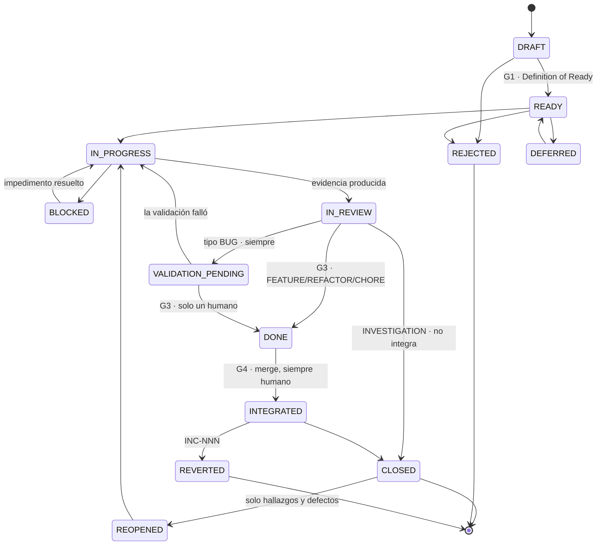

# LEXICON — Vocabulario Canónico de la Suite

> **Estatus:** normativo. Este documento es la **única** fuente de verdad para nombres.
> Ningún otro documento de la suite puede introducir un término de paso, un prefijo de
> identificador, un valor de estado o un nombre de archivo que no esté declarado aquí.
> **Autoridad:** en cualquier conflicto de nomenclatura, este documento prevalece sobre
> todos los demás, incluido el `CLAUDE.md` del proyecto destino.
>
> Suite version: **7.3.0** · Ver [CHANGELOG.md](CHANGELOG.md)

---

## 1. Por qué existe este documento

Antes de la v4.0.0 la suite usaba cinco palabras distintas para "paso del flujo"
(`Estado n`, `STATE n`, `FASE n`, `F-n`, `FIDE-n`), tres nombres para el componente de
QA, cuatro máquinas de estado en dos idiomas y dos esquemas incompatibles para el mismo
archivo. La consecuencia no era cosmética: `Estado 4` significaba *diseñar la estrategia*
en un documento y `STATE 4` significaba *escribir código* en otro. Un agente que leyera
ambos recibía órdenes contradictorias.

Un vocabulario ambiguo produce agentes ambiguos. Este documento elimina la ambigüedad por
construcción: hay un solo nombre para cada cosa y está aquí.

---

## 2. Palabra única de paso: `PHASE`

`PHASE` es la **única** palabra admitida para designar un paso de cualquier flujo de la
suite. Quedan prohibidos: `Estado n`, `STATE n`, `FASE n`, `F-n`, `Fn`, `FIDE-n`, `Step n`,
`Etapa n`.

Regla de escritura: `PHASE <n> — <Nombre semántico>`. El número ordena; el nombre significa.
Al referirse a una fase en prosa se usa el **nombre**, no el número
(«en Strategy», no «en la fase 3»). El número solo aparece en encabezados, tablas y triggers.

### 2.1 Estados cognitivos: sin numeración

Los documentos `Framework-*.md` describen el **razonamiento** (qué se comprende y en qué
orden). Los documentos `*-Implementation.md` y `*-Prompts.md` describen el **recorrido
operativo** (qué se ejecuta y en qué orden).

`LEX-R01` · Los documentos `Framework-*.md` **no numeran** sus estados cognitivos. Los
nombran. Solo el recorrido operativo lleva números de `PHASE`. Esto elimina de raíz la
colisión de dos numeraciones sobre el mismo flujo.

---

## 3. Mapa de fases por componente

### 3.1 FDGE — Desarrollo Gobernado por Evidencia

| PHASE | Nombre | Artefacto principal | Compuerta |
|:--|:---|:---|:---|
| 0 | Context | `SESSION_LOG.md` | — |
| 1 | **Intake** | `changes/PT-XXX-slug/intake.md` | **G1 — Definition of Ready** |
| 2 | Analysis | `discovery.md` · `enrichment.md` · `scope.md` + `context.md` | — |
| 3 | Strategy | `strategy.md` | — |
| 4 | Proposal | Proposal Package completo | **G2 — Proposal Gate** |
| 5 | Implementation | Código + commits atómicos | — |
| 6 | Evidence | `evidence/PT-XXX/` + `self-review.md` + `manifest.json` | — |
| 7 | Validation | Cambio de estado del PT | **G3 — Validation Gate** |
| 8 | Persistence | `HISTORY.log` · `HANDOFF.md` | — |
| 9 | Integration | PR · CI · merge · tag · archivado | **G4 — Integration Gate** |
| 10 | Rollback | `INCIDENTS.log` · revert | (carril condicional) |

Variantes de PHASE 2, según el tipo declarado en el Intake:

| Variante | Tipo | Artefacto |
|:---|:---|:---|
| `PHASE 2-B` | `BUG` · `INVESTIGATION` | `discovery.md` |
| `PHASE 2-E` | `FEATURE` | `enrichment.md` |
| `PHASE 2-R` | `REFACTOR` | `scope.md` |

`LEX-R02` · **`EXPRESS` es un track, no una fase.** Un PT de complejidad `TRIVIAL` puede
recorrer el track `EXPRESS`, que condensa PHASE 2 + 3 + 4 en un único bloque con una sola
compuerta G2. Nunca omite PHASE 1, 6, 7, 8 ni 9. Se escribe `TRACK: EXPRESS`, nunca
`PHASE 1-EXPRESS`.

### 3.2 FQAGE — Quality Assurance Gobernado por Evidencia

| PHASE | Nombre | Compuerta |
|:--|:---|:---|
| 1 | Reconnaissance | — |
| 2 | Test Plan | ACK humano |
| 3 | Spec Generation | ACK humano |
| 4 | Execution | — |
| 5 | Analysis | — |
| 6 | Report | ACK humano |
| 7 | Defect Promotion | ACK humano por defecto |

`LEX-R03` · El componente se llama **FQAGE** en prosa normativa y **QA** en triggers, rutas
y nombres de archivo (`[START QA]`, `QA/`, `Framework-QA.md`). No se admite ninguna tercera
grafía. Cuando el documento es normativo, se escribe «FQAGE (QA)» la primera vez y «QA»
después.

### 3.3 PTSA — Auditoría y Certificación Continua

Las 15 fases se renumeran a `PHASE 0..14`. La tabla de equivalencia con la nomenclatura
`F-n` anterior es normativa y debe conservarse en la especificación oficial para que los
proyectos que ya instalaron la suite puedan migrar.

| PHASE | Nombre | Nomenclatura anterior |
|:--|:---|:---|
| 0 | Value Declaration | `F-1` |
| 1 | Inventory | `F0` |
| 2 | System Map | `F1` |
| 3 | Scope | `F2` |
| 4 | Products | `F3` |
| 5 | Criticality | `F3.5` |
| 6 | **Traceability** (hito central) | `F4` |
| 7 | Technical (D2) | `F5` |
| 8 | Domain Acid Test (D1) | `F6` |
| 9 | Documentary Fidelity (D4) | `F7` |
| 10 | Observability (D3) | `F8` |
| 11 | Consolidation | `F9` |
| 12 | Executive Matrix | `F10` |
| 13 | Continuous Certification | `F11` |
| 14 | Domain Governance | `F12` |

Los archivos de fase pasan a `PTSA/Phases/PHASE-NN-slug.md`.

### 3.4 Foundation Protocol

| PHASE | Nombre | Produce |
|:--|:---|:---|
| 0 | Reconnaissance | comprensión · no escribe nada |
| 1 | **Reconciliation** | `00-Baseline.md` · **G0** · `RECONCILIATION.log` · `docs/_archive/` |
| 2 | Context Documents | `01-Platform-Overview` · `02-PRD` |
| 3 | Technical Documents | `03-TRD` · `04` · `05` · `06` · `07` · `08` · `09` · `10` |
| 4 | Conventions | `11-Conventions.md` — el más crítico |
| 5 | Inventory & Graph | `inventory/` · `graphify-out/` · `REGISTRY.graph` |
| 6 | Human Validation | `[FOUNDATION VALIDATED]` |

`PHASE 1 — Reconciliation` es nueva en 4.1.0. Sin ella, Foundation generaba documentación
correcta encima de documentación vieja contradictoria y nadie sabía cuál mandaba.

### 3.5 FIDE — Investigación y Diseño Evolutivo

| PHASE | Nombre |
|:--|:---|
| 1 | Discovery |
| 2 | Advisory |
| 3 | Blueprinting |
| 4 | Scaffolding |
| 5 | Handoff |

---

## 4. Identificadores

`LEX-R04` · Todo identificador es **monotónico, único y permanente**. Nunca se reutiliza,
nunca se renumera, nunca se elimina. La asignación es **exclusivamente** vía
`docs/implementation/REGISTRY.json` (ver §4.3). Derivar un número contando entradas en un
`.md` o en un `.json` de historial está **prohibido**.

### 4.1 Identificadores de trabajo

| Prefijo | Significado | Dueño | Ámbito |
|:---|:---|:---|:---|
| `PT-NNN` | Work item — unidad de trabajo | FDGE | Proyecto |
| `EP-NNN` | Epic / lote de PTs | FDGE | Proyecto |
| `PT-NNN.M` | Tarea atómica dentro de un PT | FDGE | PT |
| `AC-NN` | Criterio de aceptación | Intake | PT |
| `TS-NN` | Escenario de test | FDGE | PT |
| `RC-NN` | Control de regresión | FDGE | PT |
| `QA-NNN` | Caso de prueba QA | QA | Proyecto |
| `QR-NNN` | Ciclo de ejecución QA | QA | Proyecto |
| `QD-NNN` | Defecto QA | QA | Proyecto |
| `H-NNN` | Hallazgo de auditoría | PTSA | Proyecto |
| `E-NNN` | Evidencia de auditoría | PTSA | Proyecto |
| `P-NNN` | Producto auditado | PTSA | Proyecto |
| `U-NNN` | Bloque de actualización de fase | PTSA | Fase |
| `R-NNN` | Ítem de roadmap | FPGE | Proyecto |
| `INC-NNN` | Incidente / rollback | FDGE | Proyecto |

### 4.2 Identificadores de regla

`LEX-R05` · Las reglas normativas se identifican con **prefijo de componente**, nunca con
una `R` desnuda. La grafía `[R45]` queda prohibida porque colisiona con `R-NNN` (roadmap).

| Prefijo | Origen |
|:---|:---|
| Prefijo | Definidas en |
|:---|:---|
| `SUITE-Rnn` · `FND-Rnn` · `FDGE-Rnn` · `INTAKE-Rnn` · `QA-Rnn` · `FPGE-Rnn` · `FIDE-Rnn` | [RULES.md](RULES.md) |
| `LEX-Rnn` | **este documento** |
| `EXEC-Pn` · `EXEC-Rnn` | [EXECUTION-MODES.md](EXECUTION-MODES.md) |
| `PTSA-Rnn` | [PTSA/PTSA-V3-Especificacion-Oficial.md](PTSA/PTSA-V3-Especificacion-Oficial.md) (antes `[Rnn]`) |
| `RULE-nn` | `11-Conventions.md` del proyecto |

`LEX-R23` · **Un ID se define en exactamente un documento.** Los demás **citan**; nunca
reformulan ni renumeran. `SUITE-R14` y `tools/verify-suite.mjs` lo verifican: una definición
duplicada es un defecto que bloquea. (La 4.0.0 nació con una: `RULES.md` renumeraba los
axiomas de PTSA como `PTSA-R01..R12`, colisionando con reglas distintas y ya existentes de
la especificación.)

`LEX-R24` · **Sub-identificadores.** Una regla con cláusulas enumeradas admite sub-IDs con
letra minúscula pegada: `SUITE-R06a`, `SUITE-R06f`. Solo para citar una cláusula concreta;
la regla sigue siendo una sola y se define una sola vez.

### 4.3 `REGISTRY.json` — asignador único

Vive en `docs/implementation/REGISTRY.json`. Es el único lugar donde se asigna un número.

Esquema canónico. Es el mismo en `FDGE-Implementation.md`, en `FIDE-Implementation.md` y en
el instalador; `tools/verify-fdge.mjs` depende de los campos `status` y `execution_mode`.

```json
{
  "suite_version": "5.2.0",
  "execution_mode": "SUPERVISED",
  "foundation": { "generated": "2026-08-01", "validated_by": "Ada Lovelace", "pt_at_generation": 38 },
  "graph": { "generated": "2026-08-01", "scope": "src/", "pt_at_generation": 38 },
  "tracker": { "plataforma": "github" | "azure" | null },
  "counters": {
    "PT": 0, "EP": 0, "QA": 0, "QR": 0, "QD": 0,
    "H": 0, "E": 0, "P": 0, "R": 0, "INC": 0
  },
  "allocations": [
    {
      "id": "PT-001",
      "type": "BUG",
      "severity": "S2",
      "slug": "login-redirect-loop",
      "created": "2026-08-05",
      "epic": null,
      "status": "READY",
      "phase": 1,
      "structural": false,
      "suite_version": "5.2.0"
    }
  ]
}
```

Campos obligatorios de cada `allocation`: `id` · `type` · `severity` · `slug` · `created` ·
`status` (valor de `Lifecycle`, §5.1) · `phase` (número de `PHASE` actual) · `structural`
(booleano — si el PT movió, creó, renombró o eliminó archivos; `FDGE-R44`). `epic` es opcional.

`suite_version` por `allocation` es lo que permite migrar sin romper trabajo en curso
(`SUITE-R18`): un PT abierto bajo 4.1.0 se cierra bajo las reglas de 4.1.0 aunque el proyecto
ya esté en 4.2.0.

El bloque `graph` hace computable la frescura del grafo (`FDGE-R43`): un grafo generado en
`pt_at_generation: 38` está `STALE` en cuanto se integra un PT posterior con
`structural: true`.

`LEX-R06` · Asignar un identificador es: leer `counters`, incrementar, escribir el nuevo
valor **y** añadir la entrada a `allocations` en la misma operación. Si el agente no puede
escribir en `REGISTRY.json`, no puede asignar el identificador: se detiene y reporta.

---

## 5. Estados

`LEX-R07` · La suite tiene **tres** enumeraciones de estado y ninguna más. Están en inglés,
en `MAYÚSCULA_CON_GUION_BAJO`. Ningún componente puede inventar un valor.

### 5.1 Enum A — `Lifecycle`

Aplica a: `PT` · `EP` · `R` · `QD` · `H` · `P` · `INC` · `QA` (el caso de prueba como
entidad viva; su resultado por ciclo es el Enum B, §5.2).

No todos los valores aplican a todas las entidades: `INTEGRATED` y `REVERTED` solo tienen
sentido para lo que produce código (`PT`, `EP`); `BLOCKED_DOMAIN`, solo para productos PTSA;
`REOPENED`, solo para hallazgos y defectos.

| Valor | Significado |
|:---|:---|
| `DRAFT` | Creado. Aún no admisible. No puede consumir trabajo. |
| `READY` | Superó la compuerta de admisión (G1 / ACK equivalente). Puede planificarse. |
| `REOPENED` | Estuvo resuelto y volvió a estar activo. Solo hallazgos y defectos. |
| `IN_PROGRESS` | Alguien o algo está trabajando en él ahora. |
| `BLOCKED` | Existe un impedimento externo. No progresa. Requiere razón declarada. |
| `BLOCKED_DOMAIN` | Solo productos PTSA: rechazado por fallo duro de dominio (D1). |
| `IN_REVIEW` | Trabajo terminado, evidencia producida, esperando revisión. |
| `VALIDATION_PENDING` | Esperando validación **humana**. Terminal para el agente. |
| `DONE` | Validado técnicamente. Aún no integrado a la línea principal. |
| `INTEGRATED` | Mergeado a la línea principal. |
| `CLOSED` | Terminal. Completo y verificado. |
| `REJECTED` | Terminal. No se hará. Requiere motivo declarado. |
| `DEFERRED` | Aparcado. Puede volver en una corrida futura. |
| `REVERTED` | Terminal. Estuvo `INTEGRATED` y se revirtió. Requiere `INC-NNN`. |

Transiciones válidas:



Notas de lectura:

* `CLOSED` es **posterior** a `INTEGRATED` para todo lo que produce código. Exigir `CLOSED`
  antes de una compuerta de integración es un bloqueo circular (ver `FDGE-R34`).
* `INVESTIGATION` es la única excepción: va de `IN_REVIEW` a `CLOSED` sin integrar, porque
  no produce código (`FDGE-R10`, `FDGE-R27`).
* `BLOCKED_DOMAIN` no aparece aquí: es exclusivo de los productos de PTSA y su máquina vive
  en §22 de la especificación.
* `REOPENED` solo aplica a hallazgos `H-NNN` y defectos `QD-NNN`.

`LEX-R08` · Un ítem de tipo `BUG` **nunca** transita de `IN_REVIEW` a `DONE` por acción del
agente. Pasa obligatoriamente por `VALIDATION_PENDING` y solo un humano lo mueve a `DONE`.
Lo mismo aplica a los hallazgos PTSA de tipo `BUG` y `DOMAIN`, y a todo `QD-NNN`.

### 5.2 Enum B — `ExecutionResult`

Aplica a: ejecución de un caso QA, de un test, de un chequeo de CI. **No es un estado de
ciclo de vida.** Un caso QA tiene a la vez un `Lifecycle` (existe, está vigente) y un
`ExecutionResult` por ciclo.

| Valor | Significado |
|:---|:---|
| `PASS` | Lo observado coincide exactamente con lo esperado. |
| `FAIL` | Diverge en cualquier dimensión. La ambigüedad es `FAIL`. |
| `SKIP` | Excluido de esta corrida por decisión humana declarada. |
| `ERROR` | No se pudo ejecutar. Problema de la infraestructura de prueba, no del sistema. |

### 5.3 Enum C — `PhaseStatus`

Aplica a: archivos de fase de PTSA, fases de Foundation, fases de FIDE.

| Valor | Significado |
|:---|:---|
| `NOT_STARTED` | — |
| `IN_PROGRESS` | — |
| `BLOCKED` | Con bloqueante declarado. |
| `COMPLETE` | Cumple su criterio de compleción. |
| `NEEDS_REVIEW` | Completa pero con confianza insuficiente. |

### 5.4 Tabla de migración desde v3

| Componente | Valor anterior | Valor canónico v4 |
|:---|:---|:---|
| FDGE | `PENDING` | `READY` |
| FDGE | `DISCOVERY_PENDING` · `ENRICHMENT_PENDING` · `SCOPE_PENDING` · `REFACTOR_PENDING` | `DRAFT` (antes de G1) · `READY` (después de G1) |
| QA | `OPEN` | `READY` |
| QA | `IN_REMEDIATION` | `IN_PROGRESS` |
| QA | `VERIFIED` | `DONE` |
| QA | `RUNNING` | `IN_PROGRESS` |
| PTSA · hallazgo | `ABIERTA` | `READY` |
| PTSA · hallazgo | `REABIERTA` | `REOPENED` |
| PTSA · hallazgo | `CORREGIDA` | `IN_REVIEW` |
| PTSA · hallazgo | `VERIFICADA` | `DONE` |
| PTSA · hallazgo | `CERRADA` | `CLOSED` |
| PTSA · producto | `BORRADOR` | `DRAFT` |
| PTSA · producto | `IDENTIFICADO` | `READY` |
| PTSA · producto | `REQUIERE_REVISION` | `IN_REVIEW` |
| PTSA · producto | `RECHAZADO_DOMINIO` | `BLOCKED_DOMAIN` |
| PTSA · producto | `VALIDADO` | `CLOSED` |
| PTSA · producto | `RETIRADO` | `REJECTED` |
| PTSA · fase | `NO_INICIADA` · `EN_PROGRESO` · `BLOQUEADA` · `COMPLETADA` · `REQUIERE_REVISION` | `NOT_STARTED` · `IN_PROGRESS` · `BLOCKED` · `COMPLETE` · `NEEDS_REVIEW` |
| FPGE | `PROPUESTO` | `DRAFT` |
| FPGE | `APROBADO` | `READY` |
| FPGE | `PROMOVIDO` | `IN_PROGRESS` |
| FPGE | `DESCARTADO` · `CLOSED-WONTFIX` · `CLOSED-ACCEPTED` | `REJECTED` |
| FPGE | `DIFERIDO` | `DEFERRED` |
| FIDE | `PENDING` (features en ENRICHMENT) | `DRAFT` |

`LEX-R09` · Los valores `CLOSED-WONTFIX`, `CLOSED-ACCEPTED` y `REJECTED` que FPGE v3
escribía en artefactos ajenos quedan **derogados**. Ver `FPGE-R03`.

---

## 6. Nombres de archivo canónicos

`LEX-R10` · Un archivo tiene un solo nombre. Cualquier documento que lo referencie usa
exactamente esta grafía.

### 6.1 Documentación de Foundation — `docs/enterprise-documentation/`

```
README.md
00-Baseline.md             ← solo proyectos legado · inventario del desorden de partida
01-Platform-Overview.md
02-PRD.md
03-TRD.md
04-App-Flow.md
05-UI-UX-Brief.md          ← canónico (deroga 05-UIUX-Brief.md)
06-Backend-Architecture.md
07-Database-Architecture.md
08-API-Catalog.md
09-Security-Architecture.md
10-Technical-Debt.md
11-Conventions.md
inventory/
  routes.md · endpoints.md · entities.md · components.md · services.md · integrations.md
```

`LEX-R11` · **Todo generador de esta carpeta debe usar exactamente estos nombres.** Incluye
a FIDE, que en v3 generaba `00-BUSINESS_CASE.md` · `01-PRD.md` · `02-ARCHITECTURE.md` ·
`03-CONVENTIONS.md` y dejaba rotos todos los consumidores. Ver `FIDE-R04`.

FIDE añade un único documento propio, fuera del rango numerado de Foundation:

```
00-Business-Case.md        ← solo proyectos nacidos de FIDE
```

### 6.2 Artefactos de FDGE — `docs/implementation/`

**Ledgers globales** (uno por proyecto):

```
REGISTRY.json          append + counters · asignador único de IDs
HISTORY.log            append-only   · un registro por PT cerrado
HANDOFF.md             sobrescribible · abre con el bloque ESTADO [SUITE-R33]
SESSION_LOG.md         append-only   · una entrada por sesión (antes SESSION_SUMMARY.md)
BACKLOG.md             sobrescribible · índice de PTs vivos y su fase actual
RECONCILIATION.log     append-only   · una entrada por decisión sobre un documento legado
MIGRATION.log          append-only   · una entrada por migración de versión de suite
INCIDENTS.log          append-only   · un registro por INC-NNN
LAYOUT.md              plan de terreno de la raíz · G0 · FND-R20..R23
INSTALL.log            lo que la instalación EJECUTÓ · append-only · SUITE-R30
SECRETOS-EXCEPCIONES.md  falsos positivos firmados por huella · FND-R29
ROADMAP.md             sobrescribible · FPGE
ROADMAP_HISTORY.log    append-only   · FPGE
```

**Índices append-only** (permiten a FPGE leer specs pendientes sin abrir cada PT):

```
DISCOVERY.md           índice de bugs e investigaciones → apunta a changes/PT-XXX/discovery.md
ENRICHMENT.md          índice de features               → apunta a changes/PT-XXX/enrichment.md
REFACTOR_SCOPE.md      índice de refactors              → apunta a changes/PT-XXX/scope.md
```

`LEX-R12` · Estos tres archivos son **append-only e índices**. Contienen una línea por PT
con su ID, título, tipo, estado canónico y ruta. **Nunca** contienen el cuerpo del análisis
—ese vive en el directorio del PT— y **nunca** se sobrescriben. La instrucción v3
«Create or overwrite `ENRICHMENT.md`» queda derogada.

**Evidencia:**

```
evidence/PT-XXX/
  manifest.json        mapa AC → evidencia (obligatorio, verificable)
  self-review.md
  tests/ · logs/ · api/ · screenshots/ · reports/
```

### 6.3 Espacio de trabajo por PT — `changes/PT-XXX-slug/`

```
changes/PT-XXX-slug/
  intake.md            PHASE 1 · lo firma el humano
  context.md           PHASE 2 · análisis arquitectónico
  discovery.md         PHASE 2-B  (o)
  enrichment.md        PHASE 2-E  (o)
  scope.md             PHASE 2-R
  strategy.md          PHASE 3    (antes PLAN_ACTUAL.md)
  design.md            PHASE 4
  tasks.md             PHASE 4    (antes PENDING_TASKS.md)
  spec-changes.md      PHASE 4
  test-scenarios.md    PHASE 4
  out-of-scope.md      PHASE 4
  traceability.md      PHASE 4→6 · matriz AC → TS → test → evidencia → caso QA
  bitacora.md          append-only · tres líneas por transición de fase [FDGE-R52]
```

`LEX-R13` · **Ningún archivo de trabajo de un PT vive en una ruta global.**
`PLAN_ACTUAL.md`, `PENDING_TASKS.md` y `CONTEXT_ANALYSIS.md` quedan **derogados** como
archivos globales: eran sobrescribibles y hacían físicamente imposible tener dos PTs en
vuelo. Su contenido se mueve a `strategy.md`, `tasks.md` y `context.md` dentro del
directorio del PT.

### 6.4 Espacio de trabajo de QA — `QA/` y `qa/`

```
QA/
  QA-PLAN.md · QA-DEFECTS.md · QA-LOG.md · qa-score-history.json
  cases/QA-NNN.md
  reports/QR-NNN/{REPORT.md, summary.json, evidence/}
qa/
  tests/QA-NNN-slug.spec.ts
  fixtures/test-data.ts
playwright.config.ts
```

### 6.5 Espacio de trabajo de PTSA — `PTSA/`

```
PTSA/
  RESUMEN.md · ESTADO_ACTUAL.md · AUDIT_LOG.md · PENDIENTES.md
  COVERAGE.md                    ← matriz universo × D1-D4 [PTSA-R77]
  audit-scope.yaml · score-history.json · RELACIONES.md
  Phases/PHASE-NN-slug.md        ← antes Fases/F*.md
  Findings/H-NNN.md              ← antes Hallazgos/
  Evidence/E-NNN.md              ← antes Evidencias/
  Products/P-NNN.md              ← antes Productos/
```

`LEX-R14` · Los nombres de directorio de la suite están en inglés. Los archivos con
contenido de auditoría en español conservan su nombre (`RESUMEN.md`, `PENDIENTES.md`) por
compatibilidad con la especificación normativa de PTSA.

### 6.6 Documentos de metodología — `docs/methodology/`

```
CORE.md                       ← GENERADO · lo único que carga el agente (SUITE-R15)

LEXICON.md                    ← este documento · nombres
RULES.md                      ← reglas de componente
EXECUTION-MODES.md            ← modos, compuertas, lotes
PHASES.md                     ← procedimiento denso por fase
CHANGELOG.md
Suite-CLAUDE-Template.md
README.md

Foundation-Protocol.md · Foundation-Implementation.md · Foundation-Prompts.md
Framework-FDGE.md      · FDGE-Implementation.md      · FDGE-Prompts.md
Framework-FPGE.md      · FPGE-Implementation.md      · FPGE-Prompts.md
INTAKE/
  Intake-Protocol.md
  templates/BUG-REPORT.md · FEATURE-REQUEST.md · CHANGE-REQUEST.md · EPIC-INTAKE.md
QA/
  Framework-QA.md · QA-Implementation.md · QA-Prompts.md
CORE-PTSA.md                     overlay de PTSA · generado · se carga con [START PTSA]
INSTALL.md                       instalación conversacional · [INSTALL SUITE] · SUITE-R28
PTSA/
  PTSA-V3-Especificacion-Oficial.md · PTSA-Prompts.md
  templates/COVERAGE.md          plantilla de la matriz de cobertura [PTSA-R77]
INTAKE/templates/
  TAREA.md                       tarea dentro de una implementación firmada [FDGE-R51]
FIDE/
  Framework-FIDE.md · FIDE-Implementation.md · FIDE-CLAUDE-Launcher.md
tools/
  build-core.mjs      genera CORE.md desde RULES + LEXICON + EXECUTION-MODES + PHASES
  verify-fdge.mjs     cumplimiento de un PT · precondición de G4
  verify-suite.mjs    coherencia de la metodología
  migrate.mjs         migración de versión, verificada
  audit.mjs           cobertura: enumera reglas, fases, triggers, artefactos y herramientas
  verify-ptsa.mjs     matriz de cobertura de una auditoría · precondición de certificar
  verify-qa.mjs       ciclo QA y roadmap FPGE · los dos componentes que no tenían ninguna
  patrones.mjs        los patrones críticos, una vez y con su contrato · SUITE-R38
  verify-patrones.mjs ejecuta ese contrato: un patrón degradado falla su propio ejemplo
  version.mjs         propaga la versión del CHANGELOG a documentos y paquete · SUITE-R40
  plan-layout.mjs     enumera el terreno de la raíz y propone su reorganización · G0
  comparar-marco.mjs  divergencia entre la copia del proyecto y la de referencia · SUITE-R31
  tracker.mjs         espejo entre el registro y la plataforma de trabajo · SUITE-R35
  revisar-secretos.mjs  árbol e historia antes de publicar · bloquea y propone · FND-R29
  selftest.sh         batería de casos límite, defectos inyectados y migración
```

`LEX-R25` · `CORE.md`, `CORE-PTSA.md`, `PHASES.md`, `tools/` y los directorios `templates/`
forman parte del paquete instalable. Un
proyecto sin `CORE.md` no puede cumplir `SUITE-R15`: no tiene qué cargar.

`LEX-R15` · El archivo `instrucctions.md` (con errata) queda **derogado**. Su reemplazo es
`FDGE-Prompts.md`, simétrico con `QA-Prompts.md`, `PTSA-Prompts.md`, `FPGE-Prompts.md` y
`Foundation-Prompts.md`. **Todo componente tiene exactamente un archivo de prompts.**

---

## 7. Triggers

`LEX-R16` · Gramática única: `[VERB COMPONENT]` para triggers de arranque en corchetes;
`verbo componente [argumento]` en minúscula para operaciones sobre un componente ya activo.

| Trigger | Componente | Efecto |
|:---|:---|:---|
| `[START FIDE] prompt: "..."` | FIDE | Incubar proyecto nuevo desde cero. |
| `[IMPLEMENTACIÓN]` | FDGE | Abrir una implementación: el marco decide si es un `EP` nuevo o parte del abierto (`FDGE-R50`), propone y espera confirmación. |
| `[CIERRA]` | FDGE | Cerrar la implementación abierta. Dispara `[START QA]` sobre lo que entregó. |
| `[INSTALL SUITE]` | Suite | Instalar la suite en el proyecto, en conversación. También lo dispara «instala el framework». Ver `INSTALL.md`. |
| `[START FOUNDATION]` | Foundation | Ingeniería inversa completa. Admite `scope:`. |
| `[START RECONCILE]` | Foundation | Reconciliación **suelta** sobre un proyecto ya documentado. No regenera el paquete (`FND-R15`). |
| `[START MIGRATE]` | Suite | Migrar el proyecto a la versión vigente (`SUITE-R17`). |
| `[FOUNDATION VALIDATED]` | Foundation | ACK humano. Habilita el resto de la suite. |
| `[START PT] <tipo>: <título>` | FDGE | Abrir un PT nuevo en PHASE 1 (Intake). |
| `[START EP] <título>` | FDGE | Abrir un lote. |
| `resume PT-XXX` | FDGE | Retomar un PT en su fase actual. |
| `status FDGE` | FDGE | Reportar `BACKLOG.md` sin modificar nada. |
| `[START QA]` | QA | Ciclo QA completo desde PHASE 1. |
| `delta QA PT-XXX` | QA | Ciclo QA parcial para un PT reciente. |
| `status QA` | QA | Reportar score, defectos abiertos y freshness. |
| `promote QD-NNN to FDGE` | QA | Convertir un defecto en PT. |
| `promote QD-NNN to PTSA` | QA | Convertir un defecto en hallazgo. |
| `[START PTSA]` | PTSA | Auditoría completa desde PHASE 0. |
| `resume PTSA` | PTSA | Retomar una auditoría interrumpida en su fase actual. |
| `delta PTSA` | PTSA | Delta sync: re-auditar solo lo afectado. |
| `status PTSA` | PTSA | Reportar score, clasificación y freshness. |
| `[START FPGE]` | FPGE | Corrida completa de priorización. |
| `promote FPGE R-NNN` | FPGE | Promover un ítem a PT. |
| `promote FPGE R-NNN..R-MMM as EP-XXX` | FPGE | Promover un rango como lote. |
| `status FPGE` | FPGE | Reportar el roadmap vigente sin recalcular. |

`LEX-R17` · `resume PTSA` y `delta PTSA` son operaciones **distintas** con precondiciones
distintas. `resume` continúa una auditoría inconclusa desde su `PhaseStatus`; `delta`
re-audita productos afectados sobre una auditoría ya `COMPLETE`. El alias `continue PTSA`
queda derogado por ambiguo. Lo mismo aplica a `delta QA PT-XXX` (antes `resume QA PT-XXX`).

`LEX-R18` · Ningún componente se auto-activa. En ausencia de trigger, el agente opera como
asistente normal. La única excepción es FDGE, que rige toda actividad de desarrollo por
defecto — pero incluso FDGE requiere `[START PT]` para abrir trabajo nuevo.

---

## 8. Clasificaciones

### 8.1 Tipo de trabajo (`type`)

`BUG` · `FEATURE` · `REFACTOR` · `INVESTIGATION` · `CHORE`

`CHORE` es nuevo en v4: trabajo necesario que no es ninguno de los otros cuatro
(actualizar una dependencia, mover un archivo, ajustar CI). Recorre el track `EXPRESS` por
defecto y nunca cierra un hallazgo ni un defecto.

### 8.2 Complejidad (`complexity`) — mide **esfuerzo y riesgo técnico**

`TRIVIAL` · `STANDARD` · `MAJOR`

### 8.3 Severidad (`severity`) — mide **urgencia de negocio**. Nuevo en v4.

`LEX-R19` · Complejidad y severidad son **ejes independientes**. Un bug crítico de
producción puede ser `TRIVIAL/S1`; un rediseño interno puede ser `MAJOR/S4`. En v3 solo
existía la complejidad, de modo que un fallo crítico y un texto mal alineado recorrían el
mismo camino con la misma urgencia. La severidad la declara el **humano** en el Intake.

| Nivel | Definición | Efecto |
|:---|:---|:---|
| `S1` | Sistema caído, pérdida de datos, brecha de seguridad, bloqueo total de un flujo crítico. | Habilita el carril `HOTFIX`. Encabeza el orden de trabajo. |
| `S2` | Flujo crítico degradado; existe workaround. | Prioridad alta. No habilita hotfix. |
| `S3` | Flujo no crítico afectado, o feature esperada. | Cadencia normal. |
| `S4` | Cosmético, mejora, deuda sin impacto observable. | Se agrupa en lotes. |

### 8.4 Track

`STANDARD` (recorrido completo) · `EXPRESS` (solo `TRIVIAL`) · `HOTFIX` (solo `S1`, ver
`FDGE-R22`).

---

## 9. Prohibiciones de vocabulario

`LEX-R20` · Términos derogados. Su aparición en cualquier documento de la suite es un
defecto que `tools/verify-suite.mjs` debe reportar.

| Derogado | Reemplazo |
|:---|:---|
| `Estado n` · `STATE n` · `FASE n` · `F-n` · `FIDE-n` | `PHASE n` |
| `STATE 1-EXPRESS` | `TRACK: EXPRESS` |
| `instrucctions.md` | `FDGE-Prompts.md` |
| `PLAN_ACTUAL.md` | `changes/PT-XXX-slug/strategy.md` |
| `PENDING_TASKS.md` | `changes/PT-XXX-slug/tasks.md` |
| `CONTEXT_ANALYSIS.md` | `changes/PT-XXX-slug/context.md` |
| `SESSION_SUMMARY.md` | `SESSION_LOG.md` |
| `05-UIUX-Brief.md` | `05-UI-UX-Brief.md` |
| `Motor-PTSA.md` · `PTSA.md` | `PTSA-Prompts.md` |
| `[Rnn]` (PTSA) | `PTSA-Rnn` |
| `[R-FIDE-nn]` | `FIDE-Rnn` |
| `Sprint S-nnn` | `EP-NNN` |
| `CLOSED-WONTFIX` · `CLOSED-ACCEPTED` | `REJECTED` |
| `Fases/` · `Hallazgos/` · `Evidencias/` · `Productos/` | `Phases/` · `Findings/` · `Evidence/` · `Products/` |

---

## 10. Regla de precedencia documental

`LEX-R21` · Ante un conflicto entre documentos, el orden de autoridad es:

```
1. LEXICON.md          (nombres)
2. RULES.md            (reglas)
3. EXECUTION-MODES.md  (compuertas y automatización)
4. CLAUDE.md del proyecto destino  (parametrización: modo, dominio, rutas)
5. *-Implementation.md · *-Prompts.md   (procedimiento)
6. Framework-*.md      (explicación — nunca normativo)
```

`LEX-R22` · Los documentos `Framework-*.md` **explican**; no mandan. Si un `Framework-*.md`
enuncia una obligación, es un defecto: la obligación pertenece a `RULES.md` y el framework
debe citarla por ID. Esto elimina la causa raíz de la divergencia v3, donde la misma regla
estaba escrita a mano en cuatro archivos y las cuatro copias divergieron.
