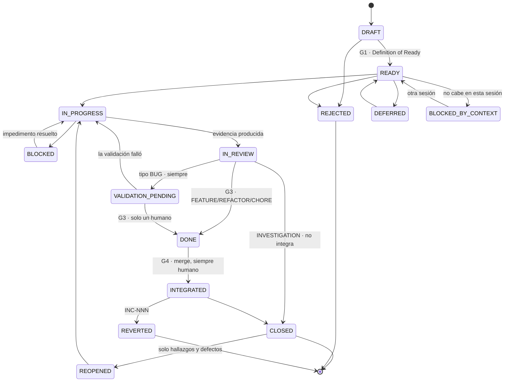

# LEXICON — Vocabulario Canónico de la Suite

> **Estatus:** normativo. Este documento es la **única** fuente de verdad para nombres.
> Ningún otro documento de la suite puede introducir un término de paso, un prefijo de
> identificador, un valor de estado o un nombre de archivo que no esté declarado aquí.
> **Autoridad:** en cualquier conflicto de nomenclatura, este documento prevalece sobre
> todos los demás, incluido el `CLAUDE.md` del proyecto destino.
>
> Suite version: **13.0.0** · Ver [CHANGELOG.md](CHANGELOG.md)

---

## 1. Por qué existe este documento

Antes de la v4.0.0 la suite usaba cinco palabras distintas para "paso del flujo"
(`Estado n`, `STATE n`, `FASE n`, `F-n`, `FIDE-n`), tres nombres para el componente de
QA, cuatro máquinas de estado en dos idiomas y dos esquemas incompatibles para el mismo
archivo. La consecuencia no era cosmética: `Estado 4` significaba *diseñar la estrategia*
en un documento y `STATE 4` significaba *escribir código* en otro. Un agente que leyera
ambos recibía órdenes contradictorias.

Un vocabulario ambiguo produce agentes ambiguos. Este documento elimina la ambigüedad por
construcción: hay un solo nombre para cada cosa y está aquí.

---

## 2. Palabra única de paso: `PHASE`

`PHASE` es la **única** palabra admitida para designar un paso de cualquier flujo de la
suite. Quedan prohibidos: `Estado n`, `STATE n`, `FASE n`, `F-n`, `Fn`, `FIDE-n`, `Step n`,
`Etapa n`.

Regla de escritura: `PHASE <n> — <Nombre semántico>`. El número ordena; el nombre significa.
Al referirse a una fase en prosa se usa el **nombre**, no el número
(«en Strategy», no «en la fase 3»). El número solo aparece en encabezados, tablas y triggers.

### 2.1 Estados cognitivos: sin numeración

Los documentos `Framework-*.md` describen el **razonamiento** (qué se comprende y en qué
orden). Los documentos `*-Implementation.md` y `*-Prompts.md` describen el **recorrido
operativo** (qué se ejecuta y en qué orden).

`LEX-R01` · Los documentos `Framework-*.md` **no numeran** sus estados cognitivos. Los
nombran. Solo el recorrido operativo lleva números de `PHASE`. Esto elimina de raíz la
colisión de dos numeraciones sobre el mismo flujo.

---

## 3. Mapa de fases por componente

### 3.1 FDGE — Desarrollo Gobernado por Evidencia

| PHASE | Nombre | Artefacto principal | Compuerta |
|:--|:---|:---|:---|
| 0 | Context | `SESSION_LOG.md` | — |
| 1 | **Intake** | `changes/PT-XXX-slug/intake.md` | **G1 — Definition of Ready** |
| 2 | Analysis | `discovery.md` · `enrichment.md` · `scope.md` + `context.md` | — |
| 3 | Strategy | `strategy.md` | — |
| 4 | Proposal | Proposal Package completo | **G2 — Proposal Gate** |
| 5 | Implementation | Código + commits atómicos | — |
| 6 | Evidence | `evidence/PT-XXX/` + `self-review.md` + `manifest.json` | — |
| 7 | Validation | Cambio de estado del PT | **G3 — Validation Gate** |
| 8 | Persistence | `HISTORY.log` · `HANDOFF.md` | — |
| 9 | Integration | PR · CI · merge · tag · archivado | **G4 — Integration Gate** |
| 10 | Rollback | `INCIDENTS.log` · revert | (carril condicional) |

Variantes de PHASE 2, según el tipo declarado en el Intake:

| Variante | Tipo | Artefacto |
|:---|:---|:---|
| `PHASE 2-B` | `BUG` · `INVESTIGATION` | `discovery.md` |
| `PHASE 2-E` | `FEATURE` | `enrichment.md` |
| `PHASE 2-R` | `REFACTOR` | `scope.md` |

`LEX-R02` · **`EXPRESS` es un track, no una fase.** Un PT de complejidad `TRIVIAL` puede
recorrer el track `EXPRESS`, que condensa PHASE 2 + 3 + 4 en un único bloque con una sola
compuerta G2. Nunca omite PHASE 1, 6, 7, 8 ni 9. Se escribe `TRACK: EXPRESS`, nunca
`PHASE 1-EXPRESS`.

### 3.2 FQAGE — Quality Assurance Gobernado por Evidencia

| PHASE | Nombre | Compuerta |
|:--|:---|:---|
| 1 | Reconnaissance | — |
| 2 | Test Plan | ACK humano |
| 3 | Spec Generation | ACK humano |
| 4 | Execution | — |
| 5 | Analysis | — |
| 6 | Report | ACK humano |
| 7 | Defect Promotion | ACK humano por defecto |

`LEX-R03` · El componente se llama **FQAGE** en prosa normativa y **QA** en triggers, rutas
y nombres de archivo (`[START QA]`, `QA/`, `Framework-QA.md`). No se admite ninguna tercera
grafía. Cuando el documento es normativo, se escribe «FQAGE (QA)» la primera vez y «QA»
después.

### 3.3 PTSA — Auditoría y Certificación Continua

Las 15 fases se renumeran a `PHASE 0..14`. La tabla de equivalencia con la nomenclatura
`F-n` anterior es normativa y debe conservarse en la especificación oficial para que los
proyectos que ya instalaron la suite puedan migrar.

| PHASE | Nombre | Nomenclatura anterior |
|:--|:---|:---|
| 0 | Value Declaration | `F-1` |
| 1 | Inventory | `F0` |
| 2 | System Map | `F1` |
| 3 | Scope | `F2` |
| 4 | Products | `F3` |
| 5 | Criticality | `F3.5` |
| 6 | **Traceability** (hito central) | `F4` |
| 7 | Technical (D2) | `F5` |
| 8 | Domain Acid Test (D1) | `F6` |
| 9 | Documentary Fidelity (D4) | `F7` |
| 10 | Observability (D3) | `F8` |
| 11 | Consolidation | `F9` |
| 12 | Executive Matrix | `F10` |
| 13 | Continuous Certification | `F11` |
| 14 | Domain Governance | `F12` |

Los archivos de fase pasan a `PTSA/Phases/PHASE-NN-slug.md`.

### 3.4 Foundation Protocol

| PHASE | Nombre | Produce |
|:--|:---|:---|
| 0 | Reconnaissance | comprensión · no escribe nada |
| 1 | **Reconciliation** | `00-Baseline.md` · **G0** · `RECONCILIATION.log` · `docs/_archive/` |
| 2 | Context Documents | `01-Platform-Overview` · `02-PRD` |
| 3 | Technical Documents | `03-TRD` · `04` · `05` · `06` · `07` · `08` · `09` · `10` |
| 4 | Conventions | `11-Conventions.md` — el más crítico |
| 5 | Inventory & Graph | `inventory/` · `graphify-out/` · `REGISTRY.graph` |
| 6 | Human Validation | `[FOUNDATION VALIDATED]` |

`PHASE 1 — Reconciliation` es nueva en 4.1.0. Sin ella, Foundation generaba documentación
correcta encima de documentación vieja contradictoria y nadie sabía cuál mandaba.

### 3.5 FIDE — Investigación y Diseño Evolutivo

| PHASE | Nombre |
|:--|:---|
| 1 | Discovery |
| 2 | Advisory |
| 3 | Blueprinting |
| 4 | Scaffolding |
| 5 | Handoff |

---

## 4. Identificadores

`LEX-R04` · Todo identificador es **monotónico, único y permanente**. Nunca se reutiliza,
nunca se renumera, nunca se elimina. La asignación es **exclusivamente** vía
`docs/implementation/REGISTRY.json` (ver §4.3). Derivar un número contando entradas en un
`.md` o en un `.json` de historial está **prohibido**.

### 4.1 Identificadores de trabajo

| Prefijo | Significado | Dueño | Ámbito |
|:---|:---|:---|:---|
| `PT-NNN` | Work item — unidad de trabajo | FDGE | Proyecto |
| `EP-NNN` | Epic / lote de PTs | FDGE | Proyecto |
| `PT-NNN.M` | Tarea atómica dentro de un PT | FDGE | PT |
| `AC-NN` | Criterio de aceptación | Intake | PT |
| `TS-NN` | Escenario de test | FDGE | PT |
| `RC-NN` | Control de regresión | FDGE | PT |
| `QA-NNN` | Caso de prueba QA | QA | Proyecto |
| `QR-NNN` | Ciclo de ejecución QA | QA | Proyecto |
| `QD-NNN` | Defecto QA | QA | Proyecto |
| `H-NNN` | Hallazgo de auditoría | PTSA | Proyecto |
| `E-NNN` | Evidencia de auditoría | PTSA | Proyecto |
| `P-NNN` | Producto auditado | PTSA | Proyecto |
| `U-NNN` | Bloque de actualización de fase | PTSA | Fase |
| `R-NNN` | Ítem de roadmap | FPGE | Proyecto |
| `INC-NNN` | Incidente / rollback | FDGE | Proyecto |

### 4.2 Identificadores de regla

`LEX-R05` · Las reglas normativas se identifican con **prefijo de componente**, nunca con
una `R` desnuda. La grafía `[R45]` queda prohibida porque colisiona con `R-NNN` (roadmap).

| Prefijo | Origen |
|:---|:---|
| Prefijo | Definidas en |
|:---|:---|
| `SUITE-Rnn` · `FND-Rnn` · `FDGE-Rnn` · `INTAKE-Rnn` · `QA-Rnn` · `FPGE-Rnn` · `FIDE-Rnn` | [RULES.md](RULES.md) |
| `LEX-Rnn` | **este documento** |
| `EXEC-Pn` · `EXEC-Rnn` | [EXECUTION-MODES.md](EXECUTION-MODES.md) |
| `PTSA-Rnn` | [PTSA/PTSA-V3-Especificacion-Oficial.md](PTSA/PTSA-V3-Especificacion-Oficial.md) (antes `[Rnn]`) |
| `RULE-nn` | `11-Conventions.md` del proyecto |

`LEX-R23` · **Un ID se define en exactamente un documento.** Los demás **citan**; nunca
reformulan ni renumeran. `SUITE-R14` y `tools/verify-suite.mjs` lo verifican: una definición
duplicada es un defecto que bloquea. (La 4.0.0 nació con una: `RULES.md` renumeraba los
axiomas de PTSA como `PTSA-R01..R12`, colisionando con reglas distintas y ya existentes de
la especificación.)

`LEX-R24` · **Sub-identificadores.** Una regla con cláusulas enumeradas admite sub-IDs con
letra minúscula pegada: `SUITE-R06a`, `SUITE-R06f`. Solo para citar una cláusula concreta;
la regla sigue siendo una sola y se define una sola vez.

### 4.3 `REGISTRY.json` — asignador único

Vive en `docs/implementation/REGISTRY.json`. Es el único lugar donde se asigna un número.

Esquema canónico. Es el mismo en `FDGE-Implementation.md`, en `FIDE-Implementation.md` y en
el instalador; `tools/verify-fdge.mjs` depende de los campos `status` y `execution_mode`.

```json
{
  "suite_version": "5.2.0",
  "execution_mode": "SUPERVISED",
  "foundation": { "generated": "2026-08-01", "validated_by": "Ada Lovelace", "pt_at_generation": 38 },
  "graph": { "generated": "2026-08-01", "scope": "src/", "pt_at_generation": 38 },
  "tracker": { "plataforma": "github" | "azure" | null },
  "counters": {
    "PT": 0, "EP": 0, "QA": 0, "QR": 0, "QD": 0,
    "H": 0, "E": 0, "P": 0, "R": 0, "INC": 0
  },
  "allocations": [
    {
      "id": "PT-001",
      "type": "BUG",
      "severity": "S2",
      "slug": "login-redirect-loop",
      "created": "2026-08-05",
      "epic": null,
      "status": "READY",
      "phase": 1,
      "structural": false,
      "suite_version": "5.2.0"
    }
  ]
}
```

Campos obligatorios de cada `allocation`: `id` · `type` · `severity` · `slug` · `created` ·
`status` (valor de `Lifecycle`, §5.1) · `phase` (número de `PHASE` actual) · `structural`
(booleano — si el PT movió, creó, renombró o eliminó archivos; `FDGE-R44`). `epic` es opcional.

`suite_version` por `allocation` es lo que permite migrar sin romper trabajo en curso
(`SUITE-R18`): un PT abierto bajo 4.1.0 se cierra bajo las reglas de 4.1.0 aunque el proyecto
ya esté en 4.2.0.

El bloque `graph` hace computable la frescura del grafo (`FDGE-R43`): un grafo generado en
`pt_at_generation: 38` está `STALE` en cuanto se integra un PT posterior con
`structural: true`.

`LEX-R06` · Asignar un identificador es: leer `counters`, incrementar, escribir el nuevo
valor **y** añadir la entrada a `allocations` en la misma operación. Si el agente no puede
escribir en `REGISTRY.json`, no puede asignar el identificador: se detiene y reporta.


### 4.4 Identificadores de **clase de evento** — `CE-NNN`   `PT-118`

`LEX-R31` · **Hay una tercera clase de identificador, y no se asigna desde `REGISTRY.json`.**
Un `CE-NNN` no es un ítem de trabajo —no se abre, no se cierra, no tiene fases ni compuertas— ni
una regla —no obliga a nada—. Nombra **una forma de fallar que se repite**, para que quince
descripciones distintas del mismo tropiezo dejen de ser quince cosas.

Es la **única excepción** a `LEX-R04`, y por eso se enuncia aquí en vez de darse por supuesta:
`counters` cuenta trabajo, y meter una taxonomía en el asignador haría que el número de clases
dependiera del orden en que alguien las escribió. Un `CE-NNN` se declara **en esta tabla** y su
número no cambia nunca (`LEX-R04` sigue rigiendo lo demás: único, permanente, nunca reutilizado).

`LEX-R32` · **La lista es cerrada por versión y ampliable por cambio de metodología.** Citar un
`CE-NNN` que esta tabla no declara es un defecto que `verify-suite` bloquea. Ampliarla es
modificar `docs/methodology/`, que no se automatiza (`SUITE-R06e`).

**El prefijo `CE` se eligió midiendo, no por gusto.** Los prefijos vivos son `AC` `E` `EP` `H`
`INC` `P` `PT` `QA` `QD` `QR` `R` `RC` `TS` `U` para trabajo y `EXEC` `FDGE` `FIDE` `FND` `FPGE`
`INTAKE` `LEX` `PTSA` `QA` `SUITE` para reglas. `CE` no está en ninguna.

El riesgo real no era el prefijo sino la **subcadena**: `CE-001` contiene `E-001`, así que una
expresión que buscara `E-\d+` sin anclar lo cazaría. Se midió: **ninguna herramienta busca un
`E-\d+` suelto** —los que hay son `EP-\d+`, precedidos de letra— y los únicos patrones de una
sola letra son `P-\d+` y `H-\d+`, que no pueden casar dentro de `CE-NNN`.

Lo que la medición **sí** encontró, y aquí se declara en vez de callarse (`RULE-06`):
`tools/verify-ptsa.mjs:203` usa `/H-\d+/` **sin anclar**. No afecta a `CE`, pero es un riesgo
latente para cualquier prefijo futuro acabado en `H`.

| ID | Clase | Enunciado en una frase |
|:---|:---|:---|
| `CE-001` | El proxy en lugar del hecho | Se comprueba algo que acompaña al hecho —una palabra, un archivo, un recuento— en vez del hecho mismo |
| `CE-002` | Rotura de escapado | Una barra invertida escrita en un literal llega al destino distinta de como se pensó, y la expresión deja de casar |
| `CE-003` | Un argumento se cuela por la detección de `ROOT` | Una bandera con valor no está declarada, y su valor se toma por la raíz del proyecto |
| `CE-004` | Probar donde trabajo, no donde se decide | El caso pasa en el entorno en que se escribió y falla en el que decide, porque no ancla lo que depende del entorno |
| `CE-005` | Verde por no haber mirado | Una comprobación no encuentra nada porque no llegó a ejecutarse, y el cero se lee como conformidad |
| `CE-006` | El acto hecho fuera del comando | Existe un comando que escribe ese estado y se escribe a mano, así que ninguna de sus comprobaciones corre |
| `CE-007` | Existe la herramienta y nada la echa en falta | La herramienta correcta existe, nadie la invoca, y ningún verificador nota su ausencia |
| `CE-008` | Un hecho, varios nombres | El mismo hecho se nombra de dos maneras en dos documentos, y las dos versiones divergen |
| `CE-009` | El estado terminal escrito a mano o adelantado | Un estado que sólo debía escribirse al cumplirse una condición se escribe antes, o sin ella |
| `CE-010` | La cifra transcrita caduca | Una cifra se copia a un documento y el árbol sigue cambiando; la copia describe un pasado |
| `CE-011` | Un arreglo deja tests del estado anterior | El comportamiento cambia y los casos que describían el anterior siguen verdes describiendo lo que ya no ocurre |
| `CE-012` | Filtrar la salida antes de mirarla | Se aplica un filtro a la salida de una herramienta y lo que el filtro descarta no se lee nunca |
| `CE-013` | Un encabezado mal formado bloquea la integración | Un artefacto correcto en contenido no cumple la forma que una comprobación exige, y detiene una compuerta |
| `CE-014` | Una regla nueva juzga hacia atrás | Una regla recién escrita marca como incumplimiento trabajo hecho cuando no existía |
| `CE-015` | El cierre destapa más que el reparto | Cerrar un lote encuentra más defectos que repartirlo, porque el cierre es el primer momento en que todo se mira junto |
| `CE-016` | Trabajar sin allocation | El trabajo se hace sin ítem abierto: sin intake, sin identificador y sin compuerta, y sólo lo corta una persona |
| `CE-017` | La comprobación acusa a quien documenta el hecho | Una comprobación cuyo alcance es todo el texto falla porque el texto **describe** el hecho que vigila |

**Diecisiete, y la lista no se promete completa.** Son las clases **medidas** en `EP-020` §2.1;
clasificar las entradas cerradas puede encontrar más, y encontrarlas es la tarea funcionando, no
un defecto de esta tabla (`RULE-06`: se declara lo medido).

---

## 5. Estados

`LEX-R07` · La suite tiene **tres** enumeraciones de estado y ninguna más. Están en inglés,
en `MAYÚSCULA_CON_GUION_BAJO`. Ningún componente puede inventar un valor.

### 5.1 Enum A — `Lifecycle`

Aplica a: `PT` · `EP` · `R` · `QD` · `H` · `P` · `INC` · `QA` (el caso de prueba como
entidad viva; su resultado por ciclo es el Enum B, §5.2).

No todos los valores aplican a todas las entidades: `INTEGRATED` y `REVERTED` solo tienen
sentido para lo que produce código (`PT`, `EP`); `BLOCKED_DOMAIN`, solo para productos PTSA;
`REOPENED`, solo para hallazgos y defectos.

| Valor | Significado |
|:---|:---|
| `DRAFT` | Creado. Aún no admisible. No puede consumir trabajo. |
| `READY` | Superó la compuerta de admisión (G1 / ACK equivalente). Puede planificarse. |
| `REOPENED` | Estuvo resuelto y volvió a estar activo. Solo hallazgos y defectos. |
| `IN_PROGRESS` | Alguien o algo está trabajando en él ahora. |
| `BLOCKED` | Existe un impedimento externo. No progresa. Requiere razón declarada. |
| `BLOCKED_BY_CONTEXT` | La tarea **está lista**; el **momento** no. No es un fallo. Lo desbloquea empezar otra sesión. **No terminal**. |
| `BLOCKED_DOMAIN` | Solo productos PTSA: rechazado por fallo duro de dominio (D1). |
| `IN_REVIEW` | Trabajo terminado, evidencia producida, esperando revisión. |
| `VALIDATION_PENDING` | Esperando validación **humana**. Terminal para el agente. |
| `DONE` | Validado técnicamente. Aún no integrado a la línea principal. |
| `INTEGRATED` | Mergeado a la línea principal. |
| `CLOSED` | Terminal. Completo y verificado. |
| `REJECTED` | Terminal. No se hará. Requiere motivo declarado. |
| `DEFERRED` | Aparcado. Puede volver en una corrida futura. |
| `REVERTED` | Terminal. Estuvo `INTEGRATED` y se revirtió. Requiere `INC-NNN`. |

Transiciones válidas:



Notas de lectura:

* `CLOSED` es **posterior** a `INTEGRATED` para todo lo que produce código. Exigir `CLOSED`
  antes de una compuerta de integración es un bloqueo circular (ver `FDGE-R34`).
* `INVESTIGATION` es la única excepción: va de `IN_REVIEW` a `CLOSED` sin integrar, porque
  no produce código (`FDGE-R10`, `FDGE-R27`).
* `BLOCKED_DOMAIN` no aparece aquí: es exclusivo de los productos de PTSA y su máquina vive
  en §22 de la especificación.
* `REOPENED` solo aplica a hallazgos `H-NNN` y defectos `QD-NNN`.

`LEX-R08` · Un ítem de tipo `BUG` **nunca** transita de `IN_REVIEW` a `DONE` por acción del
agente. Pasa obligatoriamente por `VALIDATION_PENDING` y solo un humano lo mueve a `DONE`.
Lo mismo aplica a los hallazgos PTSA de tipo `BUG` y `DOMAIN`, y a todo `QD-NNN`.

### 5.2 Enum B — `ExecutionResult`

Aplica a: ejecución de un caso QA, de un test, de un chequeo de CI. **No es un estado de
ciclo de vida.** Un caso QA tiene a la vez un `Lifecycle` (existe, está vigente) y un
`ExecutionResult` por ciclo.

| Valor | Significado |
|:---|:---|
| `PASS` | Lo observado coincide exactamente con lo esperado. |
| `FAIL` | Diverge en cualquier dimensión. La ambigüedad es `FAIL`. |
| `SKIP` | Excluido de esta corrida por decisión humana declarada. |
| `ERROR` | No se pudo ejecutar. Problema de la infraestructura de prueba, no del sistema. |

### 5.3 Enum C — `PhaseStatus`

Aplica a: archivos de fase de PTSA, fases de Foundation, fases de FIDE.

| Valor | Significado |
|:---|:---|
| `NOT_STARTED` | — |
| `IN_PROGRESS` | — |
| `BLOCKED` | Con bloqueante declarado. |
| `COMPLETE` | Cumple su criterio de compleción. |
| `NEEDS_REVIEW` | Completa pero con confianza insuficiente. |

### 5.4 Tabla de migración desde v3

| Componente | Valor anterior | Valor canónico v4 |
|:---|:---|:---|
| FDGE | `PENDING` | `READY` |
| FDGE | `DISCOVERY_PENDING` · `ENRICHMENT_PENDING` · `SCOPE_PENDING` · `REFACTOR_PENDING` | `DRAFT` (antes de G1) · `READY` (después de G1) |
| QA | `OPEN` | `READY` |
| QA | `IN_REMEDIATION` | `IN_PROGRESS` |
| QA | `VERIFIED` | `DONE` |
| QA | `RUNNING` | `IN_PROGRESS` |
| PTSA · hallazgo | `ABIERTA` | `READY` |
| PTSA · hallazgo | `REABIERTA` | `REOPENED` |
| PTSA · hallazgo | `CORREGIDA` | `IN_REVIEW` |
| PTSA · hallazgo | `VERIFICADA` | `DONE` |
| PTSA · hallazgo | `CERRADA` | `CLOSED` |
| PTSA · producto | `BORRADOR` | `DRAFT` |
| PTSA · producto | `IDENTIFICADO` | `READY` |
| PTSA · producto | `REQUIERE_REVISION` | `IN_REVIEW` |
| PTSA · producto | `RECHAZADO_DOMINIO` | `BLOCKED_DOMAIN` |
| PTSA · producto | `VALIDADO` | `CLOSED` |
| PTSA · producto | `RETIRADO` | `REJECTED` |
| PTSA · fase | `NO_INICIADA` · `EN_PROGRESO` · `BLOQUEADA` · `COMPLETADA` · `REQUIERE_REVISION` | `NOT_STARTED` · `IN_PROGRESS` · `BLOCKED` · `COMPLETE` · `NEEDS_REVIEW` |
| FPGE | `PROPUESTO` | `DRAFT` |
| FPGE | `APROBADO` | `READY` |
| FPGE | `PROMOVIDO` | `IN_PROGRESS` |
| FPGE | `DESCARTADO` · `CLOSED-WONTFIX` · `CLOSED-ACCEPTED` | `REJECTED` |
| FPGE | `DIFERIDO` | `DEFERRED` |
| FIDE | `PENDING` (features en ENRICHMENT) | `DRAFT` |

`LEX-R09` · Los valores `CLOSED-WONTFIX`, `CLOSED-ACCEPTED` y `REJECTED` que FPGE v3
escribía en artefactos ajenos quedan **derogados**. Ver `FPGE-R03`.

---

## 6. Nombres de archivo canónicos

`LEX-R10` · Un archivo tiene un solo nombre. Cualquier documento que lo referencie usa
exactamente esta grafía.

### 6.1 Documentación de Foundation — `docs/enterprise-documentation/`

```
README.md
00-Baseline.md             ← solo proyectos legado · inventario del desorden de partida
01-Platform-Overview.md
02-PRD.md
03-TRD.md
04-App-Flow.md
05-UI-UX-Brief.md          ← canónico (deroga 05-UIUX-Brief.md)
06-Backend-Architecture.md
07-Database-Architecture.md
08-API-Catalog.md
09-Security-Architecture.md
10-Technical-Debt.md
11-Conventions.md
inventory/
  routes.md · endpoints.md · entities.md · components.md · services.md · integrations.md
```

`LEX-R11` · **Todo generador de esta carpeta debe usar exactamente estos nombres.** Incluye
a FIDE, que en v3 generaba `00-BUSINESS_CASE.md` · `01-PRD.md` · `02-ARCHITECTURE.md` ·
`03-CONVENTIONS.md` y dejaba rotos todos los consumidores. Ver `FIDE-R04`.

FIDE añade un único documento propio, fuera del rango numerado de Foundation:

```
00-Business-Case.md        ← solo proyectos nacidos de FIDE
```

### 6.2 Artefactos de FDGE — `docs/implementation/`

**Ledgers globales** (uno por proyecto):

```
REGISTRY.json          append + counters · asignador único de IDs
HISTORY.log            append-only   · un registro por PT cerrado, más las entradas
                       de encabezado reservado que lo completan sin editarlo:
                         ## PT-NNN — REVERTIDO: …   una reversión [FDGE-R36]
                         ## PT-NNN — CORRIGE: …     una corrección [FDGE-R29]
                       Los dos encabezados son vocabulario canónico: la comprobación
                       los reconoce por ellos, no por su contenido.
HANDOFF.md             sobrescribible · abre con el bloque ESTADO [SUITE-R33]
                       responde por el PROYECTO: qué implementación, qué tarea, qué sigue
SESSION-<usuario>.json sobrescribible · la sesion de UNA persona (§6.5e) · UNA por persona,
                       no una por dia. Dos personas nunca escriben el mismo archivo, asi que no
                       hay conflicto que resolver — la colision se evita por construccion

SESSION.json           sobrescribible · el estado de la SESION, no de la tarea (§6.5e)
                       «desde» es lo unico capturado; el resto se deriva de «desde..HEAD»
                       sin el, lo que lleva la sesion es SIN EVALUAR — el dia NO es la sesion

EVENTOS.jsonl          append-only   · un registro por evento Y por entrada RECORRIDA del
                       ledger, con su CITA LITERAL. La clase va siempre DECLARADO: es un
                       juicio (LEX-R31), y separar una instancia de una simple mención lo
                       decide una persona. Lo escribe «tools/eventos.mjs»          [PT-125]
MATRIZ.md              GENERADO · qué se repite y qué clase no tiene regla que la reclame.
                       Toda cifra se deriva; ninguna se transcribe. «Tiene verificador» NO
                       es «la regla existe»: es que alguna herramienta EMITA por ella.
                       Lo escribe «tools/matriz.mjs»; su frescura entra en verify [PT-119]
CHECKPOINT.json        sobrescribible · el estado de la tarea EN CURSO, legible por máquina
                       responde por la TAREA, y es UNO: escribirlo sobre otra la sustituye
                       STATE_MISMATCH · la CONDICION que se reporta cuando el arbol no
                       corresponde a lo que declara. NO es un «status» del registro: durante
                       una discrepancia la tarea sigue IN_PROGRESS, y lo que esta mal es la
                       correspondencia entre la foto y el arbol           [LEX-R26]
SESSION_LOG.md         append-only   · una entrada por sesión (antes SESSION_SUMMARY.md)
BACKLOG.md             sobrescribible · índice de PTs vivos y su fase actual
RECONCILIATION.log     append-only   · una entrada por decisión sobre un documento legado
MIGRATION.log          append-only   · una entrada por migración de versión de suite
INCIDENTS.log          append-only   · un registro por INC-NNN
LAYOUT.md              plan de terreno de la raíz · G0 · FND-R20..R23
INSTALL.log            lo que la instalación EJECUTÓ · append-only · SUITE-R30
SECRETOS-EXCEPCIONES.md  falsos positivos firmados por huella · FND-R29
ROADMAP.md             sobrescribible · FPGE
ROADMAP_HISTORY.log    append-only   · FPGE
```

**Índices append-only** (permiten a FPGE leer specs pendientes sin abrir cada PT):

```
DISCOVERY.md           índice de bugs e investigaciones → apunta a changes/PT-XXX/discovery.md
ENRICHMENT.md          índice de features               → apunta a changes/PT-XXX/enrichment.md
REFACTOR_SCOPE.md      índice de refactors              → apunta a changes/PT-XXX/scope.md
```

**El contrato de `CHECKPOINT.json`** — todos sus campos se **derivan**; ninguno se recuerda:

```
pt · type · epic · status · phase · rama    ← REGISTRY.json          [SUITE-R08]
fase · compuerta · produce · siguiente      ← la tabla de fases, ya derivada
sha · sha_corto                             ← git rev-parse HEAD
sucio · archivos                            ← git status --porcelain
generado                                    ← la fecha del commit HEAD
```

`LEX-R26` · **Un campo que solo pueda rellenar la memoria no entra en `CHECKPOINT.json`.** Si un
dato hace falta y no se deriva de `REGISTRY.json`, de git o de una tabla que el marco ya calcula,
se declara como hueco y no se escribe. Un campo así miente **con la autoridad de un dato
estructurado**, que es peor que decirlo en prosa: la prosa se lee con la duda puesta y un JSON no.

El `sha` que declara tiene que ser **alcanzable**, no solo tener forma de SHA. Un checkpoint que
apunta a un commit inexistente es la peor de las dos averías posibles — **el que no existe se nota;
el que miente, no**.

Y el **árbol tiene que corresponder**: el `HEAD` actual y la rama actual son los que el checkpoint
declara. Un `sha` alcanzable que describe un árbol que ya no existe **miente sin que nada lo note**
— el checkpoint apunta a un commit real y el trabajo continúa sobre otro estado.

La condición se llama **`STATE_MISMATCH`** y la comprobación **detiene**: reanudar con una
discrepancia es una decisión humana (`SUITE-R06`), y la herramienta **propone** el comando que la
resolvería sin ejecutarlo — reescribir el checkpoint borraría la única prueba de que hubo
divergencia.

**Ir por detrás tampoco lo es.** Entre dos transiciones de fase hay varios commits —medido: hasta
diez por tarea en `EP-014`, contra nueve transiciones—, así que el `sha` declarado deja de ser
`HEAD` en cuanto se commitea. Lo que distingue no es la igualdad sino la **historia**: un commit
que es **antecesor** del actual describe un estado del que el de ahora desciende. Uno que no lo es
está en otra rama o en una historia reescrita, y ahí sí. No poder decidirlo cuenta como
discrepancia: no haberlo demostrado no es haberlo desmentido (`RULE-06`).

Y **no poder leer la rama tampoco es divergir**: en `detached HEAD` —el estado en que
`actions/checkout` deja el repositorio— `git rev-parse --abbrev-ref HEAD` devuelve la cadena
`HEAD`, que no es el nombre de ninguna rama. Tratarla como valor hacía que la comprobación se
disparara contra sí misma en cada PR.

**Un árbol sucio NO es una discrepancia.** Cambios sin commitear son el estado normal de una tarea
en curso, y la lista de archivos cambia sin parar mientras se trabaja: medido, pasó de 3 a 5 con el
`sha` intacto en el tiempo de escribir tres párrafos. Solo `sha` y `rama` sostienen la
correspondencia; `sucio` y `archivos` describen **progreso**, no divergencia.

Y **no tener checkpoint no es una discrepancia**: no hay nada que contrastar. No saber y no haber
son cosas distintas.

`LEX-R12` · Estos tres archivos son **append-only e índices**. Contienen una línea por PT
con su ID, título, tipo, estado canónico y ruta. **Nunca** contienen el cuerpo del análisis
—ese vive en el directorio del PT— y **nunca** se sobrescriben. La instrucción v3
«Create or overwrite `ENRICHMENT.md`» queda derogada.

**Evidencia:**

```
evidence/PT-XXX/
  manifest.json        mapa AC → evidencia (obligatorio, verificable)
  self-review.md
  tests/ · logs/ · api/ · screenshots/ · reports/
```

### 6.3 Espacio de trabajo por PT — `changes/PT-XXX-slug/`

```
changes/PT-XXX-slug/
  intake.md            PHASE 1 · lo firma el humano
  context.md           PHASE 2 · análisis arquitectónico
  discovery.md         PHASE 2-B  (o)
  enrichment.md        PHASE 2-E  (o)
  scope.md             PHASE 2-R
  strategy.md          PHASE 3    (antes PLAN_ACTUAL.md)
  design.md            PHASE 4
  tasks.md             PHASE 4    (antes PENDING_TASKS.md)
  spec-changes.md      PHASE 4
  test-scenarios.md    PHASE 4
  out-of-scope.md      PHASE 4
  traceability.md      PHASE 4→6 · matriz AC → TS → test → evidencia → caso QA
  (la nota de reanclaje NO vive aquí: va al issue si hay plataforma, y si no a
   docs/implementation/TRANSICIONES.log — uno por repositorio [FDGE-R52, INC-008])
```

`LEX-R13` · **Ningún archivo de trabajo de un PT vive en una ruta global.**
`PLAN_ACTUAL.md`, `PENDING_TASKS.md` y `CONTEXT_ANALYSIS.md` quedan **derogados** como
archivos globales: eran sobrescribibles y hacían físicamente imposible tener dos PTs en
vuelo. Su contenido se mueve a `strategy.md`, `tasks.md` y `context.md` dentro del
directorio del PT.

### 6.4 Espacio de trabajo de QA — `QA/` y `qa/`

```
QA/
  QA-PLAN.md · QA-DEFECTS.md · QA-LOG.md · qa-score-history.json
  cases/QA-NNN.md
  reports/QR-NNN/{REPORT.md, summary.json, evidence/}
qa/
  tests/QA-NNN-slug.spec.ts
  fixtures/test-data.ts
playwright.config.ts
```

### 6.5 Espacio de trabajo de PTSA — `PTSA/`

```
PTSA/
  RESUMEN.md · ESTADO_ACTUAL.md · AUDIT_LOG.md · PENDIENTES.md
  COVERAGE.md                    ← matriz universo × D1-D4 [PTSA-R77]
  audit-scope.yaml · score-history.json · RELACIONES.md
  Phases/PHASE-NN-slug.md        ← antes Fases/F*.md
  Findings/H-NNN.md              ← antes Hallazgos/
  Evidence/E-NNN.md              ← antes Evidencias/
  Products/P-NNN.md              ← antes Productos/
```

`LEX-R14` · Los nombres de directorio de la suite están en inglés. Los archivos con
contenido de auditoría en español conservan su nombre (`RESUMEN.md`, `PENDIENTES.md`) por
compatibilidad con la especificación normativa de PTSA.

### 6.5b Referencia de coste   `PT-057`

**Referencia de coste**: lo que **suele** costar un tipo de tarea en este repositorio, derivado de
las tareas **cerradas** de su mismo `type` y `complexity`. No se guarda en ningún archivo: se
recalcula al preguntar, porque una copia diverge en cuanto se cierra la tarea siguiente
(`SUITE-R38`).

```
tracker coste [tipo] [complejidad]

de dónde sale     REGISTRY.json     el tipo y la complejidad de cada allocation
                  git               commits, archivos y líneas de cada tarea cerrada
qué mide          commits · archivos · líneas — señales OBSERVABLES
qué NO mide       tokens · el contexto restante del modelo · el coste de UNA tarea concreta
```

**A quién pertenece un commit.** El primer `PT-NNN` del **asunto**, y solo del asunto. El cuerpo
cita tareas anteriores —«CORRIGE `PT-052`»— y eso es **lo correcto** en una bitácora append-only;
medido: 61 de 162 commits nombran más de un `PT` y uno nombra diez. Atribuir por el cuerpo hacía
que `BUG/TRIVIAL` y `BUG/STANDARD` salieran idénticos hasta la línea.

**Mediana con su rango, nunca media.** Los grupos van de 6 a 13 tareas y la dispersión llega a un
factor de diez —`BUG/TRIVIAL` de 242 a 2591 líneas—: una media la arrastra un solo caso, y una
cifra central sin dispersión se lee como una predicción.

**`MINIMO_REFERENCIA`** · Por debajo de ese número de tareas cerradas **no hay cifra**: se dice
cuántas hay y se enseñan los casos en crudo. Una mediana de una tarea no es una mediana, y una
media de dos presentada como una de treinta engaña por precisión aparente. El valor es un
**juicio declarado**, no un resultado: vive con nombre en el código para que se pueda discutir.

**Lo que la referencia no dice.** De **cuántas** tareas sale, sí; de **cuándo**, no. Las tareas
anteriores a `FDGE-R19` llevaban el trabajo entero en un commit, así que la cifra puede describir
con verdad un pasado que ya no aplica.

### 6.5c Naturaleza de una cifra   `PT-058`

Toda cifra que el marco presente declara **de qué naturaleza es**. El vocabulario es **cerrado** y
son exactamente tres, ordenadas de mejor a peor:

```
MEDIDO        se contó de algo que se puede volver a contar — git, el registro, el disco
ESTIMADO      se derivó de datos medidos, pero describe algo que nadie midió
SIN EVALUAR   no se sabe, y se dice · NO es cero
```

**El orden es la regla**, no una convención de escritura: al operar dos cifras, el resultado lleva
la **peor** de las dos naturalezas. Una resta entre un dato medido y una estimación **es** una
estimación, y presentarla como medida es exactamente lo que estas tres palabras existen para
impedir.

**`SIN EVALUAR` no vale cero.** Una cifra `SIN EVALUAR` no tiene valor: vale `null`. Un cero
sobrevive a cualquier suma y desaparece del resultado, así que un presupuesto sin datos parecería
**holgado** — el marco arrancaría trabajo justo cuando menos sabe. No saber y no haber son cosas
distintas, y la diferencia tiene que sobrevivir a las operaciones.

**Una cifra sin naturaleza no existe.** Construirla **falla**. No se asume la más favorable, y
tampoco la más conservadora: asumir cualquiera convertiría un olvido en un dato válido que se
propaga en silencio.

**Qué NO es `MEDIDO`.** El contexto restante del modelo no se puede medir desde el marco: es
`SIN EVALUAR` y se dice. Fabricar ahí un número sería un dato falso con forma de medida.

> Estas tres palabras **ya se usaban**. `SIN EVALUAR` aparecía 50 veces en trece archivos —seis
> documentos normativos, incluido `RULES.md`, y siete herramientas— y **cero** en este documento,
> que es justo lo que `LEX-R21` prohíbe. Declararlas no amplía el marco: lo pone al día con su
> propia regla.

### 6.5d Viabilidad: `SAFE` · `MARGINAL` · `UNSAFE`   `PT-059`

Antes de empezar una tarea, el marco dice si hay **precedente** de que quepa. Tres veredictos, y
siempre con su motivo:

```
SAFE       la sesión ya completó algo de este tamaño
MARGINAL   pasa de lo ya completado pero cabe en la HOLGURA · solo trabajo atómico
UNSAFE     hay evidencia EN CONTRA · checkpoint, handoff y parada
```

**No compara contra un presupuesto, porque no existe.** `disponible = total − gastado` es
inoperable: el `total` es el contexto del modelo y el marco no puede medirlo, así que sale
`SIN EVALUAR` **siempre**. Lo que compara es el **precedente** — lo mayor que esta sesión ya
completó—, que sí es observable. `SAFE` no promete que quepa: dice que ya se pudo con algo así.

**Con una cifra `SIN EVALUAR` el veredicto es `MARGINAL`**, nunca `SAFE` ni `UNSAFE`. Aprobar sería
aprobar por omisión; prohibir bloquearía **todo trabajo para siempre**, porque el disponible es
`SIN EVALUAR` siempre — y una compuerta que bloquea siempre se apaga, y entonces no protege el día
que tiene razón. `MARGINAL` es la respuesta honesta: no apruebo, y no invento un motivo para
prohibir.

**`UNSAFE` exige evidencia en contra**, que no es lo mismo que ausencia de evidencia a favor.

**`HOLGURA`** · Cuánto por encima de lo ya completado sigue siendo `MARGINAL` en vez de `UNSAFE`.
Es un **juicio declarado**, como `MINIMO_REFERENCIA`: vive con nombre en el código para que se
pueda discutir.

**No cabe ahora ≠ no cabría nunca.** Si el coste supera **la mayor sesión jamás registrada**, la
siguiente sesión dará lo mismo y esperar sería un bucle infinito. Ahí la compuerta pide **partir la
tarea** — y no la parte: partirla cambia su alcance, y el alcance lo firma una persona
(`INTAKE-R06`).

Esta es una compuerta de **viabilidad**, no de gobernanza: `G1`..`G4` siguen decidiendo lo que
decidían.

### 6.5e La sesión es el worker, no el estado   `PT-060`

**`SESSION ≠ STATE ≠ TASK`.** La sesión de IA es un **recurso temporal**; el estado del trabajo
pertenece al marco y es persistente. `SESSION.json` describe la **sesión**, no la tarea.

```
SESSION.json      sobrescribible · UNA sesión a la vez
  desde           el commit donde empezó — lo ÚNICO capturado
  commits · archivos · lineas · tareas    derivados de «desde..HEAD»
  pt · phase      del CHECKPOINT.json
```

**`desde` es una MARCA, no memoria.** `LEX-R26` prohíbe un campo que solo pueda rellenar la
memoria del agente; una marca no lo es: es un dato **verificable en el momento en que se pone**,
igual que el `sha` del checkpoint. La memoria sería «llevo unas tres horas» — una afirmación sobre
el pasado sin nada que la respalde.

**Sin sesión abierta, lo que lleva la sesión es `SIN EVALUAR`.** No se cae al día. Medido: un día
y una sesión coinciden **por casualidad** cuando la sesión empezó ese día, y el día que no
coincidan —dos sesiones en una jornada, o una que cruza la medianoche— nada lo notaría.

**La sesión es de alguien** (`PT-065`) · Con `personas` declaradas, la marca vive en
`SESSION-<usuario>.json`. Y no es un detalle de organización: `SESSION.json` está **versionado**, así
que con dos personas la marca de una **se propaga** y da conflicto en cada merge — reproducido—, y
la resolución obvia borra la sesión del otro.

Un archivo por persona lo evita **por construcción**: nadie escribe el de nadie.

**Y las sesiones ajenas se ven.** Si cada persona solo viera la suya, las dos creerían que trabajan
solas y ninguna entendería por qué las cifras no cuadran.

**Esto no contradice `LEX-R26`**, y conviene decirlo porque la forma se parece: `CHECKPOINT.json`
**es uno** porque responde por *la tarea en curso*. `SESSION.json` responde por *una sesión*, y
puede haber varias a la vez. Sin `personas` declaradas sigue siendo `SESSION.json`, que es lo que
tiene un proyecto de una persona.

**Las transiciones se apilan en `SESSION_LOG.md`**, que ya es el ledger de sesiones (`SUITE-R09`).
No hay un segundo ledger: sería el mismo hecho en dos sitios.

**`SESSION.json` no sustituye a `HANDOFF.md`.** El bloque `ESTADO` del handoff lleva decisiones y
prohibiciones escritas por personas: es lo **único del estado que no se puede derivar**, y por eso
no se deriva. El cierre de sesión produce un handoff **derivado** —qué tarea, en qué fase, sobre
qué commit, qué sigue— que se **suma** al handoff escrito, no lo reemplaza.

**Los estados de sesión no son estados de tarea.** Durante un cambio de sesión la tarea sigue
`IN_PROGRESS`: no cambia nada de la tarea, termina la sesión. Por eso no aparecen en §4 y no entran
en `REGISTRY.json` — ahí `SUITE-R09` los haría permanentes, y el registro guardaría para siempre
mecánica transitoria.

### 6.5f Quién es quién   `PT-061`

`REGISTRY.json` declara **`personas`**: quién trabaja en el proyecto y con qué identidades de git
lo hace.

```
personas[]
  nombre        el CANONICO · de el sale su rama (§6.5 · PT-054) y con el se firma
  git[]         los pares (nombre, correo) que esa persona ha usado
```

**Por qué hace falta.** Medido en este repositorio, de **una sola persona**: 218 commits como
`Alberto Martínez <alberto@a81.biz>`, 9 como `a81Biz <albe.mtz@gmail.com>` y 1 como
`Alberto Martínez <albe.mtz@gmail.com>`. Tres identidades, una persona. El desorden no viene de
trabajar con más gente: viene de **cambiar de máquina**.

**El par casa entero.** Solo el correo no basta —dos personas pueden compartir un buzón de
equipo— y solo el nombre tampoco. Un autor que no case **se reporta**: no se adivina por parecido,
porque atribuir por mismo apellido o mismo dominio convierte **una duda en un dato**, y todo lo
que se derive después construye sobre él sin notarlo.

**`personas` NO es `firmantes:`**, y la diferencia importa:

| | Responde | Vive en |
|:---|:---|:---|
| `firmantes:` | quién **puede firmar** — gobierno, decisión humana | `CLAUDE.md` (`SUITE-R27`) |
| `personas` | quién **es quién** — identidad, dato que leen las herramientas | `REGISTRY.json` |

Un becario puede tener identidad y no poder firmar. Lo que no puede pasar es que alguien firme sin
existir: **todo firmante existe como persona**, y se comprueba. **En esa dirección y no en la
contraria** — si fuera simétrica, las dos listas serían copias del mismo hecho y divergirían.

**Esto no dice qué puede hacer nadie.** `SUITE-R27` ya declara que `firmantes:` no prueba que
firmara una persona; esta tabla tampoco lo prueba. Dice **a quién atribuir** un commit, no quién lo
escribió.

**Rango reservado** (`PT-062`) · Una persona puede declarar de qué tramo de identificadores saca
los suyos:

```
rango: { "PT": [1, 999] }      los dos extremos INCLUSIVE
```

**El registro sigue asignando** (`SUITE-R08`): el rango dice **de dónde** sale el número, no quién
lo da. Y el siguiente ID se **deriva** de lo ya asignado dentro del rango — un contador por persona
sería un segundo sitio donde vive el mismo hecho.

**El identificador NO se namespacea.** Sigue siendo `PT-NNN`: `LEX-R04` los declara permanentes, y
`PT-alberto-001` rompería cada referencia escrita en las tareas ya cerradas.

**Dos rangos que se solapan fallan** —incluso si solo se tocan por un extremo, porque ese número
compartido es exactamente el que las dos personas pedirán a la vez—. Solapados son **peores que
ninguno**: dan confianza sin darla.

**Un rango agotado se dice**, y no se invade el siguiente: invadirlo reproduce la colisión que los
rangos evitan, pero más tarde y con trabajo hecho encima.

**La rama de tarea lleva al usuario** (`PT-063`) · `<type>/<usuario>/PT-NNN-slug`. El `<usuario>`
es el **nombre canónico**, normalizado igual que en `cauce/<usuario>`: minúsculas, sin acentos,
guiones. Las dos ramas del marco normalizan con el mismo código — si divergieran, la misma persona
tendría dos nombres según qué rama se mire.

```
cauce/<usuario>                       la proyección DERIVADA del estado (PT-054)
<type>/<usuario>/PT-NNN-slug          la rama efímera de una tarea (FDGE-R19)
trabajo                               UNA · la rama de integración, sin usuario
```

**`trabajo` sigue siendo una** y **`G4` sigue siendo una por lote** (`EXEC-R03`): el usuario vive
en la rama de **tarea**, no en la de integración. Un cuarto nivel obligaría a decidir quién integra
el trabajo de quién antes de `trabajo`.

**Sin `personas` declaradas, el marco funciona como si no existieran.** Un proyecto de una sola
persona no tiene que declarar nada, y su rama de tarea sigue siendo `<type>/PT-NNN-slug`.

### 6.6 Documentos de metodología — `docs/methodology/`

```
CORE.md                       ← GENERADO · lo único que carga el agente (SUITE-R15)

LEXICON.md                    ← este documento · nombres
RULES.md                      ← reglas de componente
EXECUTION-MODES.md            ← modos, compuertas, lotes
PHASES.md                     ← procedimiento denso por fase
CHANGELOG.md
MANUAL.md                     ← de cero al primer trabajo cerrado · se lee entero una vez
CASOS-DE-USO.md               ← el catálogo: cada caso con su ruta, y los huecos declarados
Suite-CLAUDE-Template.md
README.md

Foundation-Protocol.md · Foundation-Implementation.md · Foundation-Prompts.md
Framework-FDGE.md      · FDGE-Implementation.md      · FDGE-Prompts.md
Framework-FPGE.md      · FPGE-Implementation.md      · FPGE-Prompts.md
INTAKE/
  Intake-Protocol.md
  templates/BUG-REPORT.md · FEATURE-REQUEST.md · CHANGE-REQUEST.md · EPIC-INTAKE.md
QA/
  Framework-QA.md · QA-Implementation.md · QA-Prompts.md
CORE-PTSA.md                     overlay de PTSA · generado · se carga con [START PTSA]
INSTALL.md                       instalación conversacional · [INSTALL SUITE] · SUITE-R28
PTSA/
  PTSA-V3-Especificacion-Oficial.md · PTSA-Prompts.md
  templates/COVERAGE.md          plantilla de la matriz de cobertura [PTSA-R77]
INTAKE/templates/
  TAREA.md                       tarea dentro de una implementación firmada [FDGE-R51]
FIDE/
  Framework-FIDE.md · FIDE-Implementation.md · FIDE-CLAUDE-Launcher.md
tools/
  build-core.mjs      genera CORE.md desde RULES + LEXICON + EXECUTION-MODES + PHASES
  verify-fdge.mjs     cumplimiento de un PT · precondición de G4
  verify-suite.mjs    coherencia de la metodología
  migrate.mjs         migración de versión, verificada
  audit.mjs           cobertura: enumera reglas, fases, triggers, artefactos y herramientas
  verify-ptsa.mjs     matriz de cobertura de una auditoría · precondición de certificar
  verify-qa.mjs       ciclo QA y roadmap FPGE · los dos componentes que no tenían ninguna
  patrones.mjs        los patrones críticos, una vez y con su contrato · SUITE-R38
  verify-patrones.mjs ejecuta ese contrato: un patrón degradado falla su propio ejemplo
  version.mjs         propaga la versión del CHANGELOG a documentos y paquete · SUITE-R40
  regla.mjs           qué exige una regla y qué puede fallar, DERIVADO del código · SUITE-R53
  eventos.mjs         clasifica las entradas cerradas contra las clases de evento · LEX-R31
                      escribe EVENTOS.jsonl: un registro por evento Y por entrada RECORRIDA.
                      Automatiza el MATERIAL —la frase con que el ledger se autodescribe y la
                      cita literal—, NO el juicio: la clase va siempre DECLARADO, y separar
                      una instancia de una simple mención lo decide una persona.
  matriz.mjs          deriva la matriz de eventos: qué se repite y qué clase no tiene
                      dueño · PT-119 · su salida se declara en §6.2
                      cruza EVENTOS.jsonl con LEXICON §4.4, con la regla que CITA la clase
                      y con los fail() REALES. «Tiene verificador» no es «la regla existe»:
                      SUITE-R59 existe y nada emite por ella, y la matriz lo dice.
                      Sin fuente legible NO escribe: SIN EVALUAR no es una matriz de ceros.
  plan-layout.mjs     enumera el terreno de la raíz y propone su reorganización · G0
  comparar-marco.mjs  divergencia entre la copia del proyecto y la de referencia · SUITE-R31
  tracker.mjs         espejo entre el registro y la plataforma de trabajo · SUITE-R35
                      acciones: espejo · abrir · cerrar · notas · pr · estado · pendiente
                                siguiente · checkpoint  [LEX-R26] · avanzar  [FDGE-R52]
                                proyectar  [SUITE-R31]
                      «avanzar PT-NNN --a N --nota» hace la transicion en UN acto: registro,
                      YAML, checkpoint y nota. Lo irreversible —la nota— va el ULTIMO, y si
                      algo falla NADA queda aplicado. SIN --nota NO AVANZA.
                      «proyectar» escribe la rama DERIVADA cauce/<usuario>: un agregado de
                      lo vivo, con el SHA de cada rama. Solo la escribe la herramienta y
                      cada commit lleva la marca «cauce:proyeccion»; uno sin ella se
                      REPORTA, porque una rama derivada en la que alguien escribe deja de
                      serlo. Es LOCAL: publicarla es «--publicar», una decision y no un
                      efecto colateral.
  revisar-secretos.mjs  árbol e historia antes de publicar · bloquea y propone · FND-R29
  selftest.sh         batería de casos límite, defectos inyectados y migración
```

`LEX-R25` · `CORE.md`, `CORE-PTSA.md`, `PHASES.md`, `tools/` y los directorios `templates/`
forman parte del paquete instalable. Un
proyecto sin `CORE.md` no puede cumplir `SUITE-R15`: no tiene qué cargar.

`LEX-R15` · El archivo `instrucctions.md` (con errata) queda **derogado**. Su reemplazo es
`FDGE-Prompts.md`, simétrico con `QA-Prompts.md`, `PTSA-Prompts.md`, `FPGE-Prompts.md` y
`Foundation-Prompts.md`. **Todo componente tiene exactamente un archivo de prompts.**

---

## 7. Triggers

`LEX-R16` · Gramática única: `[VERB COMPONENT]` para triggers de arranque en corchetes;
`verbo componente [argumento]` en minúscula para operaciones sobre un componente ya activo.

| Trigger | Componente | Efecto |
|:---|:---|:---|
| `[START FIDE] prompt: "..."` | FIDE | Incubar proyecto nuevo desde cero. |
| `[IMPLEMENTACIÓN]` | FDGE | Abrir una implementación: el marco decide si es un `EP` nuevo o parte del abierto (`FDGE-R50`), propone y espera confirmación. |
| `[CIERRA]` | FDGE | Cerrar la implementación abierta. Dispara `[START QA]` sobre lo que entregó. |
| `[INSTALL SUITE]` | Suite | Instalar la suite en el proyecto, en conversación. También lo dispara «instala el framework». Ver `INSTALL.md`. |
| `[START FOUNDATION]` | Foundation | Ingeniería inversa completa. Admite `scope:`. |
| `[START RECONCILE]` | Foundation | Reconciliación **suelta** sobre un proyecto ya documentado. No regenera el paquete (`FND-R15`). |
| `[START MIGRATE]` | Suite | Migrar el proyecto a la versión vigente (`SUITE-R17`). |
| `[FOUNDATION VALIDATED]` | Foundation | ACK humano. Habilita el resto de la suite. |
| `[START PT] <tipo>: <título>` | FDGE | Abrir un PT nuevo en PHASE 1 (Intake). |
| `[START EP] <título>` | FDGE | Abrir un lote. |
| `resume PT-XXX` | FDGE | Retomar un PT en su fase actual. |
| `status FDGE` | FDGE | Reportar `BACKLOG.md` sin modificar nada. |
| `[START QA]` | QA | Ciclo QA completo desde PHASE 1. |
| `delta QA PT-XXX` | QA | Ciclo QA parcial para un PT reciente. |
| `status QA` | QA | Reportar score, defectos abiertos y freshness. |
| `promote QD-NNN to FDGE` | QA | Convertir un defecto en PT. |
| `promote QD-NNN to PTSA` | QA | Convertir un defecto en hallazgo. |
| `[START PTSA]` | PTSA | Auditoría completa desde PHASE 0. |
| `resume PTSA` | PTSA | Retomar una auditoría interrumpida en su fase actual. |
| `delta PTSA` | PTSA | Delta sync: re-auditar solo lo afectado. |
| `status PTSA` | PTSA | Reportar score, clasificación y freshness. |
| `[START FPGE]` | FPGE | Corrida completa de priorización. |
| `promote FPGE R-NNN` | FPGE | Promover un ítem a PT. |
| `promote FPGE R-NNN..R-MMM as EP-XXX` | FPGE | Promover un rango como lote. |
| `status FPGE` | FPGE | Reportar el roadmap vigente sin recalcular. |

`LEX-R17` · `resume PTSA` y `delta PTSA` son operaciones **distintas** con precondiciones
distintas. `resume` continúa una auditoría inconclusa desde su `PhaseStatus`; `delta`
re-audita productos afectados sobre una auditoría ya `COMPLETE`. El alias `continue PTSA`
queda derogado por ambiguo. Lo mismo aplica a `delta QA PT-XXX` (antes `resume QA PT-XXX`).

`LEX-R18` · Ningún componente se auto-activa. En ausencia de trigger, el agente opera como
asistente normal. La única excepción es FDGE, que rige toda actividad de desarrollo por
defecto — pero incluso FDGE requiere `[START PT]` para abrir trabajo nuevo.

---

## 8. Clasificaciones

### 8.1 Tipo de trabajo (`type`)

`BUG` · `FEATURE` · `REFACTOR` · `INVESTIGATION` · `CHORE`

`CHORE` es nuevo en v4: trabajo necesario que no es ninguno de los otros cuatro
(actualizar una dependencia, mover un archivo, ajustar CI). Recorre el track `EXPRESS` por
defecto y nunca cierra un hallazgo ni un defecto.

`LEX-R27` · Un **lote** (`EP-NNN`) NO lleva `type`: se reconoce por su **identificador**, que el
registro asigna (`SUITE-R08`) y que siempre está. El campo es opcional y depender de él es
depender de dos fuentes del mismo hecho quedándose con la peor (`SUITE-R38`).

> Se declara porque la pregunta no tenía respuesta y el registro acumuló **tres**: `EP` en
> dieciséis lotes, ausente en dos y `EPIC` en uno. Con eso, `tracker estado` perdía una tarea
> **sin decirlo** —su lote no entraba en el grupo de lotes y ella declaraba `epic`, así que no
> era «suelta»— y el cuerpo de un issue de lote nunca listaba nada. Las herramientas derivan del
> ID desde `PT-096` y `PT-100`; esta regla cierra la pregunta en vez de elegir una de las tres.

### 8.1b Tipo de caso de `QA` (`tipo`)

`HP` · `EC` · `EF` · `REG`

| | |
|:---|:---|
| `HP` | *happy path* — el camino que el usuario recorre cuando todo va bien |
| `EC` | caso **borde** — el límite de lo válido |
| `EF` | caso de **fallo** — lo que debe rechazarse, y cómo se le dice al usuario |
| `REG` | **regresión** — lo que ya se rompió una vez |

`LEX-R28` · El `tipo` de un caso de `QA` es uno de esos cuatro. `QA-PLAN.md` los escribe y
`verify-qa` los comprueba **contra esta lista y ninguna otra**.

> Se declara porque había **dos** vocabularios: los documentos —`QA-Prompts`, `PHASES`, `CORE`—
> decían `HP|EC|EF|REG` y `verify-qa.mjs` esperaba `HP|REG|EDGE|NEG`. Un `QA-PLAN` escrito
> siguiendo la documentación **fallaba la verificación**, y uno escrito para pasarla contradecía
> la documentación. `INC-012` lo midió en un proyecto destino.

### 8.2 Complejidad (`complexity`) — mide **esfuerzo y riesgo técnico**

`TRIVIAL` · `STANDARD` · `MAJOR`

### 8.3 Severidad (`severity`) — mide **urgencia de negocio**. Nuevo en v4.

`LEX-R19` · Complejidad y severidad son **ejes independientes**. Un bug crítico de
producción puede ser `TRIVIAL/S1`; un rediseño interno puede ser `MAJOR/S4`. En v3 solo
existía la complejidad, de modo que un fallo crítico y un texto mal alineado recorrían el
mismo camino con la misma urgencia. La severidad la declara el **humano** en el Intake.

| Nivel | Definición | Efecto |
|:---|:---|:---|
| `S1` | Sistema caído, pérdida de datos, brecha de seguridad, bloqueo total de un flujo crítico. | Habilita el carril `HOTFIX`. Encabeza el orden de trabajo. |
| `S2` | Flujo crítico degradado; existe workaround. | Prioridad alta. No habilita hotfix. |
| `S3` | Flujo no crítico afectado, o feature esperada. | Cadencia normal. |
| `S4` | Cosmético, mejora, deuda sin impacto observable. | Se agrupa en lotes. |

### 8.4 Track

`STANDARD` (recorrido completo) · `EXPRESS` (solo `TRIVIAL`) · `HOTFIX` (solo `S1`, ver
`FDGE-R22`).

---

### 8.5 Parada (`PARADA`)

`LEX-R29` · Una **parada** es el punto en que el agente detiene el trabajo y devuelve el control.
La que **lleva una decisión** se escribe en la tarea que la motiva, con tres cosas: su **motivo**,
la **explicación**, y su **desenlace** (`FDGE-R55`).

**Dónde vive**: el issue de la tarea si el proyecto declara plataforma, y
`docs/implementation/TRANSICIONES.log` si no — **el mismo destino que la nota de reanclaje**, no
uno nuevo. Un hecho con dos nombres es la avería que la v4 nació para eliminar (`LEX-R22`,
`INC-008`).

**Clases de `motivo`** — cerrada. Cada una nació de una instancia medida en `EP-020`, no de
imaginar casos:

| `motivo` | Qué es |
|:---|:---|
| `hallazgo` | Se encontró un defecto que no se buscaba |
| `condicion-bloqueante` | Algo impide seguir y no depende del agente |
| `compuerta` | Una compuerta pide decisión humana |
| `abre-trabajo` | La parada produce una allocation nueva |
| `limite-alcanzado` | Se llegó al borde de lo que se puede afirmar |
| `desafio-al-intake` | El agente discrepa de lo firmado (`INTAKE-R07`) |

**Clases de `desenlace`** — cerrada:

| `desenlace` | Qué ocurre después |
|:---|:---|
| `continua` | Se sigue con la misma tarea |
| `abre` | Nace una allocation: `PT-NNN` o `EP-NNN` |
| `cambia-fase` | Es una transición — **el caso particular de `FDGE-R52`** |
| `detiene` | El trabajo para y espera a una persona |
| `declara` | Se registra un límite y no se hace nada más |

`LEX-R30` · **Una transición de fase es una parada cuyo desenlace es `cambia-fase`.** `FDGE-R52`
no se relaja ni desaparece: es el caso particular que ya está implementado y verificado. Una
parada que **no** sea transición no lleva la forma `PHASE n → m`, o inflaría el recuento de
reanclajes y una tarea parecería tener transiciones que no tuvo.

**Ampliar cualquiera de las dos listas es un cambio de metodología**, no un parche. Una lista
cerrada mal elegida **se rodea**: si un motivo real no encaja, quien trabaja se salta la
herramienta —que es lo que `PT-103` midió cuando a `asignar` le faltaban campos—. Por eso `EP-020`
publica cuántas paradas hubo **por clase**: una clase en cero o sobra, o la lista está mal.

## 9. Prohibiciones de vocabulario

`LEX-R20` · Términos derogados. Su aparición en cualquier documento de la suite es un
defecto que `tools/verify-suite.mjs` debe reportar.

| Derogado | Reemplazo |
|:---|:---|
| `Estado n` · `STATE n` · `FASE n` · `F-n` · `FIDE-n` | `PHASE n` |
| `STATE 1-EXPRESS` | `TRACK: EXPRESS` |
| `instrucctions.md` | `FDGE-Prompts.md` |
| `PLAN_ACTUAL.md` | `changes/PT-XXX-slug/strategy.md` |
| `PENDING_TASKS.md` | `changes/PT-XXX-slug/tasks.md` |
| `CONTEXT_ANALYSIS.md` | `changes/PT-XXX-slug/context.md` |
| `SESSION_SUMMARY.md` | `SESSION_LOG.md` |
| `05-UIUX-Brief.md` | `05-UI-UX-Brief.md` |
| `Motor-PTSA.md` · `PTSA.md` | `PTSA-Prompts.md` |
| `[Rnn]` (PTSA) | `PTSA-Rnn` |
| `[R-FIDE-nn]` | `FIDE-Rnn` |
| `Sprint S-nnn` | `EP-NNN` |
| `CLOSED-WONTFIX` · `CLOSED-ACCEPTED` | `REJECTED` |
| `Fases/` · `Hallazgos/` · `Evidencias/` · `Productos/` | `Phases/` · `Findings/` · `Evidence/` · `Products/` |

---

## 10. Regla de precedencia documental

`LEX-R21` · Ante un conflicto entre documentos, el orden de autoridad es:

```
1. LEXICON.md          (nombres)
2. RULES.md            (reglas)
3. EXECUTION-MODES.md  (compuertas y automatización)
4. CLAUDE.md del proyecto destino  (parametrización: modo, dominio, rutas)
5. *-Implementation.md · *-Prompts.md   (procedimiento)
6. Framework-*.md      (explicación — nunca normativo)
```

`LEX-R22` · Los documentos `Framework-*.md` **explican**; no mandan. Si un `Framework-*.md`
enuncia una obligación, es un defecto: la obligación pertenece a `RULES.md` y el framework
debe citarla por ID. Esto elimina la causa raíz de la divergencia v3, donde la misma regla
estaba escrita a mano en cuatro archivos y las cuatro copias divergieron.
