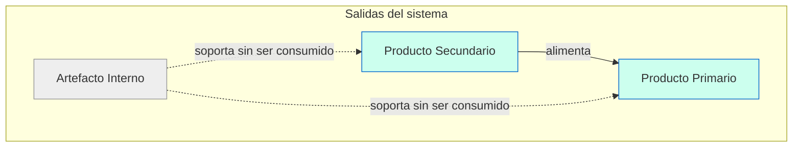
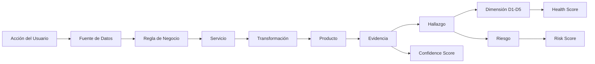
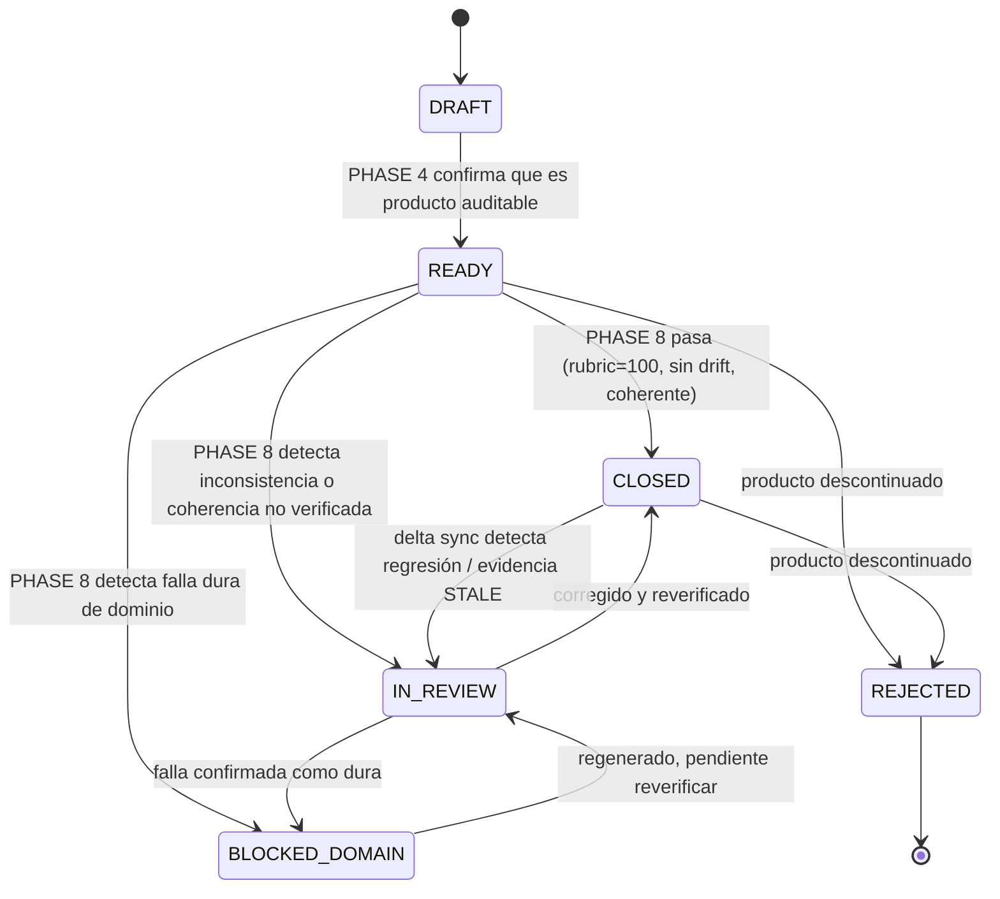
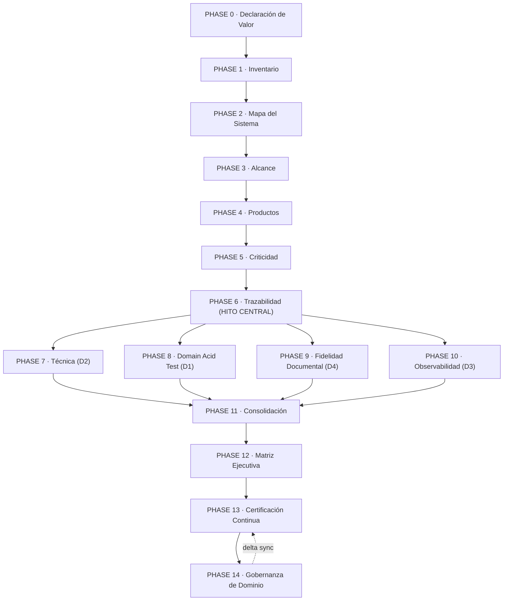
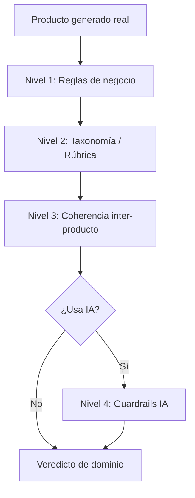

# PTSA V3 — ESPECIFICACIÓN OFICIAL

## Sistema de Auditoría y Certificación Continua para Sistemas Generativos

**Documento normativo.** Versión 3.1 — alineada con Methodology Suite **4.14.0**.
**Clase de documento:** Estándar Operativo y Normativo (Operational & Normative Standard).
**Estado:** EN VIGOR (binding).
**Sustituye a:** PTSA v2.0 (Motor PTSA v4.1) y al borrador `docs/methodology/Framework-PTSA.md` (3.0 Draft Candidate).
**Audiencia:** Auditores humanos, agentes auditores Claude, arquitectos, ingenieros de sistemas, especialistas de gobernanza de IA.
**Prompts operativos:** [PTSA-Prompts.md](PTSA-Prompts.md).

---

## Alineación con la Methodology Suite 4.14.0

Esta revisión **no cambia ningún requisito, fórmula, umbral ni procedimiento**. Cambia
únicamente la nomenclatura, para eliminar las colisiones que hacían ambigua la suite:

| Antes | Ahora | Motivo |
|:---|:---|:---|
| `F-1` … `F12` (15 fases) | `PHASE 0` … `PHASE 14` | `LEX-R01`: una sola palabra de paso en toda la suite. `F-1` y `F1` eran fases distintas con grafías casi idénticas. |
| `[Rnn]` | `PTSA-Rnn` | `LEX-R05`: `[R45]` colisionaba con `R-045`, que es un ítem de roadmap de FPGE. |
| `Fases/` `Hallazgos/` `Evidencias/` `Productos/` | `Phases/` `Findings/` `Evidence/` `Products/` | `LEX-R14`. |
| Estados en español (`ABIERTA`, `CERRADA`, `VALIDADO`, …) | Enumeración canónica de `LEXICON.md` §5 | `LEX-R07`: la suite tenía cuatro máquinas de estado en dos idiomas y tres grafías para «cerrado». |
| `Motor-PTSA.md` · `PTSA.md` | `PTSA-Prompts.md` | Esos dos archivos se citaban como autoridad normativa y **nunca existieron**. |

La tabla de equivalencia completa de fases está en [LEXICON.md](../LEXICON.md) §3.3 y
repetida junto al diagrama de la Parte VII. Los proyectos que instalaron PTSA v3.0 pueden
migrar con esa tabla; los identificadores `PTSA-Rnn` conservan su numeración original.

Las reglas de nivel suite que gobiernan a PTSA están en [RULES.md](../RULES.md) §Parte 6
(`PTSA-R01`..`PTSA-R12` en su forma resumida). Este documento sigue siendo la fuente
normativa exhaustiva.

---

## Nota editorial sobre el estatus normativo

Este documento es un **estándar**, no una guía ni una propuesta. Está redactado para que:

1. Un agente Claude sin contexto previo pueda implementar PTSA en su totalidad a partir de este único documento.
2. Dos auditores independientes que apliquen este estándar al mismo sistema lleguen a resultados equivalentes (reproducibilidad inter-auditor).
3. La metodología sea aplicable a **cualquier** sistema generativo, no únicamente al sistema de referencia (KnowTo).
4. El documento funcione simultáneamente como norma (qué se exige), manual operativo (cómo se ejecuta) y referencia (definiciones, fórmulas, plantillas).

### Convenciones de lenguaje normativo (RFC 2119 / ISO adaptado)

| Término | Significado normativo |
|:---|:---|
| **DEBE / DEBERÁ / OBLIGATORIO / SE EXIGE** | Requisito absoluto. Su incumplimiento invalida la auditoría. |
| **NO DEBE / PROHIBIDO** | Prohibición absoluta. Su violación invalida la auditoría. |
| **DEBERÍA / SE RECOMIENDA** | Requisito fuerte. Puede omitirse solo con justificación documentada en `PENDIENTES.md`. |
| **NO DEBERÍA / DESACONSEJADO** | Existen razones válidas para no hacerlo; requiere justificación. |
| **PUEDE / OPCIONAL / SE PERMITE** | Discrecional. No afecta el cumplimiento. |

Cuando este documento usa MAYÚSCULAS en estos términos, aplica el significado normativo de la tabla.

### Identificadores normativos

Cada requisito verificable de este estándar lleva un identificador `[Rxx]`. Los identificadores son estables entre revisiones: una vez asignados no se reutilizan. Un sistema "cumple PTSA V3" cuando satisface todos los requisitos marcados OBLIGATORIO aplicables a su clase de sistema.

---

# PARTE I — FUNDAMENTOS

## 1. Filosofía

### 1.1 El problema que PTSA resuelve

Los marcos tradicionales de aseguramiento de calidad —QA funcional, testing automatizado, cobertura de código, escaneo de vulnerabilidades, observabilidad de infraestructura— responden a la pregunta:

> ¿El software se ejecuta correctamente?

PTSA responde a una pregunta categóricamente distinta:

> ¿El producto que el sistema genera es válido, utilizable y confiable para el dominio de negocio declarado?

Estas dos preguntas son **independientes**. Un sistema puede:

* pasar el 100% de sus tests,
* tener cobertura total,
* carecer de vulnerabilidades conocidas,
* desplegar sin errores,
* responder con baja latencia,

y aun así producir documentos legalmente inválidos, cursos pedagógicamente incoherentes, reportes con datos alucinados, o certificados que no satisfacen la rúbrica del estándar profesional que dicen cumplir. En sistemas generativos basados en LLM, esta brecha es la norma, no la excepción: el motor de ejecución es correcto, pero la salida semántica es defectuosa.

### 1.2 La unidad de auditoría es el producto

PTSA postula que **la unidad real de auditoría es el producto generado**, no el componente técnico que lo produce. Un módulo de código, un endpoint, una tabla o un prompt no tienen valor auditable por sí mismos; solo importan en la medida en que explican cómo se construye un producto y si preservan la fidelidad al dominio.

Esta es la diferencia ontológica fundamental con respecto a las metodologías de QA centradas en componentes: PTSA audita **hacia atrás desde el entregable**, no hacia adelante desde el código.

### 1.3 Postura epistemológica: evidencia, no opinión

PTSA es un sistema de auditoría **forense**. Toda conclusión es una afirmación que requiere evidencia verificable, reproducible y fechada. Las palabras "probablemente", "debería funcionar", "parece correcto" están prohibidas como sustento de cualquier conclusión. Toda incertidumbre no es una conclusión: es un disparador de investigación.

### 1.4 Certificación continua, no evento puntual

En sistemas generativos, la validez del producto se degrada con el tiempo (drift de modelos, cambios de prompts, evolución del esquema, regresiones). Por tanto PTSA no es una auditoría "de una sola vez": es un proceso de **certificación continua** con scores que tienen una fecha de frescura (freshness) y caducan. Una certificación sin frescura declarada no es válida.

---

## 2. Objetivos

### 2.1 Objetivo primario

`PTSA-R01` PTSA DEBE demostrar, con evidencia, que los productos generados por un sistema son **legal, operativa y semánticamente válidos** para el dominio de negocio declarado en la Fase PHASE 0.

### 2.2 Objetivos secundarios

| ID | Objetivo |
|:---|:---|
| `PTSA-R02` | Producir un **Health Score** reproducible que cuantifique la salud del sistema sobre 5 dimensiones. |
| `PTSA-R03` | Producir un **Risk Score** que cuantifique la exposición operativa derivada de los hallazgos abiertos. |
| `PTSA-R04` | Producir un **Confidence Score** que cuantifique cuánto se puede confiar en la auditoría misma. |
| `PTSA-R05` | Mantener una **cadena de trazabilidad inversa** completa para cada producto: `Producto ← Transformación ← Servicio ← Regla ← Fuente de Datos ← Acción del Usuario`. |
| `PTSA-R06` | Mantener un **registro inmutable y acumulativo** de hallazgos, evidencias y operaciones. |
| `PTSA-R07` | Integrarse con el ciclo de desarrollo (CI/CD, delta sync) para detectar regresiones de dominio tempranamente. |
| `PTSA-R08` | Emitir una **clasificación de certificación** (A/B/C/F) auditable y defendible ante stakeholders. |

### 2.3 No-objetivos

PTSA **no** persigue:

* Demostrar que el software se ejecuta sin errores (eso es prerrequisito, no objetivo).
* Reemplazar tests unitarios, CI, linters o escáneres de seguridad (los consume como evidencia).
* Optimizar rendimiento o costo (fuera de alcance, salvo cuando afectan validez del producto).
* Cerrar hallazgos de tipo BUG sin validación humana (prohibido por diseño).

---

## 3. Alcance

### 3.1 Sistemas en alcance

`PTSA-R09` PTSA V3 SE APLICA a cualquier sistema que **genere productos consumibles** a partir de transformaciones, reglas y datos, incluyendo —pero no limitado a— sistemas que usan modelos de lenguaje (LLM), pipelines multi-agente, motores de reglas, generadores de documentos, y sistemas RAG.

### 3.2 Aplicabilidad condicional (guardrails de IA)

`PTSA-R10` La **Parte VIII Nivel 4 (Guardrails de IA)** y la **dimensión D5** se aplican OBLIGATORIAMENTE solo si el sistema usa generación con IA/LLM. Para sistemas puramente determinísticos, el Nivel 4 se marca `NO_APLICA` con justificación, y D5 se evalúa solo con sus métricas determinísticas (estabilidad, reproducibilidad).

### 3.3 Fronteras del alcance de cada auditoría

`PTSA-R11` Cada ejecución de auditoría DEBE declarar su alcance explícito (`audit-scope.yaml`, Parte IX). Un score emitido sin cobertura declarada NO PUEDE certificarse (ver `PTSA-R47`).

### 3.4 Independencia del dominio

`PTSA-R12` El núcleo de PTSA (dimensiones, scoring, fases, evidencia, lifecycle) es **agnóstico al dominio**. Las reglas de negocio específicas viven exclusivamente en la Declaración de Valor PHASE 0 y en las "Domain Rules as Code" (Parte VIII §15). Ningún artefacto del núcleo DEBE codificar reglas de un dominio particular.

---

## 4. Definiciones formales

Las siguientes definiciones son normativas. Cuando un término definido aparece en el cuerpo del estándar, se interpreta según esta sección.

| Término | Definición formal |
|:---|:---|
| **Sistema generativo** | Software cuyo valor primario es producir artefactos consumibles (documentos, datos estructurados, decisiones) mediante una o más transformaciones sobre datos de entrada. |
| **Producto** | Resultado identificable y consumible de una transformación del sistema. Se subclasifica en Primario, Secundario y Artefacto Interno (§5.1). |
| **Transformación** | Operación que convierte entradas en un producto. Puede ser determinística (código TS) o probabilística (invocación LLM). |
| **Servicio** | Componente de software que aloja o ejecuta una transformación (p. ej. un assembler, un orquestador de pipeline, un endpoint). |
| **Regla de negocio** | Restricción del dominio que el producto DEBE satisfacer (cálculo, rango, formato, taxonomía, obligatoriedad de campo). |
| **Fuente de datos** | Origen verificable de la información que alimenta una transformación (tabla, archivo, payload de usuario). |
| **Evidencia** | Fragmento verificable, fechado y con fingerprint, que respalda una afirmación de la auditoría (§16). |
| **Hallazgo** | Desviación registrada entre el estado observado y el estado esperado (§26). |
| **Dimensión** | Eje de calidad (D1–D5) sobre el cual se mide el sistema y al cual se imputan los hallazgos (Parte II). |
| **Riesgo** | Producto de la severidad/impacto de un hallazgo por su probabilidad de materialización (§14, §28). |
| **Score** | Valor numérico calculado a partir de evidencia. Existen tres: Health, Risk, Confidence (Parte III). |
| **Drift semántico** | Divergencia entre el significado declarado de un producto (en PHASE 0 o en un producto upstream) y el significado realmente generado. |
| **Cobertura de auditoría** | Conjunto declarado de elementos del sistema efectivamente examinados durante una ejecución. |
| **Frescura de score (freshness)** | Estado de vigencia de un score respecto a los cambios ocurridos desde su última verificación. |
| **Delta Sync** | Reauditoría incremental que reverifica solo lo afectado por cambios desde la última auditoría. |
| **Certificación** | Declaración fechada de que el sistema satisface un umbral de clasificación (A/B/C/F) con cobertura y frescura declaradas. |
| **Auditor** | Entidad que ejecuta PTSA. Puede ser un humano o un agente Claude operando bajo la Parte X. |
| **Sesión de auditoría (S-XXX)** | Una ejecución continua del loop de auditoría, identificada de forma única e incremental. |
| **PT-XXX** | Identificador de una unidad de trabajo de desarrollo (del marco FDGE) que originó o cerró un hallazgo. PTSA referencia PT-XXX pero no los administra. |

---

## 5. Ontología completa

### 5.1 Taxonomía de productos



| Clase | Definición | Auditable como producto | Ejemplos |
|:---|:---|:---:|:---|
| **Producto Primario** | Resultado consumido directamente por el usuario final o un sistema externo. | SÍ (siempre) | Documento final, curso generado, reporte, certificado, expediente ZIP. |
| **Producto Secundario** | Resultado consumido por otro producto del mismo sistema. | SÍ (si afecta a un primario) | JSON estructurado intermedio, taxonomía generada, resumen intermedio, `temario_base`. |
| **Artefacto Interno** | Elemento técnico no consumido externamente y sin efecto semántico sobre un producto. | NO (se audita como evidencia, no como producto) | Caché, logs, variables temporales, salidas crudas de agentes antes del ensamblado. |

`PTSA-R13` Todo producto Primario y todo producto Secundario que alimente a un Primario DEBE tener un archivo `Products/P-XXX.md` (§21).

### 5.2 Relaciones ontológicas centrales



La trazabilidad inversa (Axioma A3) recorre este grafo de derecha a izquierda partiendo siempre del Producto.

### 5.3 Relación dimensión ↔ hallazgo ↔ score

Un hallazgo pertenece a **exactamente una** dimensión (cardinalidad 1:1 hallazgo→dimensión). La fase en que se detecta (`fase_detectada`) y la dimensión que penaliza (`dimension`) son ortogonales: un hallazgo detectado en PHASE 7 puede penalizar D2 o D3 según su naturaleza.

---

## 6. Principios normativos (Axiomas)

Los axiomas son invariantes del sistema. Ningún procedimiento, atajo o instrucción del usuario los anula salvo un breakpoint manual explícito (§ Parte X).

### A1 — Evidencia sobre Opinión `PTSA-R14`
Toda afirmación de la auditoría DEBE estar respaldada por evidencia verificable. Sin evidencia, la afirmación es "no verificada" y se convierte en hallazgo o en entrada de investigación. Prohibidas como sustento: "probablemente", "debería", "parece".

### A2 — Producto sobre Implementación `PTSA-R15`
El valor auditado es el producto. El código solo importa en la medida en que afecta al producto. Auditar carpetas o módulos aislados sin trazarlos a un producto está PROHIBIDO.

### A3 — Trazabilidad Inversa `PTSA-R16`
Toda investigación inicia en el producto y se mueve hacia atrás: `Producto ← Transformación ← Servicio ← Regla ← Fuente de Datos ← Acción del Usuario`. Nunca al revés.

### A4 — Supremacía del Dominio (Regla del Agua Potable) `PTSA-R17`
La corrección técnica jamás compensa una falla de dominio. La calidad técnica es condición **necesaria**; la validez del producto es condición **suficiente**. Si el dominio falla, el sistema falla (operacionalizado por el cap de D1, §13.3).

### A5 — Auditoría Autónoma `PTSA-R18`
Si el auditor posee acceso suficiente para obtener evidencia directamente (terminal, shell, BD, logs), DEBE obtenerla él mismo. La evidencia de segunda mano tiene confiabilidad reducida y, si es la única disponible, baja el Confidence Score.

### A6 — Inmutabilidad `PTSA-R19`
Los hallazgos se cierran, nunca se borran. Las evidencias se reemplazan mediante nuevas revisiones, nunca se sobrescriben. El registro de auditoría (`AUDIT_LOG.md`) es append-only.

### A7 — Certificación Continua `PTSA-R20`
La auditoría es un proceso permanente, no un evento. Todo score caduca y DEBE renovarse mediante Delta Sync cuando hay cambios auditables.

### A8 — Cobertura Declarada `PTSA-R21`
Ningún score es válido sin una declaración explícita de cobertura (qué se auditó) y frescura (cuándo). Un score sin cobertura es nulo.

---

## 7. Glosario exhaustivo

| Término | Definición operativa |
|:---|:---|
| **Acid Test** | Conjunto de pruebas de dominio de 4 niveles ejecutadas en PHASE 8 (Parte VIII). |
| **audit-scope.yaml** | Archivo que declara patrones auditables, patrones ignorados y alcance del delta sync. |
| **audit_coverage** | Sección publicada en cada auditoría que enumera productos, endpoints, servicios, tablas, prompts, migraciones y docs cubiertos. |
| **audit_due** | Fecha a partir de la cual un producto requiere reauditoría; si vence, genera riesgo activo. |
| **Cap de dominio** | Regla que limita el Health Score al valor de D1 cuando D1 < 60. |
| **Clasificación** | Letra A/B/C/F derivada de Health + Risk + Confidence (§24). |
| **Confidence** | Score de confiabilidad de la propia auditoría (§15). |
| **Cross-coherencia** | Coherencia entre productos relacionados (Nivel 3 del Acid Test). |
| **Delta-append** | Modo de escritura que agrega bloques `## Update U-XXX` sin alterar lo previo. |
| **Dimensión (D1–D5)** | Eje de calidad. Ver Parte II. |
| **Domain Rules as Code** | Reglas objetivas del dominio implementadas como tests ejecutables. |
| **Drift de salida (Output Drift)** | Variación no controlada de la salida ante entradas equivalentes. |
| **Evidencia STALE** | Evidencia cuyo fingerprint ya no coincide con la fuente actual. |
| **Fingerprint** | Hash estructural del contenido de una evidencia, usado para detectar obsolescencia. |
| **Freshness (FRESH/STALE/UNKNOWN)** | Estado de vigencia de un score (§8, §15.4). |
| **Health Score** | Score de salud del sistema, ponderado sobre D1–D4 (D5 modula, §13). |
| **Hallazgo (H-XXX)** | Desviación registrada. Un archivo por hallazgo. |
| **Hallucination Rate** | Proporción de salidas con contenido alucinado (referencias/datos inventados). |
| **Motor PTSA** | Conjunto de reglas operativas que gobiernan al agente auditor. Esta Parte X las consolida. |
| **Multiplicador Global** | Sinónimo operativo del cap de dominio (§13.3). |
| **Penalización** | Puntos restados a una dimensión por un hallazgo, según su severidad (§27). |
| **Producto (P-XXX)** | Ver §5.1. Un archivo por producto. |
| **phase_confidence** | Confianza de una fase = mínimo de la confianza de sus hallazgos activos. |
| **RELACIONES.md** | Índice cache derivado; nunca fuente de verdad. |
| **Retry Rate** | Proporción de transformaciones que requirieron reintento. |
| **Riesgo (Risk)** | Impacto × Probabilidad de un hallazgo (§14). |
| **Score Freshness** | Ver Freshness. |
| **Sesión (S-XXX)** | Ejecución continua del loop de auditoría. |
| **Success Rate** | Proporción de transformaciones que produjeron un producto válido al primer intento. |
| **Trazabilidad inversa** | Recorrido Producto → Acción del Usuario (Axioma A3). |

---

# PARTE II — MODELO DE CALIDAD

El modelo de calidad de PTSA V3 consta de **cinco dimensiones**. Las cuatro primeras (D1–D4) componen el Health Score con pesos fijos; la quinta (D5) es un **modulador** y una fuente de hallazgos que penalizan a D2/D3 según su naturaleza, además de alimentar el Risk Score.

| Dim | Nombre | Peso en Health | Rol |
|:---:|:---|:---:|:---|
| **D1** | Alineación de Dominio | 30% + cap global | Gobierna la certificación |
| **D2** | Integridad Arquitectónica | 30% | Salud del código y datos |
| **D3** | Observabilidad y Recuperación | 30% | Trazabilidad y resiliencia |
| **D4** | Fidelidad Documental | 10% | Coherencia docs↔realidad |
| **D5** | Confiabilidad Operacional | Modulador | Estabilidad, drift, reproducibilidad |

`PTSA-R22` Cada hallazgo DEBE imputarse a **exactamente una** dimensión.

Para cada dimensión, este estándar define: propósito, métricas, cálculo de score, hallazgos permitidos, ejemplos y antipatrones.

---

## 8. D1 — Alineación de Dominio (Peso 30% + cap global)

### 8.1 Propósito
D1 mide si los productos generados son válidos para el dominio declarado en PHASE 0. Es la dimensión soberana: por la Regla del Agua Potable (A4), una falla grave de D1 tapa el Health Score completo. Responde a "¿el producto sirve para lo que dice servir?".

### 8.2 Qué evalúa
* Exactitud de reglas de negocio (cálculos, rangos, campos obligatorios, formatos).
* Cumplimiento taxonómico y de rúbrica del dominio (vocabulario correcto, términos prohibidos, estructura requerida).
* Coherencia semántica entre el producto y la intención declarada.
* Coherencia inter-producto (un producto downstream no contradice a uno upstream).

### 8.3 Métricas
| Métrica | Definición | Fuente |
|:---|:---|:---|
| `rubric_compliance_score` | % 0–100 de criterios de rúbrica satisfechos por el producto. | PHASE 8 Nivel 2 |
| `business_rule_pass_rate` | % de reglas objetivas (Domain Rules as Code) que pasan. | PHASE 8 Nivel 1 |
| `semantic_drift_detected` | Booleano: ¿el producto se desvió del significado declarado? | PHASE 8 Nivel 2/3 |
| `cross_coherence_verified` | Booleano: ¿coherente con productos relacionados? | PHASE 8 Nivel 3 |

### 8.4 Cálculo de score
```
Score_D1 = 100 − Σ(penalización de cada hallazgo D1 activo)
```
Con piso en 0. Un producto solo transita a `CLOSED` (§23) si `rubric_compliance_score = 100`, sin drift y con coherencia verificada.

### 8.5 Hallazgos permitidos en D1
Reglas de negocio violadas; verbos/términos prohibidos en el producto; ponderaciones que no suman lo exigido; placeholders sin resolver en producto final; referencias inventadas (alucinación de dominio); incoherencia entre un producto y su upstream; idioma incorrecto del producto (Prompt Bleeding con impacto semántico).

### 8.6 Ejemplos
* **Conforme:** Un instrumento de evaluación cuyas ponderaciones suman 100%, sin verbos prohibidos, con el número mínimo de ítems por unidad.
* **Hallazgo (real, H-008):** Instrumento "mixto" que combina tipos de evaluación incompatibles con la rúbrica → `BLOCKED_DOMAIN`, severidad ALTA.
* **Hallazgo (real, H-010):** El objetivo de unidad hereda el verbo prohibido "Identificar" desde el producto upstream (Temario) → propaga drift a través de la cadena.

### 8.7 Antipatrones
* **"Pasó los tests, luego el dominio está bien"** — falacia central que PTSA combate.
* **Validar el producto con pruebas unitarias** en lugar de extraer y evaluar la salida semántica real (PROHIBIDO, ver PHASE 8).
* **Marcar `aprobado_con_errores` y tratarlo como aprobado** — un estado de aprobación con errores conocidos es un hallazgo D1, no un pase.

---

## 9. D2 — Integridad Arquitectónica (Peso 30%)

### 9.1 Propósito
D2 mide la salud del código, la arquitectura, las dependencias, la seguridad y la integridad de la base de datos: los prerrequisitos técnicos que habilitan (sin garantizar) la validez del producto.

### 9.2 Qué evalúa
* Calidad y consistencia del código y de los contratos entre módulos.
* Seguridad (vulnerabilidades de dependencias, secretos expuestos, validación de entrada).
* Conformidad de la arquitectura real con la documentada (sin reglas de negocio en gateways, assemblers que retornan correctamente, etc.).
* Integridad del esquema de BD (estado real verificado, no solo migraciones).
* Deuda técnica con impacto en mantenibilidad.

### 9.3 Métricas
| Métrica | Definición |
|:---|:---|
| `test_pass_rate` | % de tests que pasan en la suite completa. |
| `critical_vuln_count` | Vulnerabilidades de severidad alta/crítica en dependencias. |
| `schema_drift_count` | Diferencias entre esquema real de BD y migraciones declaradas. |
| `arch_rule_violations` | Violaciones a las reglas de arquitectura declaradas. |

### 9.4 Cálculo de score
```
Score_D2 = 100 − Σ(penalización de cada hallazgo D2 activo)
```

### 9.5 Hallazgos permitidos en D2
Tests rotos o ausentes; vulnerabilidades de dependencias; secretos en el repositorio; overloads ambiguos de funciones de BD; columnas faltantes; lógica de negocio en un gateway de solo-lectura; assembler que no retorna `finalDoc`; artefactos generados commitados al repo; violaciones a reglas de arquitectura.

### 9.6 Ejemplos
* **Hallazgo (real, H-015, CRÍTICA):** Overload de 4 parámetros de `sp_save_document` ambiguo → resuelto por migración 051.
* **Hallazgo (real, H-013, ALTA):** Columna `status` faltante → migración 048 + fallback 42703.
* **Conforme:** Suite de 361 tests al 100%, sin vulnerabilidades críticas, esquema real == migraciones.

### 9.7 Antipatrones
* Aceptar archivos de migración como verdad del esquema sin verificar el motor en ejecución (PROHIBIDO en PHASE 7).
* Tratar warnings de seguridad como cosméticos.
* Confundir cobertura de código con validez de producto (eso es D1).

---

## 10. D3 — Observabilidad y Recuperación (Peso 30%)

### 10.1 Propósito
D3 mide si el sistema es observable y recuperable: si deja rastro suficiente para reconstruir qué pasó, si detecta sus propios fallos y si se recupera de ellos. Incluye trazabilidad de datos y de prompts.

### 10.2 Qué evalúa
* Logging estructurado y suficiente (no asumir que el logging funciona — verificarlo en vivo).
* Trazabilidad de cada producto hasta su origen (cadena PHASE 6).
* Comportamiento de fallbacks: ¿degradan con calidad o silenciosamente?
* Recuperación ante fallos parciales (reintentos, jobs idempotentes).
* Trazabilidad de IA: ¿se registra qué prompt y qué modelo generó cada salida?

### 10.3 Métricas
| Métrica | Definición |
|:---|:---|
| `trace_completeness` | % de productos con cadena de trazabilidad PHASE 6 completa. |
| `silent_failure_count` | Fallos que no dejan rastro en logs. |
| `fallback_quality` | Evaluación de la calidad garantizada por los fallbacks (alta/media/nula). |
| `prompt_provenance` | ¿Se registra prompt+modelo por salida? (sí/parcial/no) |

### 10.4 Cálculo de score
```
Score_D3 = 100 − Σ(penalización de cada hallazgo D3 activo)
```

### 10.5 Hallazgos permitidos en D3
Logs ausentes o no estructurados; fallos silenciosos; cadena de trazabilidad rota; fallback que devuelve contenido vacío sin marcarlo; falta de variables de entorno de observabilidad; ausencia de procedencia de prompt/modelo; endpoint de recuperación faltante.

### 10.6 Ejemplos
* **Hallazgo (real, H-025, MEDIA):** Falta endpoint para recuperar documentos del expediente → se agregó `GET /documents` + fallback BD.
* **Hallazgo (real, H-011, BAJA):** Falta `TAVILY_API_KEY` en `.dev.vars.example` → afecta reproducibilidad observacional.

### 10.7 Antipatrones
* Asumir que el logging funciona sin leer logs en vivo (PROHIBIDO en PHASE 10).
* Fallbacks que "completan" un job con contenido vacío (apariencia de éxito).
* Trazabilidad documentada pero no verificada contra ejecución real.

---

## 11. D4 — Fidelidad Documental (Peso 10%)

### 11.1 Propósito
D4 mide la coherencia entre la documentación del sistema (README, CLAUDE.md, PRD, TRD, diagramas) y la realidad observable del código y la arquitectura.

### 11.2 Qué evalúa
* Rutas, comandos y estructura documentados == reales.
* Diagramas (arquitectura, ERD, flujo) == implementación.
* Modelos, conteos de tests, configuraciones citadas == actuales.
* Decisiones de arquitectura documentadas y vigentes.

### 11.3 Métricas
| Métrica | Definición |
|:---|:---|
| `doc_accuracy_rate` | % de afirmaciones documentales verificadas como ciertas. |
| `diagram_drift_count` | Nº de divergencias diagrama↔realidad. |

### 11.4 Cálculo de score
```
Score_D4 = 100 − Σ(penalización de cada hallazgo D4 activo)
```

### 11.5 Hallazgos permitidos en D4
Rutas obsoletas en docs; comandos que no existen; modelos/configuraciones desactualizados; diagramas divergentes; conteos incorrectos; secciones del PRD/TRD contradichas por el código.

### 11.6 Ejemplos
* **Hallazgo (real, H-001, MEDIA):** README/CLAUDE.md referencian rutas antiguas (`backend/` en vez de `src/backend/`).
* **Hallazgo (real, H-003):** README documenta un modelo distinto al usado.

### 11.7 Antipatrones
* "La documentación se actualizará después" como estado permanente.
* Diagramas decorativos no confrontados con la realidad (PHASE 9 exige confrontación).

---

## 12. D5 — Confiabilidad Operacional (Modulador)

### 12.1 Propósito
D5 es la dimensión nueva de V3. Mide la **estabilidad y reproducibilidad operacional** del sistema generativo en el tiempo: ¿produce resultados consistentes y confiables ejecución tras ejecución? Es especialmente crítica para sistemas con LLM, donde la misma entrada puede producir salidas divergentes.

### 12.2 Rol como modulador
D5 **no** tiene un peso fijo en la fórmula del Health Score. En su lugar:
1. Sus hallazgos se imputan a D2 (si el problema es de implementación, p. ej. ausencia de control de drift) o a D3 (si es de observabilidad/recuperación) y penalizan esa dimensión.
2. Sus métricas alimentan directamente el **Risk Score** (§14) y un **factor de modulación** del Confidence Score (§15).
3. D5 se reporta siempre como bloque propio en PHASE 12 con sus métricas crudas, aunque no tenga peso directo en Health.

`PTSA-R23` Para sistemas con IA, D5 DEBE evaluarse. Para sistemas determinísticos, D5 se evalúa solo con métricas de estabilidad/reproducibilidad y `Hallucination Rate` se marca `NO_APLICA`.

### 12.3 Métricas (obligatorias)
| Métrica | Definición | Cómo se mide |
|:---|:---|:---|
| **Success Rate** | % de transformaciones que producen un producto válido al primer intento. | Logs de pipeline / tabla de jobs. |
| **Retry Rate** | % de transformaciones que requirieron ≥1 reintento. | Logs / contador de reintentos. |
| **Failure Rate** | % de transformaciones que fallaron definitivamente. | Logs / estado de jobs. |
| **Hallucination Rate** | % de salidas con contenido alucinado (URLs/referencias/datos sin fuente). | Muestreo + detector de alucinaciones. |
| **Output Drift** | Variación de salida ante entradas equivalentes repetidas (distancia semántica). | Ejecuciones repetidas controladas. |

### 12.4 Umbrales de referencia (configurables por PHASE 0)
| Métrica | Verde | Ámbar | Rojo |
|:---|:---:|:---:|:---:|
| Success Rate | ≥ 95% | 85–95% | < 85% |
| Retry Rate | ≤ 10% | 10–25% | > 25% |
| Failure Rate | ≤ 2% | 2–8% | > 8% |
| Hallucination Rate | ≤ 1% | 1–5% | > 5% |
| Output Drift | bajo | medio | alto |

`PTSA-R24` Los umbrales DEBEN declararse en PHASE 0; los de esta tabla son los valores por defecto cuando PHASE 0 no los especifica.

### 12.5 Hallazgos permitidos (imputados a D2 o D3)
Ausencia de medición de Success/Failure Rate (D3); fallbacks que disparan por timeout sin garantía de calidad (D3); drift de salida no controlado (D2/D3); detector de alucinaciones ausente cuando el dominio lo exige (D2); reintentos no idempotentes (D2).

### 12.6 Ejemplos
* **Rojo:** Un pipeline cuyo `juez` fuerza una selección por timeout en el 30% de los casos, sin garantía de calidad del fallback → hallazgo D3 ALTA + Risk elevado.
* **Verde:** Success Rate 97%, Hallucination Rate 0.5%, drift bajo, con métricas publicadas.

### 12.7 Antipatrones
* No medir D5 en absoluto ("el pipeline corre, eso basta").
* Reportar Success Rate sin definir qué cuenta como "válido" (debe ligarse a validez de dominio, no a "no lanzó excepción").
* Fallback de baja calidad presentado como recuperación exitosa.

---

# PARTE III — MODELO DE SCORING

PTSA V3 produce **tres scores independientes y complementarios**. Ninguno sustituye a los otros. La certificación (§24) los combina.

| Score | Rango | Pregunta que responde | Caduca |
|:---|:---:|:---|:---:|
| **Health** | 0–100 | ¿Qué tan sano está el sistema hoy? | Sí (freshness) |
| **Risk** | 0–100 (o nivel) | ¿Cuánta exposición operativa hay? | Sí |
| **Confidence** | 0–100 | ¿Cuánto puedo confiar en esta auditoría? | Sí |

`PTSA-R25` Toda emisión de scores DEBE registrarse en `score-history.json` (§22) con fecha, sesión y cobertura.

---

## 13. Health Score

### 13.1 Definición
El Health Score representa la salud actual del sistema, ponderada sobre las cuatro dimensiones de peso fijo.

### 13.2 Fórmula base
```
Score_Dn = max(0, 100 − Σ penalización(hallazgos activos de Dn))

Health_calculado = (D1 × 0.30) + (D2 × 0.30) + (D3 × 0.30) + (D4 × 0.10)
```

Pesos normativos (suman 1.00):

| Dimensión | Peso |
|:---|:---:|
| D1 | 0.30 |
| D2 | 0.30 |
| D3 | 0.30 |
| D4 | 0.10 |

`PTSA-R26` Los pesos son fijos y NO DEBEN alterarse por auditoría. D5 no participa en esta suma (es modulador, §12.2).

### 13.3 Cap de dominio (Regla del Agua Potable / Multiplicador Global)
```
SI D1 < 60:
    Health = min(Health_calculado, D1)
EN CASO CONTRARIO:
    Health = Health_calculado
```

`PTSA-R27` Cuando el cap aplica, PHASE 12 y RESUMEN.md DEBEN declararlo explícitamente ("Multiplicador Global APLICA").

### 13.4 Modulación opcional por D5
Cuando D5 está en estado **Rojo** en cualquier métrica crítica (Hallucination Rate o Failure Rate en rojo), el Health Score se reporta con una **bandera de inestabilidad** (`health_unstable: true`). La bandera no altera el número, pero impide una clasificación superior a **B** (§24.4). Esto evita certificar como "A" un sistema con producto correcto pero comportamiento errático.

### 13.5 Límites
* Cada `Score_Dn` está acotado a `[0, 100]`.
* `Health` está acotado a `[0, 100]`.
* Las penalizaciones se suman aritméticamente; no hay penalización negativa.

### 13.6 Ejemplos numéricos

**Ejemplo 1 — Sistema sano (caso real KnowTo S-009):**
```
D1 = 75, D2 = 100, D3 = 100, D4 = 100
Health_calculado = 75×0.30 + 100×0.30 + 100×0.30 + 100×0.10
                 = 22.5 + 30.0 + 30.0 + 10.0 = 92.5
D1 = 75 ≥ 60 → cap NO aplica
Health = 92.5 → Clasificación A
```

**Ejemplo 2 — Cap de dominio activo:**
```
D1 = 45, D2 = 100, D3 = 100, D4 = 100
Health_calculado = 13.5 + 30 + 30 + 10 = 83.5
D1 = 45 < 60 → Health = min(83.5, 45) = 45
Health = 45 → Clasificación F (NO certificable, pese a técnica perfecta)
```
Este ejemplo es la Regla del Agua Potable en acción: técnica impecable, dominio inválido ⇒ sistema no certificable.

**Ejemplo 3 — Borde D1 = 60:**
```
D1 = 60 → cap NO aplica (la condición es estricta: D1 < 60)
D2 = 70, D3 = 70, D4 = 70
Health = 60×0.30 + 70×0.30 + 70×0.30 + 70×0.10 = 18 + 21 + 21 + 7 = 67
Health = 67 → Clasificación C
```

**Ejemplo 4 — D5 inestable degrada la clasificación:**
```
D1 = 95, D2 = 95, D3 = 92, D4 = 100 → Health = 94.6 (sería A)
Pero Hallucination Rate = 8% (rojo) → health_unstable: true
Clasificación tope = B (no A) hasta estabilizar D5.
```

### 13.7 Casos borde
* **Sin hallazgos:** `Score_Dn = 100` para toda dimensión sin hallazgos activos.
* **Producto único auditado:** El Health es válido pero el Confidence será bajo por cobertura mínima (§15).
* **Hallazgo con `producto_id: null` (sistémico):** Penaliza la dimensión pero no se imputa a un producto.

---

## 14. Risk Score

### 14.1 Definición
El Risk Score representa la exposición operativa: el daño potencial agregado de los hallazgos abiertos, ponderado por su probabilidad de materialización.

### 14.2 Matriz de riesgo (Impacto × Probabilidad)
Cada hallazgo activo recibe un **valor de riesgo** según la matriz:

| Impacto \ Probabilidad | Improbable (1) | Posible (2) | Probable (3) | Frecuente (4) |
|:---|:---:|:---:|:---:|:---:|
| **Bajo (1)** | 1 | 2 | 3 | 4 |
| **Medio (2)** | 2 | 4 | 6 | 8 |
| **Alto (3)** | 3 | 6 | 9 | 12 |
| **Crítico (4)** | 4 | 8 | 12 | 16 |

```
riesgo(h) = Impacto(h) × Probabilidad(h)        ∈ [1, 16]
```

### 14.3 Nivel de riesgo del hallazgo
| Valor | Nivel |
|:---:|:---|
| 1–3 | BAJO |
| 4–7 | MEDIO |
| 8–11 | ALTO |
| 12–16 | CRÍTICO |

### 14.4 Risk Score del sistema (0–100, mayor = peor)
```
Risk_bruto = Σ riesgo(h) sobre todos los hallazgos activos
Risk_max   = 16 × N_hallazgos_activos        (cota superior teórica)

Risk_Score = round( 100 × Risk_bruto / max(Risk_max, 1) )   ... NO

```
La normalización anterior tiende a aplanar; PTSA usa en su lugar una escala absoluta con saturación:
```
Risk_Score = min(100, Risk_bruto × 4)
```
Donde el factor 4 calibra la escala para que ~25 puntos de riesgo bruto saturen el score. Equivalente: cada punto de riesgo bruto suma 4 al Risk Score, con techo en 100.

### 14.5 Clasificación de riesgo del sistema
| Risk_Score | Nivel del sistema |
|:---:|:---|
| 0–15 | BAJO |
| 16–40 | CONTROLADO |
| 41–70 | SIGNIFICATIVO |
| 71–100 | CRÍTICO |

### 14.6 Modulación por D5
`PTSA-R28` Las métricas D5 en rojo añaden riesgo bruto: cada métrica crítica de D5 en estado Rojo suma **+3** al `Risk_bruto` (tratada como un hallazgo de impacto Alto/Probable).

### 14.7 Ejemplos numéricos

**Ejemplo (caso real, 3 hallazgos D1 activos KnowTo):**
```
H-008: Impacto Alto (3) × Probable (3) = 9 (ALTO)
H-009: Impacto Medio (2) × Posible (2) = 4 (MEDIO)
H-010: Impacto Medio (2) × Posible (2) = 4 (MEDIO)
Risk_bruto = 9 + 4 + 4 = 17
Risk_Score = min(100, 17×4) = 68 → SIGNIFICATIVO
```

**Ejemplo (sistema sin hallazgos):**
```
Risk_bruto = 0 → Risk_Score = 0 → BAJO
```

### 14.8 Casos borde
* **Hallazgo IN_REVIEW pero no DONE:** se cuenta como activo a efectos de riesgo hasta su verificación (riesgo residual).
* **Hallazgo sin Impacto/Probabilidad asignados:** PROHIBIDO; todo hallazgo activo DEBE tener ambos para computar riesgo (`PTSA-R29`).

---

## 15. Confidence Score

### 15.1 Definición
El Confidence Score mide cuánto se puede confiar en la **auditoría misma** —no en el sistema—. Un Health alto con Confidence bajo significa "el sistema parece sano, pero la auditoría es débil".

### 15.2 Factores (cada uno 0–100)
| Factor | Definición | Peso |
|:---|:---|:---:|
| **Cobertura** (`coverage`) | % de elementos auditables efectivamente examinados (productos, endpoints, servicios, tablas, prompts, migraciones, docs). | 0.40 |
| **Vigencia** (`freshness`) | Frescura de los scores (FRESH=100, STALE=50, UNKNOWN=0). | 0.25 |
| **Evidencia válida** (`evidence_validity`) | % de evidencias en estado VALID (vs STALE/MISSING). | 0.20 |
| **Autonomía** (`autonomy`) | % de evidencia obtenida de primera mano (shell/BD/logs en vivo) vs de segunda mano. | 0.15 |

### 15.3 Fórmula
```
Confidence = coverage×0.40 + freshness×0.25 + evidence_validity×0.20 + autonomy×0.15
```
Acotado a `[0, 100]`.

### 15.4 Freshness (vigencia)
```
score_freshness:
  last_verified: <fecha>
  commits_since_audit: <n>
  status: FRESH | STALE | UNKNOWN
```
Reglas de estado:
| Estado | Condición |
|:---|:---|
| **FRESH** | `commits_since_audit == 0` sobre patrones auditables, o último delta sync ≤ ventana declarada. |
| **STALE** | Existen commits sobre patrones auditables sin reauditar, o venció `audit_due`. |
| **UNKNOWN** | No se puede determinar (sin baseline, sin `audit-scope.yaml`). |

`PTSA-R30` Una certificación con `freshness = UNKNOWN` NO PUEDE clasificarse por encima de **C**.

### 15.5 Ejemplos numéricos

**Ejemplo (auditoría madura):**
```
coverage = 90, freshness = 100 (FRESH), evidence_validity = 100, autonomy = 95
Confidence = 90×0.40 + 100×0.25 + 100×0.20 + 95×0.15
           = 36 + 25 + 20 + 14.25 = 95.25 → ALTA
```

**Ejemplo (auditoría parcial y stale):**
```
coverage = 40, freshness = 50 (STALE), evidence_validity = 80, autonomy = 60
Confidence = 16 + 12.5 + 16 + 9 = 53.5 → BAJA
→ El Health resultante NO es certificable como A/B aunque sea alto.
```

### 15.6 Acoplamiento con la clasificación
La clasificación de certificación (§24) exige umbrales mínimos de Confidence además de Health. Un Health A con Confidence < 90 NO obtiene clasificación A (§24.2).

### 15.7 Casos borde
* **Cobertura 100% pero todo de segunda mano:** Confidence techo ≈ 85 (autonomía limita). Se exige obtener evidencia directa donde el acceso lo permita (A5).
* **Auditoría recién iniciada:** Confidence bajo es esperado y honesto; no se infla.

---

# PARTE IV — MODELO DE EVIDENCIA

## 16. Evidencias

### 16.1 Definición normativa
Una evidencia es un fragmento de realidad capturado, verificable, fechado y con fingerprint, que respalda una o más afirmaciones de la auditoría. **El código no es evidencia; la observación del código sí lo es.** La ejecución, la lectura del esquema real, el contenido de un log en vivo, el texto real de un producto generado — eso es evidencia.

`PTSA-R31` Toda afirmación que sustente un hallazgo o una validación DEBE referenciar al menos una evidencia.

### 16.2 Tipos de evidencia
| Tipo | Origen típico | Cómo se captura |
|:---|:---|:---|
| `codigo` | Fragmento de fuente. | Lectura de archivo con rango de líneas. |
| `log` | Salida de ejecución en vivo. | Lectura de logs de contenedor/proceso. |
| `base_datos` | Estado real del esquema o de los datos. | Query directa (psql/equivalente). |
| `infraestructura` | Configuración de despliegue/red. | Inspección de contenedores, compose, env. |
| `configuracion` | Archivos de config y env. | Lectura de archivo. |
| `documentacion` | Afirmaciones documentales. | Lectura de docs + confrontación con realidad. |
| `prueba` | Resultado de tests ejecutados. | Ejecución de la suite + captura de salida. |

### 16.3 Schema YAML completo de evidencia (`Evidence/E-XXX.md`)
```yaml
---
id: E-001                         # OBLIGATORIO, único, incremental
tipo: documentacion               # OBLIGATORIO, ∈ {codigo, log, base_datos, infraestructura, configuracion, documentacion, prueba}
origen: README.md                 # OBLIGATORIO, ruta/comando/query que la produjo
lineas: 153-180                   # OPCIONAL (obligatorio si tipo=codigo|documentacion sobre archivo)
capturada: 2026-06-13             # OBLIGATORIO, fecha de captura (ISO interno; nunca en el producto)
fingerprint: SHA256-estructural-readme-estructura-dirs   # OBLIGATORIO (§17)
estado: VALID                     # OBLIGATORIO en V3 ∈ {VALID, STALE, MISSING}
---

# E-001 — <título corto>

## Contenido capturado
<bloque literal del fragmento observado>

## Observación
<qué muestra la evidencia, sin interpretación de causa>
```

`PTSA-R32` El cuerpo de una evidencia DEBE contener el contenido capturado literal y una observación factual, sin conclusiones de causa (las causas viven en el hallazgo).

---

## 17. Fingerprints

### 17.1 Propósito
El fingerprint permite detectar si la realidad que la evidencia capturó **cambió** desde la captura. Es el mecanismo que hace caducar la evidencia (y por extensión, la frescura del score).

### 17.2 Definición
```
fingerprint = "SHA256-estructural-" + slug(descriptor)
```
Donde el hash se calcula sobre el **contenido estructural** del fragmento (no sobre bytes volátiles como timestamps o whitespace irrelevante). Para código: el cuerpo normalizado (sin comentarios triviales). Para BD: la definición del objeto (DDL normalizado). Para docs: el texto de las líneas citadas normalizado.

`PTSA-R33` El fingerprint DEBE ser recomputable de forma determinista a partir del `origen` + `lineas`. Dos auditores que recapturen la misma fuente DEBEN obtener el mismo fingerprint.

### 17.3 Normalización estructural (mínima exigida)
1. Eliminar whitespace al inicio/fin de línea.
2. Colapsar runs de espacios internos a uno solo.
3. Eliminar líneas en blanco consecutivas.
4. Para código: ignorar comentarios de una línea triviales; conservar la lógica.
5. Calcular SHA-256 del resultado; tomar prefijo legible + slug descriptivo.

---

## 18. Validación de evidencias

### 18.1 Estados
| Estado | Significado | Acción |
|:---|:---|:---|
| **VALID** | El fingerprint recomputado coincide con el registrado. | Ninguna. |
| **STALE** | La fuente existe pero su fingerprint cambió. | Recapturar y revisar hallazgos dependientes. |
| **MISSING** | La fuente (archivo/línea/objeto BD) ya no existe. | Recapturar o marcar el hallazgo para revisión. |

### 18.2 Procedimiento de validación
`PTSA-R34` En cada Delta Sync (§ Parte IX) el auditor DEBE, para cada evidencia referenciada por un hallazgo activo:
1. Resolver `origen` (+`lineas`).
2. Recomputar el fingerprint según §17.
3. Comparar con el registrado y asignar estado VALID/STALE/MISSING.
4. Si STALE o MISSING: agregar una `## Revisión` al hallazgo dependiente y recapturar la evidencia como nueva revisión (nunca sobrescribir, A6).

### 18.3 Efecto en Confidence
El factor `evidence_validity` del Confidence Score (§15.2) es:
```
evidence_validity = 100 × (#VALID) / (#VALID + #STALE + #MISSING)
```

---

## 19. Obsolescencia

### 19.1 Disparadores de obsolescencia
Una evidencia se vuelve obsoleta (STALE/MISSING) cuando:
* Cambia el archivo/línea/objeto que la originó.
* Se reorganiza la estructura del repositorio.
* Cambia el esquema de BD.
* Se actualiza la documentación citada.

### 19.2 Regla de no sobrescritura (A6)
`PTSA-R35` Una evidencia obsoleta NO DEBE editarse en su lugar. Se conserva el archivo original y se crea una **revisión** (nueva evidencia o bloque de revisión) que la reemplaza. El historial de qué se observó y cuándo es inmutable.

### 19.3 Propagación
Cuando una evidencia base de un hallazgo se vuelve STALE/MISSING, el hallazgo transita (si aplica) a `REOPENED` o `IN_REVIEW` hasta reverificar.

---

## 20. Trazabilidad

### 20.1 Cadena obligatoria
`PTSA-R36` Para cada producto, PHASE 6 DEBE construir al menos una cadena completa e ininterrumpida:
```
Producto ← Transformación ← Servicio ← Regla ← Fuente de Datos ← Acción del Usuario
```
Cada eslabón se respalda con evidencia.

### 20.2 Representación en el producto
La cadena se documenta en el cuerpo del archivo `Products/P-XXX.md` (ver plantilla en §21.3 y Anexo). Ejemplo real (P-011):
```
P-011 Manual del Participante
  ← p4-document.assembler.ts / handleDocumentP4Assembler
  ← pipeline_agent_outputs (por módulo/capítulo)
  ← F4_P4_GENERATE_DOCUMENT.md → F4_P4_GENERATE_CHAPTER.md
  ← enrichedContext: temario_base, PHASE 4 specs
  ← Fuente: temario_base WHERE project_id=?, fase3_especificaciones WHERE project_id=?
  ← Acción usuario: completar formulario PHASE 6-P4 en wizard
```

### 20.3 Criterio de completitud
PHASE 6 está completa para un producto solo si **todos** los eslabones existen y cada uno está respaldado por evidencia. Una cadena rota es un hallazgo D3.

---

# PARTE V — PRODUCTOS

## 21. Ontología de productos

### 21.1 Qué se modela como producto
Ver §5.1. Se crea un archivo `Products/P-XXX.md` para cada Producto Primario y para cada Producto Secundario que alimente a un Primario.

### 21.2 Schema YAML completo (`Products/P-XXX.md`)
```yaml
---
producto_id: P-001                # OBLIGATORIO, único
nombre: Marco de Referencia       # OBLIGATORIO
clase: primario                   # OBLIGATORIO ∈ {primario, secundario}
criticidad: ALTA                  # OBLIGATORIO ∈ {BAJA, MEDIA, ALTA, CRITICA}  (asignada en PHASE 5)
estado: DRAFT                  # OBLIGATORIO ∈ ciclo de vida §23
dimension_primaria: D1            # OBLIGATORIO (dimensión que gobierna su validez)
confidence: 0                     # OBLIGATORIO 0-100
audit_due: 2026-09-01             # OBLIGATORIO (§ Parte IX)
domain_validation:
  semantic_drift_detected: false
  rubric_compliance_score: null   # % 0-100; null hasta que PHASE 8 lo evalúe
  cross_coherence_verified: false
hallazgos_relacionados: []        # lista de H-XXX
---
```

### 21.3 Cuerpo obligatorio del archivo de producto
1. **Descripción** del producto y su rol en el dominio.
2. **Fuente de generación** (template, handlers, assembler, tabla BD).
3. **Cadena de trazabilidad** (§20.2).
4. **Invariantes de dominio verificados en PHASE 8** (checklist con estado).
5. **Estado de validación** y hallazgos que lo causan.
6. **Notas de coherencia inter-producto**.

---

## 22. Lifecycle

### 22.1 Diagrama de ciclo de vida


---

## 23. Estados

| Estado | Definición | ¿Cierre válido? |
|:---|:---|:---:|
| **DRAFT** | Candidato a producto, aún no confirmado en PHASE 4. | No (nunca al cierre) |
| **READY** | Confirmado como producto auditable; aún sin veredicto de dominio. | Solo si PHASE 8 no ejecutado y declarado pendiente |
| **CLOSED** | Pasó todas las verificaciones técnicas Y `rubric_compliance_score = 100`, sin drift, con cross-coherencia. | Sí |
| **IN_REVIEW** | Inconsistencia detectada o coherencia no verificada; requiere acción. | Sí (estado final documentado) |
| **BLOCKED_DOMAIN** | Falla dura de dominio; el producto no es válido. | Sí (estado final documentado) |
| **REJECTED** | Producto descontinuado; fuera de alcance vigente. | Sí |

`PTSA-R37` Al cierre de la auditoría, ningún producto DEBE permanecer en `DRAFT`. Todo producto DEBE tener estado final (CLOSED, IN_REVIEW, BLOCKED_DOMAIN o REJECTED).

---

## 24. Reglas de transición

`PTSA-R38` Las transiciones de estado de producto DEBEN respetar la tabla siguiente. Toda transición se registra con la sesión y el hallazgo/evidencia que la motiva.

| Desde | Hacia | Condición de disparo | Evidencia requerida |
|:---|:---|:---|:---|
| DRAFT | READY | PHASE 4 confirma producto auditable. | Inventario PHASE 4 |
| READY | CLOSED | PHASE 8: `rubric=100` ∧ `¬drift` ∧ `cross_coherence`. | PHASE 8 Niveles 1–3 (y 4 si IA) |
| READY | IN_REVIEW | PHASE 8 detecta inconsistencia o coherencia no verificable. | Hallazgo + evidencia |
| READY | BLOCKED_DOMAIN | PHASE 8 detecta falla dura (regla crítica violada). | Hallazgo CRÍTICO/ALTO |
| IN_REVIEW | CLOSED | Corrección verificada en la fuente real (BD/salida). | Evidencia post-fix VALID |
| BLOCKED_DOMAIN | IN_REVIEW | Producto regenerado, pendiente reverificar. | Evidencia de regeneración |
| CLOSED | IN_REVIEW | Delta sync: regresión o evidencia STALE/MISSING. | Evidencia STALE/MISSING |
| cualquiera | REJECTED | Producto descontinuado por el dominio. | Decisión documentada |

`PTSA-R39` La transición a CLOSED desde un estado de fallo NUNCA se hace por inferencia: requiere evidencia post-corrección **observada en la fuente real** (p. ej. `validacion_estado = 'aprobado'` verificado en BD), no por el hecho de haber editado el código.

---

## 25. Casos especiales

* **Producto con `aprobado_con_errores`:** No es CLOSED. Se modela como IN_REVIEW con un hallazgo D1 que describe los errores tolerados (caso real P-011).
* **Producto dependiente de un upstream rechazado:** Hereda `IN_REVIEW` por cross-coherencia rota aunque su contenido propio parezca correcto (caso real P-011 dependiente de P-007).
* **Producto que aún no se ha generado en un proyecto real:** Permanece `READY` y se documenta como pendiente de ejecución para validación D1 (caso real P-013/P-015/P-016/P-017).
* **Producto sistémico sin instancia individual:** Si una falla afecta a una familia de productos, se registra un hallazgo con `producto_id: null` y se referencia desde cada producto afectado.

---

# PARTE VI — HALLAZGOS

## 26. Taxonomía

### 26.1 Definición
Un hallazgo es una desviación registrada entre el estado observado y el estado esperado. Cada hallazgo es un archivo `Findings/H-XXX.md` y pertenece a exactamente una dimensión.

### 26.2 Schema YAML completo (`Findings/H-XXX.md`)
```yaml
---
id: H-001                  # OBLIGATORIO, único, incremental, nunca reutilizado
estado: READY            # OBLIGATORIO ∈ {READY, IN_REVIEW, DONE, REOPENED, CLOSED}
dimension: D4              # OBLIGATORIO ∈ {D1, D2, D3, D4}  (D5 imputa a D2/D3)
producto_id: null          # OBLIGATORIO (P-XXX o null si es sistémico)
fase_detectada: PHASE 1         # OBLIGATORIO (fase en que se detectó)
tipo: BUG                  # OBLIGATORIO ∈ {BUG, FEATURE_GAP, REFACTOR, INVESTIGATION, DOMAIN}
severidad: MEDIA           # OBLIGATORIO ∈ {BAJA, MEDIA, ALTA, CRITICA}
impacto: 2                 # OBLIGATORIO 1-4 (Bajo..Crítico)  → para Risk
probabilidad: 2            # OBLIGATORIO 1-4 (Improbable..Frecuente) → para Risk
penalizacion: 5            # OBLIGATORIO (derivada de severidad, §27)
confidence: 99             # OBLIGATORIO 0-100 (confianza en el hallazgo)
evidencias:                # OBLIGATORIO, ≥1
  - E-001
origen_actualizacion: U-001
---
```

### 26.3 Tipos de hallazgo
| Tipo | Descripción | Vía de cierre |
|:---|:---|:---|
| `BUG` | Defecto que produce comportamiento o producto incorrecto. | VALIDATION_PENDING → validación humana → CLOSED |
| `FEATURE_GAP` | Funcionalidad ausente exigida por el dominio. | Implementación + evidencia |
| `REFACTOR` | Deuda técnica sin defecto funcional. | Preservación de comportamiento + evidencia |
| `INVESTIGATION` | Incertidumbre que requiere indagación. | Hallazgos documentados → CLOSED |
| `DOMAIN` | Falla de validez de dominio (siempre D1). | Regeneración + verificación en fuente real |

---

## 27. Severidad

### 27.1 Escala y penalización
`PTSA-R40` La severidad determina la penalización al score de su dimensión según esta tabla fija:

| Severidad | Penalización | Criterio |
|:---|:---:|:---|
| **CRITICA** | 30 | El producto es inválido/inutilizable, o hay riesgo de seguridad/integridad grave. |
| **ALTA** | 15 | El producto tiene defecto significativo de dominio o técnico que compromete su uso. |
| **MEDIA** | 5 | Defecto que degrada calidad pero no inutiliza el producto. |
| **BAJA** | 1 | Defecto menor, cosmético o de bajo impacto. |

### 27.2 Relación severidad ↔ impacto
La severidad (penalización al Health) y el impacto (insumo del Risk) están correlacionados pero son distintos: la severidad mide el daño a la salud actual; el impacto, combinado con la probabilidad, mide la exposición. Guía de mapeo por defecto:

| Severidad | Impacto sugerido |
|:---|:---:|
| CRITICA | 4 (Crítico) |
| ALTA | 3 (Alto) |
| MEDIA | 2 (Medio) |
| BAJA | 1 (Bajo) |

La probabilidad se asigna independientemente según la frecuencia esperada de materialización.

---

## 28. Riesgo

### 28.1 Cálculo
Ver §14. `riesgo(h) = impacto × probabilidad`, clasificado por la matriz §14.2/14.3.

### 28.2 Matriz de decisión riesgo → acción
| Nivel de riesgo | Acción exigida |
|:---|:---|
| CRÍTICO (12–16) | Mitigación inmediata; bloquea certificación ≥ B. |
| ALTO (8–11) | Plan de corrección priorizado en el roadmap de PHASE 12. |
| MEDIO (4–7) | Programar corrección; aceptable temporalmente con justificación. |
| BAJO (1–3) | Backlog; no bloquea certificación. |

---

## 29. Priorización

### 29.1 Orden de priorización (determinístico)
`PTSA-R41` Los hallazgos activos se priorizan en este orden estricto para el roadmap de PHASE 12:
1. **Dimensión D1 antes que D2/D3/D4** (supremacía del dominio).
2. Dentro de igual dimensión: **mayor riesgo** (§14) primero.
3. A igual riesgo: **mayor penalización** (severidad) primero.
4. A igual penalización: **menor `confidence`** primero (mayor incertidumbre → atender antes).
5. A igualdad total: orden ascendente de `id`.

Este orden es reproducible: dos auditores producen el mismo roadmap.

### 29.2 Ejemplo
```
H-008 D1, riesgo 9, pen 15  → prioridad 1 (D1, mayor riesgo)
H-010 D1, riesgo 4, pen 5   → prioridad 2 (D1, menor riesgo)
H-009 D1, riesgo 4, pen 5   → prioridad 3 (empate con H-010; id mayor)
H-XXX D2, riesgo 12, pen 30 → prioridad 4 (D2 va después de todo D1)
```

---

## 30. Reapertura

### 30.1 Disparadores
Un hallazgo IN_REVIEW/DONE transita a **REOPENED** cuando:
* Un Delta Sync detecta que la corrección regresó.
* La evidencia que soportaba la corrección se vuelve STALE/MISSING.
* Se descubre que la corrección no resolvió la causa raíz.

### 30.2 Procedimiento (A6 — inmutabilidad)
`PTSA-R42` La reapertura NO sobrescribe el hallazgo. Se agrega un bloque `## Revisión — <fecha>` al final del archivo del hallazgo describiendo por qué se reabre, con nueva evidencia. El estado YAML del frontmatter se actualiza a `REOPENED`.

---

## 31. Cierre

### 31.1 Vías de cierre por tipo
`PTSA-R43` El tipo de hallazgo determina la vía y autoridad de cierre:

| Tipo | Estados de cierre permitidos | Autoridad de cierre |
|:---|:---|:---|
| `BUG` | VALIDATION_PENDING → CLOSED | **Solo humano** valida y cierra |
| `DOMAIN` | IN_REVIEW → DONE (en fuente real) → CLOSED | Verificación en BD/salida + confirmación humana |
| `FEATURE_GAP` | IN_REVIEW → CLOSED | Auditor con evidencia |
| `REFACTOR` | IN_REVIEW → CLOSED | Auditor con evidencia de no-regresión |
| `INVESTIGATION` | CLOSED tras documentar hallazgos | Auditor |

### 31.2 Prohibición de auto-cierre de BUG
`PTSA-R44` El agente auditor NO DEBE cerrar hallazgos de tipo `BUG` ni `DOMAIN` por sí mismo. Estos requieren confirmación humana. El agente puede llevarlos hasta `IN_REVIEW`/`DONE`/`VALIDATION_PENDING`, nunca a `CLOSED` sin validación humana.

### 31.3 Estados de cierre — semántica
| Estado | Significado |
|:---|:---|
| IN_REVIEW | Se aplicó una corrección; aún no verificada en la fuente real. |
| DONE | La corrección fue observada efectiva en la fuente real (BD/salida/test). |
| CLOSED | Verificada y validada (por humano cuando el tipo lo exige). |

### 31.4 Inmutabilidad del cierre
Un hallazgo cerrado nunca se borra. Permanece en `Findings/` y en `RELACIONES.md` como histórico. Si reaparece, se REABRE (§30), no se recrea.

---

# PARTE VII — FASES DE AUDITORÍA

PTSA V3 define **15 fases** ejecutadas en orden. Cada fase es un archivo `Phases/PHASE-NN-slug.md` con frontmatter de estado.



> **Equivalencia con la nomenclatura anterior** (`LEXICON.md` §3.3): `PHASE 0`←`F-1` ·
> `PHASE 1`←`F0` · `PHASE 2`←`F1` · `PHASE 3`←`F2` · `PHASE 4`←`F3` · `PHASE 5`←`F3.5` ·
> `PHASE 6`←`F4` · `PHASE 7`←`F5` · `PHASE 8`←`F6` · `PHASE 9`←`F7` · `PHASE 10`←`F8` ·
> `PHASE 11`←`F9` · `PHASE 12`←`F10` · `PHASE 13`←`F11` · `PHASE 14`←`F12`.

### Regla de dependencia central
`PTSA-R45` **PHASE 6 es el hito operativo central.** Las fases PHASE 7, PHASE 8, PHASE 9 y PHASE 10 NO PUEDEN iniciarse hasta que PHASE 6 esté 100% completa para todos los productos identificados.

### Frontmatter de fase (común)
```yaml
---
ptsa_version: 3.0
fase: PHASE 1
estado: NOT_STARTED   # PhaseStatus (LEXICON §5.3): {NOT_STARTED, IN_PROGRESS, BLOCKED, COMPLETE, NEEDS_REVIEW}
ultima_actualizacion: YYYY-MM-DD
confidence: 0
---
```

### Regla de confidence de fase
`PTSA-R46` `phase_confidence` = **mínimo** de `confidence` entre todos los hallazgos activos/no resueltos creados durante esa fase. Las evidencias no participan en el cálculo. Una fase avanza a COMPLETE cuando `phase_confidence ≥ 90` o las fuentes están agotadas y los gaps están documentados como hallazgos.

---

## PHASE 0 — Declaración de Valor

| Campo | Contenido |
|:---|:---|
| **Objetivo** | Declarar formalmente el dominio de negocio, los productos esperados y las reglas/rúbricas contra las que se medirá la validez. Es la fuente de verdad del dominio. |
| **Entradas** | PRD, TRD, estándar profesional aplicable, entrevistas/decisiones de negocio, CLAUDE.md. |
| **Salidas** | `Phases/F-1_Declaracion_Valor.md` con dominio, propósito, productos esperados, reglas objetivas, rúbricas, umbrales D5. |
| **Artefactos** | Declaración de valor; catálogo inicial de reglas de dominio; umbrales D5 declarados. |
| **Criterios de éxito** | Dominio declarado sin ambigüedad; toda regla objetiva es verificable; productos esperados enumerados. |
| **Criterios de fallo** | Dominio vago ("generar buenos documentos"); reglas no verificables; sin rúbrica. |
| **Evidencia requerida** | Documentación de negocio (`documentacion`); estándar profesional citado. |

**Checklist operativo PHASE 0:**
- [ ] Dominio de negocio declarado en una frase verificable.
- [ ] Productos esperados enumerados (primarios y secundarios).
- [ ] Reglas objetivas del dominio catalogadas (candidatas a Domain Rules as Code).
- [ ] Rúbricas formales identificadas (vocabulario, estructura, términos prohibidos).
- [ ] Umbrales D5 declarados (o se adoptan los por defecto, §12.4).
- [ ] ¿El sistema usa IA/LLM? (activa Nivel 4 y D5 completo).

---

## PHASE 1 — Inventario

| Campo | Contenido |
|:---|:---|
| **Objetivo** | Inventariar todos los componentes del sistema: servicios, endpoints, tablas, prompts, migraciones, documentación, dependencias. |
| **Entradas** | Repositorio, `docker-compose`, migraciones, manifiestos de dependencias, Graphify (si existe). |
| **Salidas** | `Phases/F0_Inventario.md` con listas completas y conteos. |
| **Artefactos** | Inventario tabulado; base para `audit-scope.yaml`. |
| **Criterios de éxito** | Inventario exhaustivo y fechado; conteos verificados (no estimados). |
| **Criterios de fallo** | Listas parciales; conteos "de memoria". |
| **Evidencia requerida** | Salida de comandos de listado; lectura de manifiestos (`codigo`, `configuracion`). |

**Checklist operativo PHASE 1:**
- [ ] Servicios/contenedores enumerados (desde compose en vivo).
- [ ] Endpoints enumerados (desde el router real).
- [ ] Tablas enumeradas (desde el esquema real, no migraciones).
- [ ] Prompts/templates enumerados.
- [ ] Migraciones enumeradas y ordenadas.
- [ ] Documentos del repo enumerados.
- [ ] Dependencias y versiones capturadas.

---

## PHASE 2 — Mapa del Sistema

| Campo | Contenido |
|:---|:---|
| **Objetivo** | Construir el mapa de flujo de requests y el grafo de dependencias entre módulos, y confrontarlo con la documentación. |
| **Entradas** | Inventario PHASE 1, código de routers/servicios, Graphify. |
| **Salidas** | `Phases/F1_Mapa_Sistema.md` con **diagramas Mermaid**: flujo de requests + dependencias de módulos. |
| **Artefactos** | Diagrama de flujo; mapa de dependencias; lista de desviaciones doc↔realidad. |
| **Criterios de éxito** | Diagramas reflejan el código real; desviaciones documentadas como candidatos D4. |
| **Criterios de fallo** | Diagrama copiado de docs sin verificar; dependencias inventadas. |
| **Evidencia requerida** | Lectura de routers/servicios (`codigo`); Graphify. |

**Checklist operativo PHASE 2:**
- [ ] Diagrama Mermaid de flujo de requests (entrada → router → handler → producto).
- [ ] Diagrama Mermaid de dependencias de módulos.
- [ ] Confrontación con diagramas documentados → desviaciones listadas.

---

## PHASE 3 — Alcance

| Campo | Contenido |
|:---|:---|
| **Objetivo** | Delimitar qué entra y qué no entra en esta ejecución de auditoría; producir `audit-scope.yaml`. |
| **Entradas** | PHASE 1, PHASE 2, PHASE 0 (criticidad del dominio). |
| **Salidas** | `Phases/F2_Alcance.md` + `audit-scope.yaml` (auditable_patterns, ignore_patterns). |
| **Artefactos** | Declaración de cobertura objetivo; patrones auditables/ignorados. |
| **Criterios de éxito** | Alcance explícito y justificado; cobertura objetivo declarada. |
| **Criterios de fallo** | Alcance implícito; sin patrones declarados (impide delta sync). |
| **Evidencia requerida** | N/A (fase de planificación); referencia a PHASE 1/PHASE 2. |

**Checklist operativo PHASE 3:**
- [ ] `auditable_patterns` declarados.
- [ ] `ignore_patterns` declarados (docs/output/artefactos generados).
- [ ] Cobertura objetivo por categoría (productos, endpoints, tablas, prompts...).

---

## PHASE 4 — Identificación de Productos

| Campo | Contenido |
|:---|:---|
| **Objetivo** | Identificar todos los productos auditables y crear su archivo `P-XXX.md` en estado DRAFT. |
| **Entradas** | PHASE 0 (productos esperados), PHASE 1/PHASE 2 (transformaciones reales). |
| **Salidas** | Directorio `Products/` poblado; un `P-XXX_Nombre.md` por producto. |
| **Artefactos** | Catálogo de productos con clase (primario/secundario) y dimensión primaria. |
| **Criterios de éxito** | Todo producto esperado de PHASE 0 mapeado a un producto real; sin huérfanos. |
| **Criterios de fallo** | Productos faltantes; artefactos internos modelados como productos. |
| **Evidencia requerida** | Trazas de generación (template→handler→tabla). |

`PTSA-R47` **Acción obligatoria de PHASE 4:** crear `PTSA/Products/` y un archivo `P-XXX_Nombre.md` (estado DRAFT) por cada producto. Sin esta acción, PHASE 4 NO PUEDE marcarse COMPLETE.

**Checklist operativo PHASE 4:**
- [ ] `Products/` creado.
- [ ] Un `P-XXX.md` por producto primario.
- [ ] Un `P-XXX.md` por producto secundario que alimenta un primario.
- [ ] Cada uno con `dimension_primaria` y `clase`.

---

## PHASE 5 — Criticidad

| Campo | Contenido |
|:---|:---|
| **Objetivo** | Asignar criticidad (BAJA/MEDIA/ALTA/CRÍTICA) a cada producto, base para priorización y `audit_due`. |
| **Entradas** | PHASE 4 (catálogo), PHASE 0 (impacto de negocio). |
| **Salidas** | `Phases/F3_5_Criticidad.md`; campo `criticidad` poblado en cada `P-XXX.md`. |
| **Artefactos** | Matriz de criticidad; cadencia de reauditoría por criticidad. |
| **Criterios de éxito** | Toda criticidad justificada por impacto de negocio. |
| **Criterios de fallo** | Criticidad uniforme sin justificación. |
| **Evidencia requerida** | Referencia a PHASE 0. |

**Cadencia `audit_due` por criticidad (por defecto):**
| Criticidad | Ventana de reauditoría |
|:---|:---|
| CRÍTICA | cada cambio que la toque, o ≤ 30 días |
| ALTA | ≤ 60 días |
| MEDIA | ≤ 90 días |
| BAJA | ≤ 180 días |

---

## PHASE 6 — Trazabilidad

| Campo | Contenido |
|:---|:---|
| **Objetivo** | Construir la cadena de trazabilidad inversa completa para cada producto. **Hito central** (§R45). |
| **Entradas** | PHASE 4/PHASE 5, código de servicios/transformaciones, esquema BD. |
| **Salidas** | `Phases/F4_Trazabilidad.md`; sección de trazabilidad en cada `P-XXX.md`. |
| **Artefactos** | Cadena `Producto ← Transformación ← Servicio ← Regla ← Fuente ← Usuario` por producto, con evidencia por eslabón. |
| **Criterios de éxito** | Cada producto con ≥1 cadena completa e ininterrumpida, cada eslabón con evidencia. |
| **Criterios de fallo** | Eslabón faltante; trazabilidad afirmada sin evidencia. |
| **Evidencia requerida** | Código del servicio, registro de outputs, query de fuente de datos. |

`PTSA-R48` PHASE 6 está completa solo cuando **todos** los productos identificados tienen cadena completa. Una cadena rota es un hallazgo D3.

**Checklist operativo PHASE 6 (por producto):**
- [ ] Transformación identificada (assembler/handler) con evidencia de código.
- [ ] Servicio identificado.
- [ ] Regla(s) de dominio aplicadas identificadas.
- [ ] Fuente de datos identificada (con query/tabla).
- [ ] Acción de usuario que origina el flujo identificada.

---

## PHASE 7 — Técnica (D2)

| Campo | Contenido |
|:---|:---|
| **Objetivo** | Evaluar integridad arquitectónica: código, seguridad, dependencias e **integridad real de BD**. |
| **Entradas** | PHASE 6 completa, repositorio, BD en ejecución, suite de tests. |
| **Salidas** | `Phases/F5_Tecnica.md` con **ERD Mermaid del esquema real verificado** y hallazgos D2. |
| **Artefactos** | ERD verificado; reporte de tests; reporte de vulnerabilidades; lista de violaciones de arquitectura. |
| **Criterios de éxito** | Esquema real confrontado con migraciones; tests ejecutados; vulnerabilidades catalogadas. |
| **Criterios de fallo** | Aceptar migraciones como verdad del esquema; no ejecutar tests. |
| **Evidencia requerida** | Salida de psql (`base_datos`), salida de tests (`prueba`), escaneo de dependencias. |

`PTSA-R49` **Mandato BD de PHASE 7:** ejecutar comandos de shell para extraer el esquema REAL de la BD en ejecución. NO aceptar archivos de migración como fuente de verdad.

**Checklist operativo PHASE 7:**
- [ ] ERD del esquema real (psql) en Mermaid.
- [ ] Confrontación esquema real ↔ migraciones → divergencias.
- [ ] Suite de tests ejecutada; conteo y pase capturados.
- [ ] Vulnerabilidades de dependencias revisadas.
- [ ] Reglas de arquitectura verificadas (gateway read-only, assemblers retornan, etc.).

---

## PHASE 8 — Domain Acid Test (D1)

| Campo | Contenido |
|:---|:---|
| **Objetivo** | Validar la validez de dominio de cada producto extrayendo y evaluando su **salida semántica real**. Gobierna D1. |
| **Entradas** | PHASE 6 completa, productos generados reales (BD/salida), PHASE 0 (reglas/rúbricas). |
| **Salidas** | `Phases/F6_Funcional.md` con resultados por Nivel (1–4) y veredicto por producto. |
| **Artefactos** | Resultados de Niveles 1–4; `rubric_compliance_score` por producto; veredictos de estado. |
| **Criterios de éxito** | Cada producto evaluado contra reglas reales; veredicto con evidencia. |
| **Criterios de fallo** | Validar producto con tests unitarios; aceptar "pasó técnica" como pase de dominio. |
| **Evidencia requerida** | Salida real del producto (BD/archivo), confrontada con reglas/rúbrica. |

`PTSA-R50` **Regla de PHASE 8:** NO depender de pruebas unitarias para validar la exactitud del producto. Extraer y evaluar el output semántico real contra las reglas del dominio establecidas en PHASE 0.

Ver Parte VIII para el desarrollo completo de los 4 Niveles del Acid Test.

**Checklist operativo PHASE 8 (por producto):**
- [ ] Nivel 1 — reglas de negocio objetivas verificadas.
- [ ] Nivel 2 — cumplimiento taxonómico/rúbrica (`rubric_compliance_score`).
- [ ] Nivel 3 — cross-coherencia con productos relacionados.
- [ ] Nivel 4 — guardrails de IA (si aplica).
- [ ] Veredicto: CLOSED / IN_REVIEW / BLOCKED_DOMAIN con evidencia.

---

## PHASE 9 — Fidelidad Documental (D4)

| Campo | Contenido |
|:---|:---|
| **Objetivo** | Confrontar la documentación con la realidad observable. Gobierna D4. |
| **Entradas** | PHASE 6 completa, docs (README/CLAUDE.md/PRD/TRD/diagramas), realidad de PHASE 1/PHASE 2/PHASE 7. |
| **Salidas** | `Phases/F7_Documental.md` con desviaciones y hallazgos D4. |
| **Artefactos** | Lista de afirmaciones documentales verificadas/refutadas. |
| **Criterios de éxito** | Toda afirmación clave verificada contra la realidad. |
| **Criterios de fallo** | Asumir que la documentación es correcta. |
| **Evidencia requerida** | Pares (afirmación doc, observación real). |

**Checklist operativo PHASE 9:**
- [ ] Rutas/comandos documentados verificados.
- [ ] Diagramas confrontados con código.
- [ ] Modelos/configuraciones/conteos verificados.
- [ ] PRD/TRD confrontados con implementación.

---

## PHASE 10 — Observabilidad (D3)

| Campo | Contenido |
|:---|:---|
| **Objetivo** | Verificar logging, trazabilidad de datos/prompts, fallbacks y recuperación, **leyendo logs en vivo**. Gobierna D3. |
| **Entradas** | PHASE 6 completa, sistema en ejecución, logs en vivo. |
| **Salidas** | `Phases/F8_Observabilidad.md` con hallazgos D3 y métricas D5 observacionales. |
| **Artefactos** | Captura de logs; análisis de fallbacks; evaluación de procedencia de prompts. |
| **Criterios de éxito** | Logs leídos en vivo; fallos silenciosos detectados; calidad de fallback evaluada. |
| **Criterios de fallo** | Asumir que el logging funciona sin leerlo. |
| **Evidencia requerida** | Logs en vivo (`log`); estado de jobs (`base_datos`). |

`PTSA-R51` **Mandato de PHASE 10:** PROHIBIDO asumir que el logging funciona. Ejecutar comandos de shell para leer logs en vivo y capturar excepciones no manejadas o fallos silenciosos activos.

**Checklist operativo PHASE 10:**
- [ ] Logs en vivo leídos; excepciones no manejadas capturadas.
- [ ] Fallos silenciosos buscados activamente.
- [ ] Calidad de fallbacks evaluada (¿degrada con calidad?).
- [ ] Procedencia de prompt+modelo por salida verificada.
- [ ] Métricas D5 observacionales recolectadas (Success/Retry/Failure/Hallucination/Drift).

---

## PHASE 11 — Consolidación de Hallazgos

| Campo | Contenido |
|:---|:---|
| **Objetivo** | Consolidar todos los hallazgos y calcular el score parcial de cada dimensión. |
| **Entradas** | Todos los hallazgos de PHASE 7–PHASE 10. |
| **Salidas** | `Phases/F9_Hallazgos.md` con scores parciales por dimensión. |
| **Artefactos** | Tabla consolidada de hallazgos; scores D1–D4 parciales; métricas D5. |
| **Criterios de éxito** | Todo hallazgo con dimensión, severidad, impacto, probabilidad y evidencia. |
| **Criterios de fallo** | Hallazgos sin dimensión o sin evidencia. |
| **Evidencia requerida** | Referencias a hallazgos y evidencias. |

`PTSA-R52` **Acción obligatoria de PHASE 11:** calcular y documentar:
```
Score_D1_Parcial = 100 − Σ(penalizaciones hallazgos D1 activos)
Score_D2_Parcial = 100 − Σ(penalizaciones hallazgos D2 activos)
Score_D3_Parcial = 100 − Σ(penalizaciones hallazgos D3 activos)
Score_D4_Parcial = 100 − Σ(penalizaciones hallazgos D4 activos)
```

---

## PHASE 12 — Matriz Ejecutiva (Dossier)

| Campo | Contenido |
|:---|:---|
| **Objetivo** | Producir el dossier ejecutivo standalone con el Score Global, Risk, Confidence y clasificación. |
| **Entradas** | PHASE 11, scores de todas las dimensiones, métricas D5. |
| **Salidas** | `Phases/F10_Matriz_Maestra.md` (documento standalone para stakeholders). |
| **Artefactos** | Ver mandato PHASE 12 abajo. |
| **Criterios de éxito** | Health, Risk, Confidence y clasificación publicados con cobertura y frescura. |
| **Criterios de fallo** | Snippets de código raw en el dossier; score sin cobertura. |
| **Evidencia requerida** | Agregada de fases previas. |

`PTSA-R53` **Mandato PHASE 12 — Dossier Ejecutivo** (standalone, PROHIBIDO incluir snippets de código raw). DEBE incluir:
1. **Blueprint de Tech Stack e Infraestructura** (tabla categorizada).
2. **Matriz de Patrones de Diseño Sistémicos** (con evaluación de implementación).
3. **Diagrama del Ecosistema Global** (Mermaid de alto nivel).
4. **Matriz de Auditoría Comprehensiva** (`ID Producto | Título | Estado D1 | Estado D2 | Hallazgos | Impacto de Negocio`).
5. **Score de Salud del Sistema** (por dimensión + Health Global + Risk + Confidence + Clasificación + Roadmap priorizado).

`PTSA-R54` **Cálculo y publicación obligatorios en PHASE 12 y RESUMEN.md:**
```
Health_calculado = (D1×0.30)+(D2×0.30)+(D3×0.30)+(D4×0.10)
SI D1 < 60: Health = min(Health_calculado, D1)   [declarar Multiplicador Global]
Risk_Score = min(100, Risk_bruto×4)
Confidence = coverage×0.40 + freshness×0.25 + evidence_validity×0.20 + autonomy×0.15
Clasificación = f(Health, Risk, Confidence, health_unstable)   [§24]
```

---

## PHASE 13 — Certificación Continua (NUEVA)

| Campo | Contenido |
|:---|:---|
| **Objetivo** | Establecer y mantener la certificación a lo largo del tiempo: freshness, `audit_due`, delta sync, integración CI/CD. |
| **Entradas** | PHASE 12 (scores base), `audit-scope.yaml`, historial de commits, `score-history.json`. |
| **Salidas** | `Phases/F11_Certificacion_Continua.md`; `score-history.json` actualizado; estado de freshness. |
| **Artefactos** | Pipeline de delta sync; checkpoints CI (D2/D3/D5); registro de freshness; calendario `audit_due`. |
| **Criterios de éxito** | Toda certificación con `score_freshness`; delta sync definido y operable; historial persistido. |
| **Criterios de fallo** | Certificar sin freshness; no detectar regresiones entre auditorías. |
| **Evidencia requerida** | Diff de commits desde la última auditoría; resultados de checkpoints CI. |

**Checklist operativo PHASE 13:**
- [ ] `score_freshness` publicado (last_verified, commits_since_audit, status).
- [ ] `audit_due` por producto vigente; vencimientos generan riesgo activo.
- [ ] Delta sync configurado contra `audit-scope.yaml`.
- [ ] Checkpoints CI (D2/D3/D5) definidos.
- [ ] `score-history.json` actualizado con la emisión actual.

---

## PHASE 14 — Gobernanza de Dominio (NUEVA)

| Campo | Contenido |
|:---|:---|
| **Objetivo** | Gobernar la evolución de las reglas de dominio: mantener Domain Rules as Code, versionar rúbricas, y asegurar que PHASE 0 sigue siendo verdad. |
| **Entradas** | PHASE 0, Domain Rules as Code, hallazgos D1 recurrentes, cambios del estándar profesional. |
| **Salidas** | `Phases/F12_Gobernanza_Dominio.md`; catálogo versionado de reglas de dominio. |
| **Artefactos** | Registro de reglas de dominio con versión; reglas migradas a tests automatizados; política de cambio de rúbrica. |
| **Criterios de éxito** | Toda regla objetiva repetible está como test (Domain Rules as Code); cambios de rúbrica versionados. |
| **Criterios de fallo** | Reglas de dominio solo en la cabeza del auditor; rúbrica cambia sin versionar (invalida scores históricos). |
| **Evidencia requerida** | Tests de dominio ejecutados; diff de versiones de rúbrica. |

**Checklist operativo PHASE 14:**
- [ ] Reglas objetivas de PHASE 0 convertidas en tests ejecutables (§ Parte VIII §15).
- [ ] Catálogo de reglas de dominio versionado.
- [ ] Cambios de rúbrica registrados con versión y fecha (afectan comparabilidad de scores).
- [ ] Hallazgos D1 recurrentes analizados para nuevas reglas-as-code.

---

# PARTE VIII — DOMAIN ACID TEST

El Domain Acid Test es el procedimiento de PHASE 8. Consta de 4 niveles de profundidad creciente. Aplica a **todos** los sistemas; el Nivel 4 es condicional a uso de IA.



`PTSA-R55` El Acid Test se ejecuta sobre la **salida real** del producto (extraída de BD/archivo), NUNCA sobre tests unitarios ni sobre el código que lo genera.

---

## Nivel 1 — Exactitud de Reglas de Negocio

**Automatizable.** Verifica reglas objetivas, determinísticas, del dominio declarado en PHASE 0.

### Algoritmo
```
para cada regla objetiva R declarada en PHASE 0:
    valor = extraer(producto, R.campo)
    resultado = evaluar(valor, R.restriccion)   # comparación determinística
    registrar(R.id, resultado, evidencia=valor)
business_rule_pass_rate = #pass / #reglas
```

### Ejemplos de reglas (genéricas)
* Ponderaciones suman exactamente 100%.
* Número mínimo de ítems por sección ≥ N.
* Fechas en formato canónico (p. ej. DD/MM/YYYY, nunca ISO).
* Campos obligatorios presentes y no vacíos.
* Sin placeholders (`{variable}`, `[PENDIENTE]`).

### Plantilla de registro de regla (CR — Criterio/Regla)
```
### CR-001: <regla>
**Estado:** ✅ VERIFICADO | ⚠️ PARCIAL | ❌ FALLO
**Evidencia:** <query/valor observado>
**Hallazgo:** <H-XXX si FALLO>
```

### Métricas
`business_rule_pass_rate` (% reglas que pasan), nº de reglas críticas falladas.

---

## Nivel 2 — Cumplimiento Taxonómico y de Rúbrica

**Parcialmente automatizable.** Mapea el contenido generado contra la rúbrica formal del dominio.

### Algoritmo
```
rubrica = PHASE 0.rubrica
score = 0; total = peso_total(rubrica)
para cada criterio C en rubrica:
    cumple = evaluar_criterio(producto, C)   # determinístico donde posible; juicio reproducible si no
    si cumple: score += C.peso
    registrar(C.id, cumple, evidencia)
# detección de términos prohibidos
para cada termino T en rubrica.prohibidos:
    si presente(producto, T): registrar_falla(T)  # p. ej. verbo Bloom prohibido
rubric_compliance_score = round(100 × score / total)
semantic_drift_detected = (significado(producto) ≠ significado_declarado)
```

### Componentes evaluados
* Vocabulario correcto del dominio.
* Ausencia de términos prohibidos (lista en PHASE 0).
* Estructura requerida presente.
* Referencias válidas (no inventadas).
* Idioma correcto.

### Métrica
`rubric_compliance_score` ∈ [0,100]. **Un producto solo es CLOSED si = 100.**

---

## Nivel 3 — Coherencia Inter-Producto

**Evaluación híbrida.** Los productos no existen en aislamiento: un producto downstream DEBE coincidir con las premisas del upstream.

### Algoritmo
```
para cada par (A upstream, B downstream) en grafo_de_productos:
    premisas_A = extraer_premisas(A)      # nombres, objetivos, estructura declarada
    uso_en_B   = extraer_referencias(B, premisas_A)
    para cada premisa p en premisas_A referida por B:
        si B.contradice(p) o B.introduce_no_declarado(p):
            marcar(A, B) como IN_REVIEW
            registrar_hallazgo(D1, cross_coherence)
cross_coherence_verified = (sin contradicciones)
```

### Regla
`PTSA-R56` Si un producto downstream contradice o introduce elementos no declarados en un upstream, **toda la cadena** se marca `IN_REVIEW`.

### Ejemplo (real)
P-011 (Manual) y P-008 (Instrumentos) deben ser coherentes. P-011 = `aprobado_con_errores` mientras P-008 = `rejected` → incoherencia de cadena → ambos IN_REVIEW.

---

## Nivel 4 — Guardrails de IA (CONDICIONAL)

**Solo si el sistema usa LLM/IA.** Evalúa los controles que protegen la salida generativa.

### Checklist de evaluación
| Control | Pregunta | Evidencia |
|:---|:---|:---|
| Validadores de dominio | ¿Existen validadores efectivos de output contra rúbrica? | Código + ejecución |
| Detección de alucinaciones | ¿Se detectan URLs/referencias/datos inventados? | Muestreo de salida |
| Formatos inválidos | ¿Se maneja JSON malformado del LLM (claves sin comillas)? | Logs + código de parseo |
| Prompt Bleeding | ¿Se detecta respuesta en idioma incorrecto? | Muestreo de salida |
| Guardrails activos | ¿Bloquean o solo loguean al detectar un problema? | Código + logs |
| Calidad de fallback | Cuando el juez fuerza selección por timeout/rechazo, ¿qué calidad garantiza? | Logs + análisis |
| Trazabilidad de prompts | ¿Se registra prompt+modelo por salida? | BD/logs |

### Algoritmo de evaluación de guardrails
```
para cada guardrail G:
    estado = {ACTIVO_BLOQUEANTE, ACTIVO_LOG_ONLY, AUSENTE}
    si estado == AUSENTE y dominio.exige(G): registrar_hallazgo(D2)
    si estado == ACTIVO_LOG_ONLY y G.critico: registrar_hallazgo(D3, "guardrail no bloquea")
evaluar_fallback_quality()   # alta/media/nula → métrica D5
```

### Plantilla de evaluación Nivel 4
```
## Nivel 4 — Guardrails IA
- Validadores de dominio: [ACTIVO_BLOQUEANTE | ACTIVO_LOG_ONLY | AUSENTE] — <evidencia>
- Detección alucinaciones: ...
- Manejo JSON malformado: ...
- Prompt Bleeding: ...
- Fallback quality: [ALTA | MEDIA | NULA] — <evidencia>
- Procedencia prompt/modelo: [SÍ | PARCIAL | NO]
Hallazgos: <H-XXX>
```

---

## 15 (bis). Domain Rules as Code

`PTSA-R57` Toda regla de dominio **objetiva y repetible** identificada en PHASE 0/PHASE 14 DEBE transformarse en un test ejecutable (Domain Rules as Code) para reducir subjetividad y permitir su verificación automática en cada Delta Sync y en CI.

### Criterio de elegibilidad
Una regla es candidata a código si: (a) es determinística, (b) su entrada es extraíble del producto, (c) su veredicto es binario o numérico. Reglas que requieren juicio (calidad pedagógica, tono) permanecen como evaluación reproducible documentada, no como código.

### Plantilla de regla-as-code (pseudo)
```
test "CR-001: ponderaciones suman 100":
    doc = load_product("P-008")
    weights = extract_weights(doc)
    assert sum(weights) == 100, evidence=weights
```

---

# PARTE IX — CONTINUOUS AUDIT INTEGRATION

## Propósito
Operacionalizar el Axioma A7: la auditoría es continua. Esta parte define pipelines, triggers, freshness, scope y delta sync.

## Pipelines y workflows
`PTSA-R58` PTSA DEBE integrarse con CI/CD con checkpoints en las dimensiones automatizables: **D2** (tests, vulnerabilidades, esquema), **D3** (trazabilidad, logging) y **D5** (Success/Failure/Hallucination Rate). D1 Nivel 1 y las Domain Rules as Code también se ejecutan en CI.

### Triggers
| Trigger | Acción |
|:---|:---|
| Push a patrón auditable | Delta Sync de los productos afectados. |
| Merge a rama principal | Recalcular freshness; checkpoints D2/D3/D5. |
| `audit_due` vencido | Marcar producto STALE; abrir riesgo de frescura. |
| Cambio de rúbrica (PHASE 14) | Invalidar comparabilidad de scores; reauditar D1. |

### Score freshness
```
score_freshness:
  last_verified: 2026-06-18
  commits_since_audit: 0
  status: FRESH        # FRESH | STALE | UNKNOWN
```
Ver §15.4 para la semántica de estado y `PTSA-R30`.

### Audit scope y delta sync
El Delta Sync usa `audit-scope.yaml` para determinar qué reauditar. Solo se reverifica lo que cae bajo `auditable_patterns` y fue tocado por commits desde `last_verified`.

### Ejemplo de workflow CI (YAML)
```yaml
# .github/workflows/ptsa-continuous-audit.yml
name: PTSA Continuous Audit
on:
  push:
    branches: [main, master]
  schedule:
    - cron: "0 6 * * 1"   # lunes 06:00 — chequeo de freshness semanal
jobs:
  ptsa-checkpoints:
    runs-on: ubuntu-latest
    steps:
      - uses: actions/checkout@v4
        with: { fetch-depth: 0 }
      - name: D2 — Tests + esquema
        run: |
          npm ci && npm test
          # verificar esquema real vs migraciones
      - name: D2 — Vulnerabilidades
        run: npm audit --audit-level=high
      - name: D1/PHASE 14 — Domain Rules as Code
        run: npm run test:domain-rules
      - name: D5 — Métricas operacionales
        run: npm run audit:metrics   # Success/Retry/Failure/Hallucination
      - name: PTSA — Delta Sync (scope-driven)
        run: ptsa delta-sync --scope PTSA/audit-scope.yaml
      - name: PTSA — Freshness gate
        run: ptsa freshness --fail-on STALE
```

### Delta Sync — algoritmo
```
1. Leer audit-scope.yaml (auditable_patterns, ignore_patterns).
2. changed = git diff --name-only last_verified..HEAD ∩ auditable_patterns − ignore_patterns
3. affected_products = mapear changed → P-XXX (vía cadenas PHASE 6).
4. para cada P en affected_products:
     revalidar evidencias (§18); recapturar STALE/MISSING.
     reejecutar PHASE 8 (Acid Test) sobre la salida real.
     actualizar estado del producto (§24) y hallazgos.
5. recalcular scores D1-D4, D5, Risk, Confidence, freshness.
6. sobrescribir RESUMEN.md y ESTADO_ACTUAL.md; append AUDIT_LOG.md; refrescar RELACIONES.md.
7. append score-history.json.
```

---

# PARTE X — OPERACIÓN CON CLAUDE

Esta parte define cómo un agente Claude opera como auditor PTSA. Consolida el "Motor PTSA" en reglas normativas.

## Rol del auditor
`PTSA-R59` Claude actúa como **Auditor Principal**. Sus responsabilidades:
* Recopilar evidencia de primera mano (shell/BD/logs en vivo).
* Verificar trazabilidad inversa.
* Abrir, actualizar y (cuando el tipo lo permite) cerrar hallazgos.
* Calcular y actualizar Health/Risk/Confidence/freshness.
* Ejecutar Delta Syncs y mantener la consistencia de los artefactos.

## Reglas de comportamiento
| ID | Regla |
|:---|:---|
| `PTSA-R60` | Proceder autónomamente cuando exista evidencia suficiente y certeza de dominio; detenerse solo ante una barrera hard del entorno (§ Condiciones de Halt). |
| `PTSA-R61` | Si posee acceso a terminal/shell/BD, NUNCA pedir al usuario que ejecute comandos diagnósticos en su lugar; ejecutarlos él mismo, capturar el output y continuar (A5). |
| `PTSA-R62` | Toda conclusión se materializa en un artefacto del repositorio PTSA. PROHIBIDO razonamiento estratégico que exista solo en el chat. |
| `PTSA-R63` | Activar el modo PTSA SOLO ante un trigger explícito (ver Triggers abajo). En ausencia de trigger, operar como asistente normal. |

### Triggers de activación
PTSA se activa SOLO si el usuario invoca explícitamente uno de:
`[START PTSA]`, `resume PTSA`, `continue PTSA`, `status PTSA`, `audit PTSA`.

## Prohibiciones (absolutas)
| ID | Prohibición |
|:---|:---|
| `PTSA-R64` | NO asumir funcionamiento. Toda afirmación requiere observación (A1). |
| `PTSA-R65` | NO cerrar hallazgos de tipo BUG/DOMAIN sin validación humana (`PTSA-R44`). |
| `PTSA-R66` | NO inferir estados sin observación directa de la fuente real. |
| `PTSA-R67` | NO sobrescribir hallazgos ni evidencias (A6); usar revisiones/append. |
| `PTSA-R68` | NO transitar un producto a CLOSED sin evidencia post-fix en la fuente real. |
| `PTSA-R69` | NO duplicar filas en las tablas de RESUMEN.md; actualizar la fila existente. |
| `PTSA-R70` | NO aceptar migraciones como verdad del esquema (PHASE 7) ni asumir que el logging funciona (PHASE 10). |

## Protocolo de investigación
```
1. Resume & Sync: leer RESUMEN.md, ESTADO_ACTUAL.md, RELACIONES.md, PENDIENTES.md.
2. Investigar vía shell nativo: extraer código, logs en vivo, datos de BD directamente.
3. Registrar evidencia factual: crear E-XXX.md con origen, líneas, fingerprint.
4. Ejecutar Domain Acid Tests (PHASE 8): drift, rúbricas, coherencia; Nivel 4 si IA.
5. Registrar hallazgos con dimensión y penalización: crear H-XXX.md.
6. Aplicar delta updates secuenciales: append ## Update U-XXX a archivos de fase.
7. Actualizar estado y auto-avanzar: sobrescribir RESUMEN.md y ESTADO_ACTUAL.md.
```

## Protocolo de evidencia
`PTSA-R71` Antes de afirmar, capturar. Cada afirmación que sustente un hallazgo o validación se respalda con una evidencia (`E-XXX.md`) con `origen`, `lineas` (si aplica), `capturada` y `fingerprint`. La evidencia precede a la conclusión, nunca al revés.

## Protocolo de cierre
`PTSA-R72` El cierre sigue la matriz de §31.1. Para BUG/DOMAIN: el agente lleva el hallazgo hasta IN_REVIEW/DONE/VALIDATION_PENDING y se detiene; el humano valida y cierra. Para FEATURE_GAP/REFACTOR/INVESTIGATION: el agente puede cerrar con evidencia suficiente.

## Reglas de gestión de estado de archivos
| Archivo | Modo de escritura |
|:---|:---|
| `RESUMEN.md` | Sobrescribir completo al cerrar cada fase/sync. Nunca append parcial. |
| `ESTADO_ACTUAL.md` | Sobrescribir completo cada vez que cambia el puntero. |
| `AUDIT_LOG.md` | Solo append. Inmutable. |
| `Phases/PHASE-NN-slug.md` | Delta-append con bloques `## Update U-XXX` + timestamp. |
| `Findings/H-XXX.md` | Frontmatter actualizable; cuerpo append (`## Revisión`). |
| `Products/P-XXX.md` | Frontmatter sobrescribible al cambiar estado; cuerpo append. |
| `RELACIONES.md` | Sobrescribir al reconstruir (cache). |
| `score-history.json` | Append de un registro por emisión. |

## Condiciones de Halt
`PTSA-R73` El auditor DEBE detenerse y reportar estado bloqueante SOLO si:
1. El entorno niega explícitamente permisos de shell/ejecución.
2. Faltan credenciales/parámetros de acceso que no pueden resolverse desde archivos locales.
3. El usuario emitió un breakpoint manual explícito.

Al detenerse: registrar bloqueantes en `PENDIENTES.md`, fijar estado `BLOCKED`, append a `AUDIT_LOG.md`, y mostrar un reporte de hard stop.

## Auditoría por enumeración, no por descubrimiento

Una auditoría que **descubre** encuentra lo que mira, y cada pasada mira cosas distintas: el
resultado depende de por dónde empezó el auditor. Una auditoría que **enumera** define
primero el universo completo y después declara, celda a celda, qué evaluó y qué no.

`PTSA-R76` **Universo auditable enumerado.** Antes de evaluar nada, `PHASE 3` construye el
universo desde fuentes **mecánicas**, no desde lo que el auditor recuerde o encuentre:
`inventory/routes.md` · `endpoints.md` · `entities.md` · `services.md` · `integrations.md`
del paquete de Foundation, más los productos de `PHASE 4` y las reglas de dominio de
`PHASE 0`. Lo que no esté en el inventario y sí en el código es, en sí mismo, un hallazgo D4.

`PTSA-R77` **Matriz de cobertura.** El universo × las dimensiones forma una matriz explícita
en `PTSA/COVERAGE.md`. **Toda celda tiene veredicto**: `PASS` · `FAIL` · `NO_APLICA` (con
justificación) · `NO_EVALUADA` (con motivo y coste estimado de evaluarla). No existe la celda
en blanco: una celda ausente es indistinguible de una que nadie miró.

`PTSA-R78` **Una celda `NO_EVALUADA` no es un aprobado.** No penaliza el Health —no hay
hallazgo— pero **sí degrada el Confidence Score** en proporción a las celdas sin evaluar:
`coverage = celdas evaluadas / celdas del universo`. Un Health de 95 sobre el 30 % del
universo no es un 95: es un 95 con `coverage = 0.30`, y así se publica.

`PTSA-R79` **Condición de parada por enumeración.** La auditoría cierra cuando la matriz está
**completa**, no cuando el auditor deja de encontrar hallazgos. «No encontré más» no es un
criterio de compleción: es una descripción de dónde dejó de buscar.

`PTSA-R80` **Verificación mecánica de la matriz.** `tools/verify-ptsa.mjs` comprueba que:
todo producto identificado tiene su `Products/P-NNN.md` · toda celda de `COVERAGE.md` tiene
veredicto · ningún producto queda en `DRAFT` al cerrar · el `coverage` publicado coincide con
el que se deduce de la matriz · ningún hallazgo `BUG`/`DOMAIN` está `CLOSED` sin validación
humana. Un score cuya matriz no cuadra no se certifica.

### Formato de `PTSA/COVERAGE.md`

La plantilla copiable está en **[templates/COVERAGE.md](templates/COVERAGE.md)**: el agente la
copia al espacio de trabajo en `PHASE 3` y la completa hasta `PHASE 12`. Lo que sigue es su
esqueleto.

```markdown
# COVERAGE — matriz de auditoría
Corrida: YYYY-MM-DD · Universo: N celdas · Evaluadas: M · coverage = M/N

## Universo enumerado
Fuente: inventory/{routes,endpoints,entities,services,integrations}.md · Products/ · PHASE 0
| Elemento | Clase | Origen |
|:---|:---|:---|
| P-001 Manual del participante | producto primario | PHASE 4 |
| POST /api/cursos | endpoint | inventory/endpoints.md |

## Matriz
| Elemento | D1 dominio | D2 técnica | D3 observab. | D4 documental |
|:---|:---|:---|:---|:---|
| P-001 | PASS | FAIL H-003 | NO_EVALUADA | PASS |
| POST /api/cursos | NO_APLICA | PASS | PASS | FAIL H-007 |

## Celdas NO_EVALUADA — motivo y coste
| Elemento | Dim | Motivo | Coste estimado |
|:---|:---|:---|:---|
| P-001 | D3 | Sin acceso a los logs de producción | 1 sesión con credenciales |

## Celdas NO_APLICA — justificación
| Elemento | Dim | Por qué no aplica |
|:---|:---|:---|
```

---

## Criterio de compleción de la auditoría
`PTSA-R74` Una auditoría es completa SOLO cuando:
1. Todo producto tiene estado final (no DRAFT).
2. Todo producto tiene cadena de trazabilidad completa.
3. Toda evidencia está catalogada con origen y fingerprint.
4. Toda validación de dominio pasa o está registrada como hallazgo con severidad y dimensión.
5. `Phases/PHASE-12-matriz-ejecutiva.md` está completo con Health/Risk/Confidence/Clasificación.
6. `RESUMEN.md` es consistente con los archivos de fase (sin filas duplicadas/contradicciones).
7. `score-history.json` y `score_freshness` están actualizados.
8. `COVERAGE.md` no tiene ninguna celda en blanco y su `coverage` coincide con el publicado
   (`PTSA-R77`, `PTSA-R80`).
9. `tools/verify-ptsa.mjs` pasa sin errores.

Solo entonces puede escribirse `auditoria_estado: COMPLETE` en `RESUMEN.md`.

## Prompts oficiales

Los prompts operativos completos, fase por fase, viven en un archivo propio:
**[PTSA-Prompts.md](PTSA-Prompts.md)**.

Hasta la v3.0 esta especificación remitía a `PTSA/Motor-PTSA.md` y `PTSA/PTSA.md` como
manual operativo y protocolo de trabajo. **Ninguno de los dos archivos existió nunca**, de
modo que PTSA era el único componente de la suite sin capa de prompts —FDGE tiene
`FDGE-Prompts.md`, QA tiene `QA-Prompts.md`. `PTSA-Prompts.md` cierra ese hueco y deroga
ambas referencias (`LEX-R20`).

### Triggers

| Trigger | Efecto |
|:---|:---|
| `[START PTSA]` | Auditoría completa desde `PHASE 0`. |
| `resume PTSA` | Reanudar una auditoría **inconclusa** desde su `PhaseStatus`. |
| `delta PTSA` | Delta sync sobre una auditoría ya `COMPLETE`: re-auditar solo lo afectado. |
| `status PTSA` | Reportar sin modificar artefactos. |
| `audit PTSA close H-XXX` | Operación discreta de cierre de hallazgo. |

`LEX-R17` · `resume` y `delta` son operaciones **distintas** con precondiciones distintas.
En v3.0 ambas compartían el trigger `resume PTSA`, y el alias `continue PTSA` lo hacía aún
más ambiguo. Ese alias queda derogado.

---

# PARTE XI — ESTRUCTURA DE REPOSITORIO

## Árbol completo
```
PTSA/
├── RESUMEN.md                    # Estado global + scores (sobrescribir)
├── ESTADO_ACTUAL.md              # Puntero de seguimiento (sobrescribir)
├── RELACIONES.md                 # Índice cache hallazgos↔evidencias↔productos (sobrescribir)
├── AUDIT_LOG.md                  # Registro inmutable (append only)
├── PENDIENTES.md                 # Bloqueantes y preguntas abiertas
├── audit-scope.yaml              # Patrones auditables/ignorados + scope delta
├── score-history.json            # Historial de scores (append)
│
├── Findings/
│   └── H-XXX.md                  # Un archivo por hallazgo
├── Evidence/
│   └── E-XXX.md                  # Un archivo por evidencia
├── Products/                    # FUENTE DE VERDAD POR PRODUCTO (creado en PHASE 4)
│   └── P-XXX_Nombre.md           # Un archivo por producto auditable
├── Phases/
│   ├── PHASE-00-declaracion-valor.md
│   ├── PHASE-01-inventario.md
│   ├── PHASE-02-mapa-sistema.md
│   ├── PHASE-03-alcance.md
│   ├── PHASE-04-productos.md
│   ├── PHASE-05-criticidad.md
│   ├── PHASE-06-trazabilidad.md
│   ├── PHASE-07-tecnica.md
│   ├── PHASE-08-domain-acid-test.md
│   ├── PHASE-09-documental.md
│   ├── PHASE-10-observabilidad.md
│   ├── PHASE-11-consolidacion.md
│   ├── PHASE-12-matriz-ejecutiva.md
│   ├── PHASE-13-certificacion-continua.md
│   └── PHASE-14-gobernanza-dominio.md
├── Scripts/                      # Herramientas de auditoría (delta sync, métricas, freshness)
│   ├── delta-sync.*              # Reauditoría incremental scope-driven
│   ├── freshness-check.*         # Calcula score_freshness
│   ├── domain-rules.*            # Domain Rules as Code (D1 Nivel 1)
│   └── metrics-d5.*              # Recolecta Success/Retry/Failure/Hallucination/Drift
└── Dashboards/                   # Vistas derivadas para stakeholders
    ├── health-trend.*            # Tendencia de Health desde score-history.json
    ├── risk-matrix.*             # Matriz de riesgo de hallazgos activos
    └── coverage.*                # Cobertura de auditoría por categoría
```

## Regla de Fuente de Verdad
`PTSA-R75` Los archivos `Products/P-XXX.md` son la verdad autoritativa del estado de cada producto. `RELACIONES.md` es solo cache. Ante inconsistencia, prevalecen los archivos individuales y `RELACIONES.md` se reconstruye desde ellos.

## Ejemplos reales (del repositorio de referencia KnowTo)
* `Findings/H-001.md` — hallazgo D4 IN_REVIEW (rutas obsoletas en docs).
* `Evidence/E-001.md` — evidencia tipo `documentacion` con fingerprint estructural.
* `Products/P-011_Manual_Participante.md` — producto CRÍTICO en IN_REVIEW con cadena de trazabilidad y checklist PHASE 8.
* `RESUMEN.md` — Score Global 92.5/A con tablas de fases, dimensiones, productos y hallazgos.
* `AUDIT_LOG.md` — entradas append por sesión (S-007, S-008, S-009).

---

# PARTE XII — ANEXOS (PLANTILLAS COMPLETAS)

Las siguientes plantillas son normativas. Un nuevo auditor las copia literalmente y rellena. Los placeholders van entre `<...>`.

## Anexo A — `Findings/H-XXX.md`
```markdown
---
id: H-XXX
estado: READY            # {READY, IN_REVIEW, DONE, REOPENED, CLOSED}
dimension: D1              # {D1, D2, D3, D4}
producto_id: P-XXX         # o null si sistémico
fase_detectada: PHASE 8
tipo: DOMAIN               # {BUG, FEATURE_GAP, REFACTOR, INVESTIGATION, DOMAIN}
severidad: ALTA            # {BAJA, MEDIA, ALTA, CRITICA}
impacto: 3                 # 1-4
probabilidad: 3            # 1-4
penalizacion: 15           # 30/15/5/1 según severidad
confidence: 95             # 0-100
evidencias:
  - E-XXX
origen_actualizacion: U-XXX
---

# H-XXX — <título corto del hallazgo>

## Descripción
<qué se desvía del estado esperado>

## Evidencia
<referencia a E-XXX y observación factual>

## Impacto
<consecuencia operativa/de negocio>

## Riesgo
Impacto <n> × Probabilidad <n> = <riesgo> (<NIVEL>)

## Recomendación
<acción correctiva propuesta>

## Revisión — <YYYY-MM-DD>   (solo si cambia estado/severidad; nunca sobrescribir)
**Estado:** <nuevo estado>
<justificación con evidencia>
```

## Anexo B — `Evidence/E-XXX.md`
```markdown
---
id: E-XXX
tipo: codigo               # {codigo, log, base_datos, infraestructura, configuracion, documentacion, prueba}
origen: src/...            # ruta / comando / query
lineas: 381-385            # si aplica
capturada: <YYYY-MM-DD>
fingerprint: SHA256-estructural-<slug>
estado: VALID              # {VALID, STALE, MISSING}
---

# E-XXX — <título corto>

## Contenido capturado
```
<fragmento literal observado>
```

## Observación
<qué muestra, sin interpretar causa>
```

## Anexo C — `Products/P-XXX_Nombre.md`
```markdown
---
producto_id: P-XXX
nombre: <nombre>
clase: primario            # {primario, secundario}
criticidad: ALTA           # {BAJA, MEDIA, ALTA, CRITICA}
estado: DRAFT           # ciclo de vida §23
dimension_primaria: D1
confidence: 0
audit_due: <YYYY-MM-DD>
domain_validation:
  semantic_drift_detected: false
  rubric_compliance_score: null
  cross_coherence_verified: false
hallazgos_relacionados: []
---

# P-XXX — <nombre>

## Descripción
## Fuente de generación
## Cadena de trazabilidad
## Invariantes de dominio verificados en PHASE 8
## Estado de validación
## Notas de coherencia inter-producto
```

## Anexo D — `ESTADO_ACTUAL.md`
```markdown
# ESTADO ACTUAL — Puntero de seguimiento PTSA
**PTSA V3 | Sobrescribir completo en cada cambio de puntero**
**Timestamp:** <YYYY-MM-DD> (sesión S-XXX / PT-XXX)

## Estado de la auditoría
<IN_PROGRESS | COMPLETE | BLOCKED> — <resumen de una línea>
**Health: <n> | Risk: <n> (<NIVEL>) | Confidence: <n> | Clasificación: <A/B/C/F>**
**Freshness:** <FRESH/STALE/UNKNOWN>

## Fase activa
<F-X o "ninguna">

## Hallazgos activos
| ID | Dim | Sev | Descripción | Acción requerida |
|:--:|:--:|:--:|:--|:--|

## Archivos de auditoría
<árbol con estados>
```

## Anexo E — `RESUMEN.md`
```markdown
---
ptsa_version: 3.0
auditoria_estado: COMPLETE
health_score: 92.5
risk_score: 68
confidence_score: 95
clasificacion: A
freshness: FRESH
ultima_actualizacion: <YYYY-MM-DD>
---

# RESUMEN EJECUTIVO — Auditoría PTSA <Sistema>
**Health <n>/100 · Risk <n> (<NIVEL>) · Confidence <n>/100 · Clasificación <A/B/C/F>**

## Estado de fases
| Fase | Nombre | Estado | Confidence |
|:--:|:--|:--:|:--:|
| PHASE 0 … PHASE 14 | … | … | … |

## Scores por dimensión
| Dimensión | Score | Hallazgos activos | Clasificación |
|:--:|:--:|:--:|:--:|
| D1 (30%) | … |
| D2 (30%) | … |
| D3 (30%) | … |
| D4 (10%) | … |
| D5 (modulador) | métricas | … |
| GLOBAL | <Health> | … | <clase> |

**Cálculo:** (D1×0.30)+(D2×0.30)+(D3×0.30)+(D4×0.10) = <n>
**Regla del Agua Potable:** D1 = <n> <≥/<> 60 → Multiplicador <NO aplica/APLICA>.
**Coverage:** <%> · **Freshness:** <estado> (last_verified <fecha>, commits_since_audit <n>)

## Estado de productos auditados
| Producto | Estado | Hallazgos activos |

## Hallazgos activos / corregidos
<tablas por sesión>

## Próximas acciones priorizadas (§29)
```

## Anexo F — `AUDIT_LOG.md`
```markdown
# AUDIT LOG — Registro inmutable de operaciones PTSA
**PTSA V3 | Solo append — nunca sobrescribir**

## <YYYY-MM-DD> — S-XXX <título de la operación>
- Trigger: <qué disparó la sesión>
- Acción: <qué se hizo>
- Evidencias creadas: E-XXX…
- Hallazgos: <creados/actualizados con estado>
- Scores: <cambios D1-D4/Risk/Confidence/Clasificación>
- Productos actualizados: <P-XXX → estado>
- Freshness: <estado tras la sesión>
- Evidence (FDGE, si aplica): docs/implementation/evidence/PT-XXX/
```

## Anexo G — `RELACIONES.md`
```markdown
# RELACIONES — Índice cache hallazgos ↔ evidencias ↔ productos
**PTSA V3 | Cache: sobrescribir al reconstruir. Prevalecen archivos individuales.**
**Última reconstrucción:** <YYYY-MM-DD> (S-XXX)

## Hallazgos registrados (<n> total)
| ID | Dim | Sev | Estado | Producto | Evidencias | Riesgo | Sesión |
|:--:|:--:|:--:|:--:|:--:|:--:|:--:|:--:|

**Hallazgos activos:** <n>  ·  **Corregidos/cerrados:** <n>
```

## Anexo H — `score-history.json`
```json
{
  "system": "<nombre del sistema>",
  "ptsa_version": "3.0",
  "history": [
    {
      "date": "2026-06-18",
      "session": "S-009",
      "pt": "PT-193",
      "dimensions": { "D1": 75, "D2": 100, "D3": 100, "D4": 100 },
      "d5_metrics": {
        "success_rate": 0.97,
        "retry_rate": 0.08,
        "failure_rate": 0.01,
        "hallucination_rate": 0.005,
        "output_drift": "low"
      },
      "health": 92.5,
      "risk": 68,
      "confidence": 95,
      "classification": "A",
      "domain_cap_applied": false,
      "health_unstable": false,
      "coverage": {
        "products": "10/10", "endpoints": "...", "services": "...",
        "tables": "...", "prompts": "...", "migrations": "...", "docs": "..."
      },
      "freshness": { "status": "FRESH", "last_verified": "2026-06-18", "commits_since_audit": 0 },
      "active_findings": ["H-008", "H-009", "H-010"]
    }
  ]
}
```

## Anexo I — `audit-scope.yaml`
```yaml
# PTSA V3 — Alcance de auditoría y delta sync
system: <nombre del sistema>
ptsa_version: "3.0"

auditable_patterns:
  - "src/**/*.ts"
  - "src/**/prompts/**/*.md"
  - "src/supabase/migrations/*.sql"
  - "docker-compose.yml"
  - "README.md"
  - "CLAUDE.md"

ignore_patterns:
  - "**/node_modules/**"
  - "**/dist/**"
  - "**/*.test.ts"            # los tests son evidencia, no producto
  - "graphify-out/**"
  - "docs/**"                 # salvo PRD/TRD listados explícitamente
  - "output/**"

coverage_targets:
  products: all
  endpoints: all
  services: all
  tables: all
  prompts: all
  migrations: all
  docs: [README.md, CLAUDE.md, docs/PRD.md, docs/TRD.md]

audit_due_policy:    # ventana de reauditoría por criticidad
  CRITICA: 30d
  ALTA: 60d
  MEDIA: 90d
  BAJA: 180d

ci_checkpoints: [D2, D3, D5, "D1.N1"]
```

---

# APÉNDICE NORMATIVO — Índice de requisitos `[Rxx]`

| ID | Resumen | Parte |
|:--|:--|:--|
| R01 | Demostrar validez de producto con evidencia | I |
| R02–R08 | Objetivos (Health/Risk/Confidence/trazabilidad/inmutabilidad/CI/clasificación) | I |
| R09–R12 | Alcance y aplicabilidad condicional (IA), cobertura, agnosticismo de dominio | I |
| R13 | Archivo P-XXX por producto primario/secundario | I |
| R14–R21 | Axiomas A1–A8 | I |
| R22 | Un hallazgo = una dimensión | II |
| R23–R24 | D5 obligatoria con IA; umbrales en PHASE 0 | II |
| R25 | Registrar en score-history.json | III |
| R26–R27 | Pesos fijos; declarar cap de dominio | III |
| R28–R29 | D5 modula Risk; impacto/probabilidad obligatorios | III |
| R30 | Freshness UNKNOWN ⇒ clasificación ≤ C | III |
| R31–R36 | Evidencia obligatoria, schema, fingerprint determinista, validación, no sobrescritura, cadena PHASE 6 | IV |
| R37–R39 | Sin DRAFT al cierre; transiciones; CLOSED requiere evidencia real | V |
| R40–R44 | Penalización por severidad; priorización; reapertura; no auto-cierre de BUG | VI |
| R45–R54 | PHASE 6 hito central; acciones obligatorias por fase; mandatos BD/logs; cálculos PHASE 11/PHASE 12 | VII |
| R55–R57 | Acid Test sobre salida real; cross-coherencia; Domain Rules as Code | VIII |
| R58 | Integración CI con checkpoints D2/D3/D5/D1.N1 | IX |
| R59–R74 | Operación de Claude: rol, comportamiento, prohibiciones, protocolos, halt, compleción | X |
| R75 | P-XXX es fuente de verdad; RELACIONES.md es cache | XI |

---

# OBJETIVO FINAL

PTSA no busca demostrar que el software funciona.

PTSA busca demostrar, con evidencia reproducible y certificación continua, que **el producto generado merece confianza** para el dominio que dice servir.

**— Fin de la Especificación Oficial PTSA V3 —**


