# Methodology Suite — Manual de instrucciones

> **Versión 5.2.0** · [CHANGELOG.md](CHANGELOG.md)
>
> Seis componentes que forman un ciclo gobernado de desarrollo de software asistido por IA.
> El objetivo: que ningún trabajo sea ambiguo, ninguna decisión invisible y ningún artefacto
> quede sin trazabilidad.

---

## Índice

1. [Los tres documentos que gobiernan todo](#1-los-tres-documentos-que-gobiernan-todo)
2. [Qué es cada componente](#2-qué-es-cada-componente)
3. [**Los flujos, paso a paso**](#3-los-flujos-paso-a-paso)
   · [ciclo completo](#31-el-ciclo-completo-de-la-suite)
   · [una tarea](#32-una-tarea-de-principio-a-fin--el-recorrido-standard)
   · [feature](#33-implementar-algo-nuevo--feature)
   · [bug](#34-arreglar-un-bug--bug)
   · [trivial](#35-un-cambio-trivial--track-express)
   · [investigación](#36-cuando-no-se-sabe-qué-pasa--investigation)
   · [hotfix](#37-producción-caída--track-hotfix)
   · [lotes](#38-varias-tareas-a-la-vez--lotes-ep-nnn)
   · [autónomo](#39-trabajar-de-forma-autónoma--modo-autonomous)
   · [rollback](#310-algo-integrado-rompió-producción--phase-10--rollback)
   · [migración](#313-proyecto-que-ya-tenía-la-suite--migración)
   · [reconciliar](#314-reconciliar-un-proyecto-ya-documentado)
   · [chuleta](#312-chuleta--qué-escribo-para-cada-cosa)
4. [Cómo adoptar la suite](#4-cómo-adoptar-la-suite)
5. [Foundation Protocol](#5-foundation-protocol)
6. [FDGE — el día a día](#6-fdge--el-día-a-día)
7. [QA](#7-qa)
8. [PTSA](#8-ptsa)
9. [FPGE](#9-fpge)
10. [FIDE — proyectos desde cero](#10-fide--proyectos-desde-cero)
11. [Verificación mecánica](#11-verificación-mecánica)
12. [Mapa de documentos](#12-mapa-de-documentos)
13. [Por qué son componentes separados](#13-por-qué-son-componentes-separados)
14. [**Economía de tokens** — lenguaje cavernícola y disciplina de respuesta](#14-economía-de-tokens--lenguaje-cavernícola-y-disciplina-de-respuesta)

---

## 0. Qué carga el agente

**`CORE.md`** — reglas **y** procedimiento, y nada más (`SUITE-R15`). 197 directivas más el
paso a paso de las 40 fases de los seis componentes. Los documentos completos solo se abren
cuando `CORE.md` los remite; los `*-Prompts.md` no se cargan en runtime.

| Se carga en **cada** sesión | tokens |
|:---|---:|
| Suite completa (LEXICON + RULES + EXEC + template + los 5 archivos de prompts) | ~59 500 |
| `CLAUDE.md` del proyecto (parametrización, sin reglas) | ~1 000 |
| **`CORE.md`** | **~14 500** |
| **total real hoy** | **~15 500 · 74 % menos** |
| `CORE-PTSA.md` — solo en sesiones de PTSA (`SUITE-R25`) | +~2 600 |

`CORE.md` lo genera `tools/build-core.mjs` desde `RULES.md`, `LEXICON.md`,
`EXECUTION-MODES.md` y **`PHASES.md`** —el procedimiento denso, canónico, del que los
`*-Prompts.md` son la expansión legible para copiar y pegar en modo `MANUAL`—.
**Nunca se edita a mano** (`SUITE-R16`): sería una quinta copia de las reglas.
`verify-suite` comprueba que está sincronizado comparando hashes de sus cuatro fuentes.

```bash
node docs/methodology/tools/build-core.mjs            # tras tocar reglas
node docs/methodology/tools/build-core.mjs --check     # en CI
```

Lo que se recorta no es prosa útil: es justificación, historia y ejemplos. El porqué vive en
los `Framework-*.md`, que no se cargan nunca.

**Overlays por componente** (`SUITE-R25`). PTSA tiene 80 reglas propias en su especificación;
meterlas en `CORE.md` encarecería **todas** las sesiones, y dejarlas fuera hacía que
`[START PTSA]` auditara con 23 de las 80. La salida es un overlay generado, que se carga solo
al invocar el componente:

| | tokens |
|:---|---:|
| especificación completa de PTSA | ~27 500 |
| **`CORE-PTSA.md`** — las 80 reglas en su frase imperativa | **~2 600** |

Esa poda no acaba en `CORE.md`. Se aplica también a lo que el agente **lee** en cada turno
(forma telegráfica) y a lo que **escribe** de vuelta (sin relleno): §14.

---

## 1. Los tres documentos que gobiernan todo

Antes de leer nada más. La v4 concentra toda la autoridad en tres archivos, precisamente
porque la v3 la tenía repartida en cuatro copias manuscritas que divergieron:

| Documento | Gobierna | Léelo cuando |
|:---|:---|:---|
| **[LEXICON.md](LEXICON.md)** | **Nombres**: fases, identificadores, estados, archivos, triggers | Dudes cómo se llama algo |
| **[RULES.md](RULES.md)** | **Reglas**, todas, con ID estable y severidad | Dudes si algo está permitido |
| **[EXECUTION-MODES.md](EXECUTION-MODES.md)** | **Compuertas**, autonomía y lotes | Dudes quién decide qué |

`LEX-R21` · Orden de autoridad ante conflicto:

```
LEXICON.md → RULES.md → EXECUTION-MODES.md → CLAUDE.md del proyecto
           → *-Implementation.md · *-Prompts.md → Framework-*.md
```

`LEX-R22` · Los `Framework-*.md` **explican; no mandan**. Si uno enuncia una obligación sin
citar su ID de regla, es un defecto — y `tools/verify-suite.mjs` lo detecta.

---

## 2. Qué es cada componente

| Componente | Pregunta que responde | Cuándo corre | Trigger |
|:---|:---|:---|:---|
| **FIDE** | ¿Cómo nace un proyecto desde una idea de negocio? | Una vez, en greenfield | `[START FIDE]` |
| **Foundation** | ¿Qué hace el sistema ya construido y qué reglas lo gobiernan? | Una vez por proyecto; re-ejecutar en cambios mayores | `[START FOUNDATION]` |
| **FDGE** | ¿Cómo se comprende, ejecuta, evidencia, valida e integra el trabajo? | Cada sesión de desarrollo | `[START PT]` · `[START EP]` |
| **FQAGE (QA)** | ¿El usuario puede usar el sistema tal como fue diseñado? | A demanda | `[START QA]` · `delta QA PT-XXX` |
| **PTSA** | ¿Lo que el sistema produce es válido para su dominio? | A demanda + delta tras cada ciclo | `[START PTSA]` · `delta PTSA` |
| **FPGE** | ¿Qué se construye a continuación, y por qué? | Antes de cada planeación | `[START FPGE]` |

`LEX-R16` · Gramática única de triggers: `[VERB COMPONENT]` para arrancar, `verbo componente [argumento]` para operar sobre uno ya activo.
`LEX-R18` · Ningún componente se auto-activa: sin trigger, el agente opera como asistente normal.

**Dependencia:** Foundation debe existir antes de que cualquier otro opere (`SUITE-R07`).
FDGE construye lo que QA verifica y PTSA audita. QA y PTSA generan la evidencia que FPGE
prioriza. FPGE devuelve ítems que entran a FDGE **por su capa de admisión**.

---

## 3. Los flujos, paso a paso

Esta sección responde a «¿qué hago exactamente para…?». Cada flujo está completo: desde la
petición hasta que el código está integrado o el trabajo cerrado.

**Leyenda común**

```
◆ COMPUERTA   el agente se detiene · decide un humano (o una regla declarada)
▸ checkpoint  el agente reporta y sigue · queda registrado
▪ artefacto   lo que queda escrito en disco
```

---

### 3.1 El ciclo completo de la suite

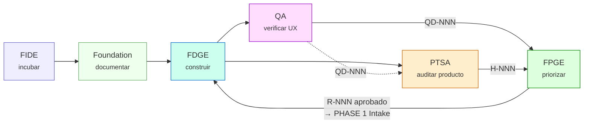

`FIDE` solo en greenfield, una vez. `Foundation` una vez por proyecto. El resto es el bucle.

---

### 3.2 Una tarea, de principio a fin — el recorrido `STANDARD`

Es el flujo por defecto para un `FEATURE`, un `BUG` o un `REFACTOR` de complejidad
`STANDARD` o `MAJOR`. Once fases, **cuatro** compuertas.

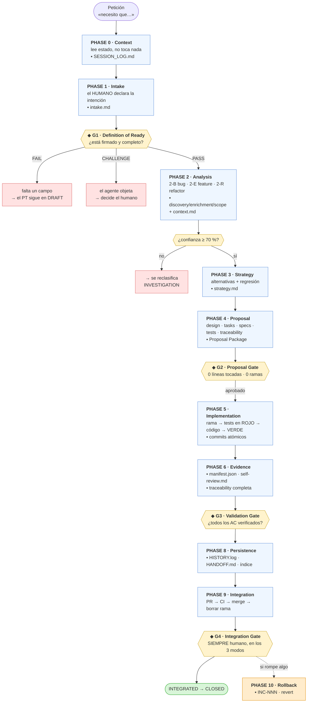

**Dónde para el agente, según el modo:**

| | `MANUAL` | `SUPERVISED` (por defecto) | `AUTONOMOUS` |
|:---|:---|:---|:---|
| Paradas por PT | 11 | **4** | 2 + las de `BUG` |
| G1 | humano | humano | humano (firma por lote) |
| G2 | humano | humano | auto si cumple 5 condiciones |
| G3 | humano | humano si `BUG`; auto el resto | igual |
| G4 | **humano** | **humano** | **humano** |

---

### 3.3 Implementar algo nuevo — `FEATURE`

Lo que cambia respecto al recorrido general: **quién escribe los criterios de aceptación**.

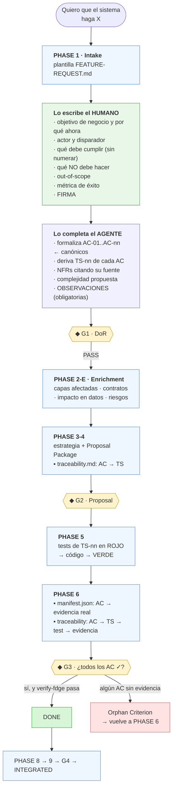

> **La regla que hace que esto funcione** (`INTAKE-R02`): los criterios de aceptación son la
> definición del negocio. El agente los **formaliza**; no los inventa. Si detecta que falta
> uno, lo propone en sus Observaciones y espera — no lo inserta.

---

### 3.4 Arreglar un bug — `BUG`

Dos diferencias con un feature, y las dos importan:

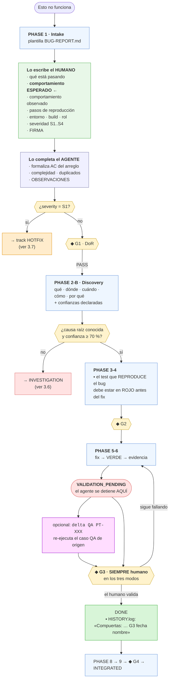

> **Por qué el comportamiento esperado lo declara el humano** (`INTAKE-R01`): es un hecho de
> negocio. Si el agente lo deduce del código, deduce el comportamiento *con el defecto
> dentro*, «arregla» el bug hacia el estado equivocado, y todos los tests pasan.
>
> **Por qué el agente nunca cierra un bug** (`FDGE-R26`): quien implementó el arreglo tiene
> el mismo modelo mental que pudo estar equivocado. Lo valida quien sufrió el síntoma, sobre
> el sistema real. La firma queda en `HISTORY.log` y `verify-fdge` la comprueba.

---

### 3.5 Un cambio trivial — track `EXPRESS`

Para `complexity: TRIVIAL`. **Condensa, no colapsa** (`LEX-R02`): las fases ocurren y se
documentan, solo se agrupan en menos artefactos y menos compuertas.

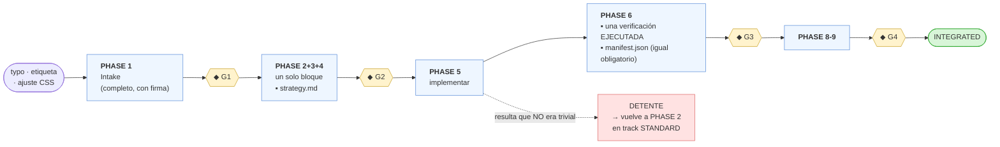

Lo que **no** se puede omitir en `EXPRESS`: el Intake firmado, la evidencia, la validación,
la persistencia y la integración. Lo que sí se condensa: análisis, estrategia y propuesta en
un solo documento, y una sola compuerta G2 en lugar de dos paradas.

Un `CHORE` o un `TRIVIAL` cuyo diff no toca lógica ejecutable puede omitir tests nuevos
(`FDGE-R18`), declarándolo en `strategy.md`. En `traceability.md` ese `AC` lleva `Test: —`;
la columna `Evidencia` sigue siendo obligatoria.

---

### 3.6 Cuando no se sabe qué pasa — `INVESTIGATION`

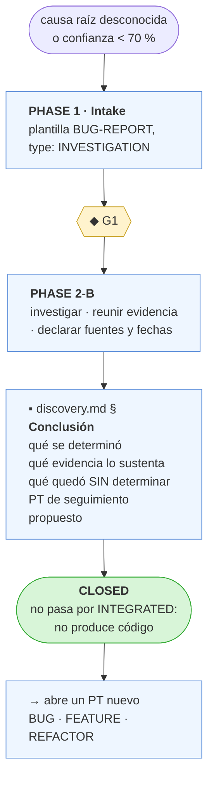

Una investigación **no produce código** (`FDGE-R10`), así que está exenta de la matriz de
trazabilidad y del manifiesto de evidencia. A cambio, `FDGE-R42` exige la sección
`## Conclusión`: sin ella no cierra.

---

### 3.7 Producción caída — track `HOTFIX`

Solo para `severity: S1`. Existe para que **nadie tenga que saltarse el framework en
silencio**: un bypass documentado es recuperable; uno silencioso destruye la trazabilidad y
nadie se entera hasta la siguiente auditoría.

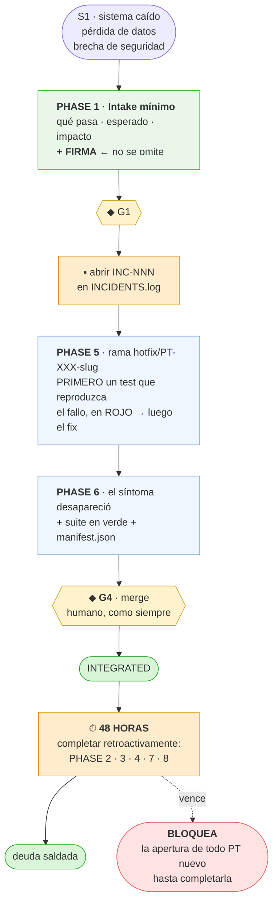

`HOTFIX` **difiere** el análisis y la propuesta; no los elimina. La firma del Intake tampoco
se omite: es lo único que distingue un hotfix de un bypass.

---

### 3.8 Varias tareas a la vez — lotes `EP-NNN`

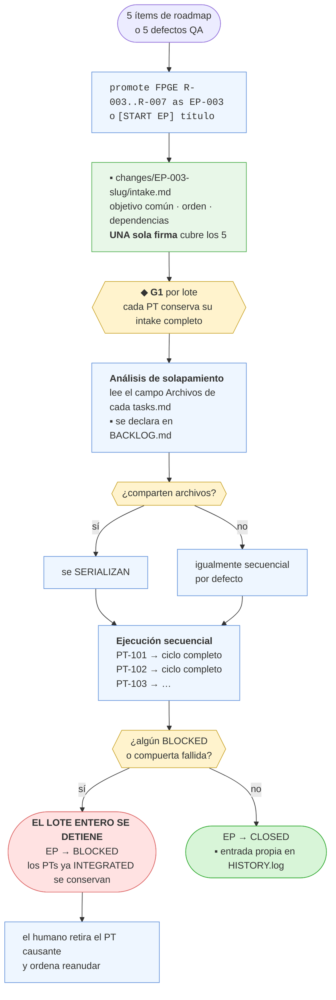

**Lo que hace posible el lote** (`FDGE-R39`): en la v3, `PLAN_ACTUAL.md` y `PENDING_TASKS.md`
eran archivos globales sobrescribibles, y la propia documentación lo decía sin ambigüedad —
*«solo puede existir un plan activo»*. Dos PTs en vuelo se destruían mutuamente. No era una
política relajable: era una **imposibilidad física**. En v4 todo el estado de un PT vive bajo
`changes/PT-XXX-slug/`.

**Por qué se detiene el lote entero** (`FDGE-R41`): los PTs de un lote suelen compartir
supuestos. Si uno falla porque el supuesto era falso, seguir con el resto multiplica el
rework en vez de contenerlo.

---

### 3.9 Trabajar de forma autónoma — modo `AUTONOMOUS`

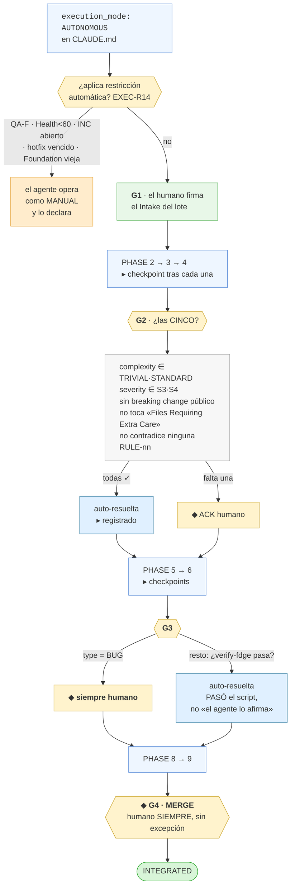

**`AUTONOMOUS` no significa «sin humano»** (`EXEC-R03`). Significa que el humano decide dos
veces por lote —al admitirlo y al integrarlo— en lugar de cuatro veces por PT.

**Lo que ningún modo automatiza jamás** (`SUITE-R06`):

```
a) merge o push a la rama principal        e) modificar docs/methodology/
b) cerrar un ítem de tipo BUG              f) push --force · reescribir historia
c) migrar o borrar datos                   g) rotar o exponer credenciales
d) tocar producción
```

Si un PT necesita una de ellas, el agente prepara todo lo demás, se detiene en el punto
exacto y **describe el comando**. No lo ejecuta (`EXEC-R07`).

---

### 3.10 Algo integrado rompió producción — `PHASE 10 · Rollback`

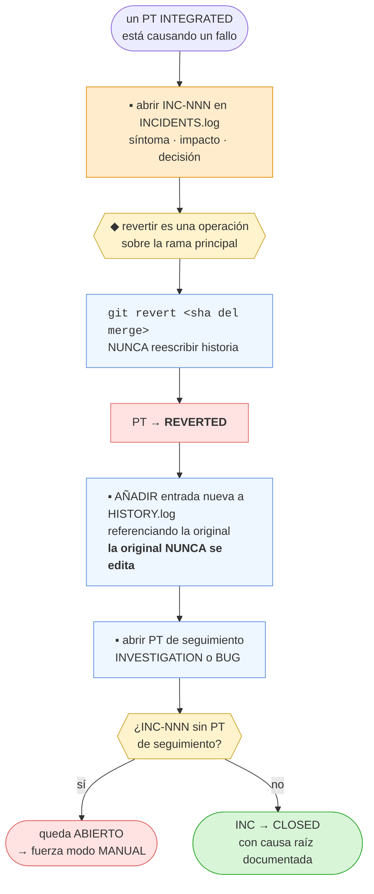

---

### 3.11 Los otros tres componentes

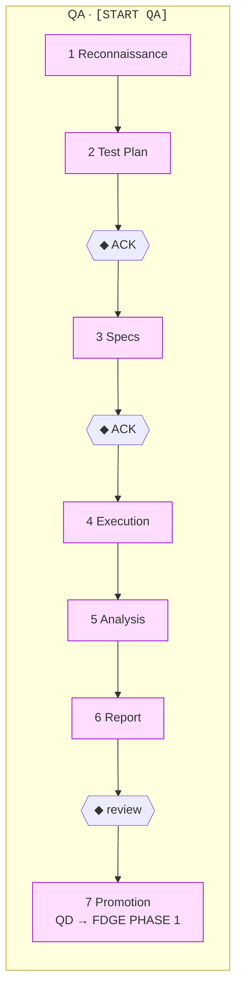

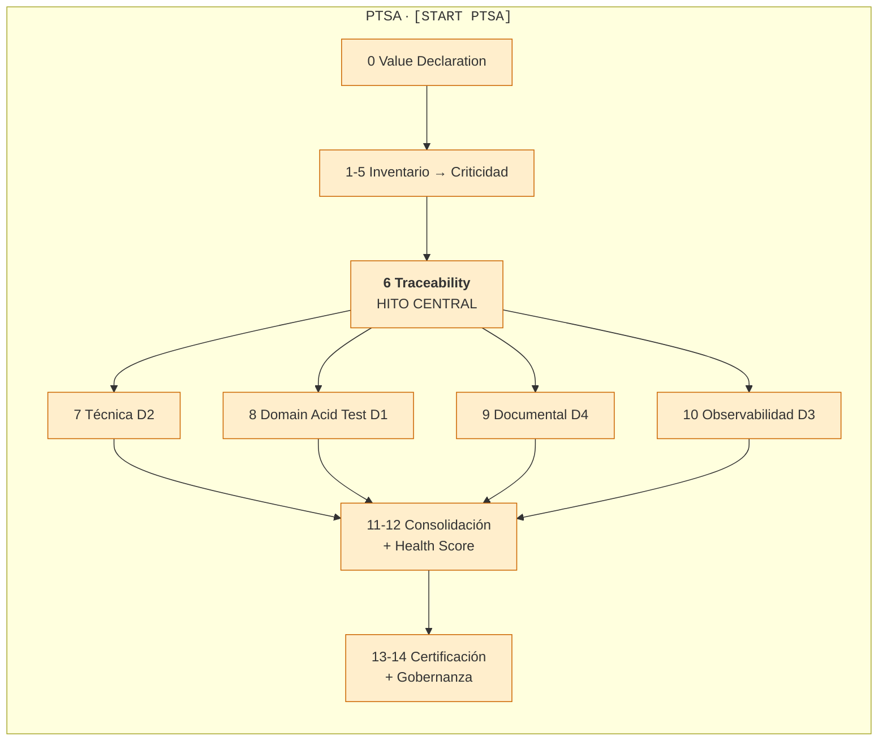

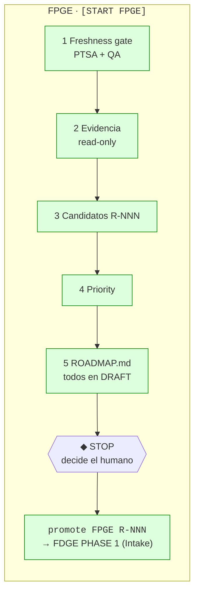

`PHASE 6` de PTSA bloquea a las cuatro fases de evaluación (`PTSA-R45`). Una promoción de
FPGE entra por el **Intake**, no por el análisis (`FPGE-R10`): el trabajo nacido del roadmap
también necesita intención humana firmada.

---

### 3.12 Chuleta — qué escribo para cada cosa

| Quiero… | Escribo | Entra por |
|:---|:---|:---|
| Reportar algo roto | `[START PT] BUG: <título>` | PHASE 1 · plantilla BUG-REPORT |
| Pedir funcionalidad nueva | `[START PT] FEATURE: <título>` | PHASE 1 · plantilla FEATURE-REQUEST |
| Limpiar código sin cambiar comportamiento | `[START PT] REFACTOR: <título>` | PHASE 1 · plantilla CHANGE-REQUEST |
| Subir una dependencia, mover archivos | `[START PT] CHORE: <título>` | PHASE 1 · plantilla CHANGE-REQUEST |
| Entender por qué pasa algo | `[START PT] INVESTIGATION: <título>` | PHASE 1 · plantilla BUG-REPORT |
| Hacer varias cosas de golpe | `[START EP] <título>` | Lote · una firma |
| Retomar trabajo a medias | `resume PT-XXX` | Su fase actual |
| Ver qué hay abierto | `status FDGE` | Nada: solo reporta |
| Verificar que el usuario puede usarlo | `[START QA]` | QA PHASE 1 |
| Auditar lo que el sistema produce | `[START PTSA]` | PTSA PHASE 0 |
| Decidir qué construir después | `[START FPGE]` | FPGE · corrida completa |
| Comprobar el cumplimiento de un PT | `node docs/methodology/tools/verify-fdge.mjs PT-XXX` | — |
| Comprobar la coherencia de la metodología | `node docs/methodology/tools/verify-suite.mjs docs/methodology` | — |

---

## 3.13 Proyecto que ya tenía la suite — migración

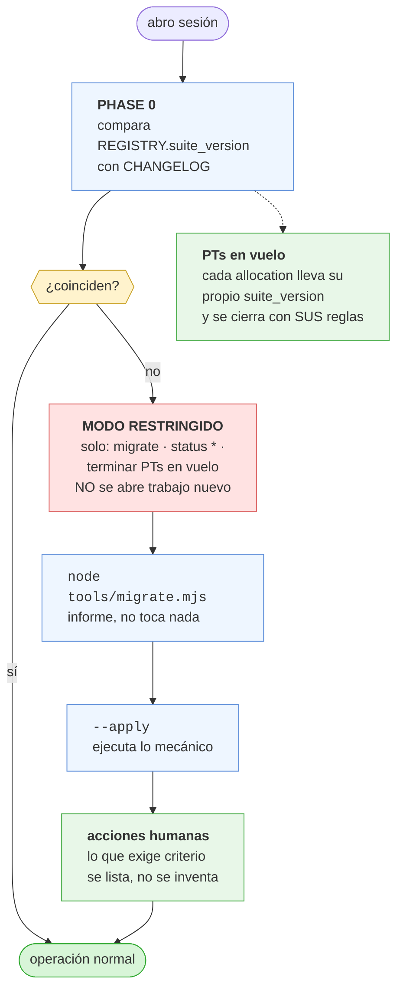

`SUITE-R18` · **Migrar nunca invalida trabajo en curso.** Un PT abierto bajo 4.1.0 se cierra
bajo las reglas de 4.1.0 aunque el proyecto ya esté en 4.2.0. Obligar a rehacer trabajo
válido es la forma más rápida de que un equipo abandone el framework.

| Desde | Automático | Requiere una persona |
|:---|:---|:---|
| **3.x** | `REGISTRY` con contadores sembrados al **máximo ID ya usado** · `SESSION_SUMMARY`→`SESSION_LOG` · `PTSA/Fases`→`Phases`, `Hallazgos`→`Findings`, `Evidencias`→`Evidence`, `Productos`→`Products` · archivar `instrucctions.md`, `Motor-PTSA.md` | mover `PLAN_ACTUAL`/`PENDING_TASKS`/`CONTEXT_ANALYSIS` al PT que corresponda · convertir los tres archivos en índices · migrar estados (§5.4) · Intake retroactivo por PT vivo · `[START RECONCILE]` · `[START FOUNDATION]` si vino de FIDE |
| **4.0.x** | `REGISTRY.graph` y `allocation.structural` · sellar `suite_version` | regenerar el grafo · añadir `Estructural:` a `HISTORY` · `[START RECONCILE]` |
| **4.1.x** | generar `CORE.md` con los prompts incluidos | — |

`SUITE-R19` · `migrate.mjs` es `--dry-run` por defecto. Lo que no puede automatizarse se
lista como pendiente; **nunca se inventa**. `docs/implementation/MIGRATION.log` lo registra.

---

## 3.14 Reconciliar un proyecto ya documentado

```
[START RECONCILE]
```

Ejecuta **solo** `PHASE 1` de Foundation sobre un proyecto que ya tiene el paquete.
No regenera nada: inventaría la documentación que aún no tiene decisión, mide la divergencia
actual contra el código y conserva la línea base anterior para que se vea si el proyecto
mejora (`FND-R15`).

Cuándo: instalaste 4.0.x, donde la fase no existía · migraste desde v3 · la documentación
volvió a divergir tras meses de desarrollo.

Lo ya decidido en `RECONCILIATION.log` **no se reabre**. La compuerta **G0** sigue viva.

---

## 4. Cómo adoptar la suite

### La vía corta: díselo a Claude          `[INSTALL SUITE]` · `SUITE-R28`

```
1. Copia docs/methodology/ al proyecto (sin FIDE/ si ya hay código).
2. En Claude Code, escribe:   instala el framework
```

Claude lee [INSTALL.md](INSTALL.md) y conduce las nueve fases **en la conversación**: terreno →
tu decisión → ejecutar → estructura → dependencias → grafo → Declaración de Valor → verificar →
`[START FOUNDATION]`. Te presenta cada cosa donde ya estás mirando y espera tu respuesta ahí.

Los pasos manuales que siguen describen lo mismo, para quien prefiera hacerlo a mano o quiera
auditar qué hizo el agente.

### Paso 0 — Copiar la metodología

Copiar `docs/methodology/` al proyecto destino, **excepto `FIDE/`** (`FIDE-R01`: FIDE incuba
desde fuera y se retira). Incluye `tools/` y los directorios `templates/` (`LEX-R25`).

Generar los dos archivos que el agente carga —nunca se copian ya hechos, se generan contra las
fuentes que acaban de instalarse:

```bash
node docs/methodology/tools/build-core.mjs docs/methodology
# → CORE.md        el núcleo, en toda sesión        (SUITE-R15)
# → CORE-PTSA.md   overlay, solo con [START PTSA]   (SUITE-R25)
```

### Paso 0-bis — Enumerar el terreno       `FND-R19..R23`

```bash
node docs/methodology/tools/plan-layout.mjs --write
```

**La carpeta que recibe la suite manda: es la raíz, sin excepción.** El plan detecta
repositorios anidados, dónde vive el código de verdad, manifiestos, documentos sueltos y
artefactos que faltan, y escribe `docs/implementation/LAYOUT.md`.

Importa porque `G4` es un merge real, `PHASE 10` es un rollback real y la evidencia se ancla a
commits: si la raíz queda fuera del repositorio, esas tres cosas no tienen dónde ocurrir — y no
dan error hasta que las necesitas.

El plan **propone; no mueve un archivo**. Lo firmas tú en **G0**, movimiento a movimiento, y lo
aceptado se ejecuta después como PT `REFACTOR` con `Estructural: sí`. Mientras `LAYOUT.md` esté
sin firmar, `verify-fdge` no deja abrir trabajo nuevo.

### Paso 1 — Configurar `CLAUDE.md`

Copiar [Suite-CLAUDE-Template.md](Suite-CLAUDE-Template.md) al `CLAUDE.md` del proyecto,
después de sus secciones propias.

**Lo único que se personaliza:**
```yaml
suite_version: 5.2.0
execution_mode: SUPERVISED
```
más el bloque **Declaración de Valor** (dominio, productos, reglas de validez), que es lo que
PTSA necesita para auditar contra algo.

### Paso 2 — Crear la estructura de artefactos

```
docs/implementation/
  REGISTRY.json          ← asignador único de IDs. Inicializar con contadores a 0.
  HISTORY.log            ← append-only
  INCIDENTS.log          ← append-only
  SESSION_LOG.md         ← append-only
  HANDOFF.md             ← estado actual
  BACKLOG.md             ← PTs vivos, regenerable
  DISCOVERY.md           ← índice append-only de BUG / INVESTIGATION
  ENRICHMENT.md          ← índice append-only de FEATURE
  REFACTOR_SCOPE.md      ← índice append-only de REFACTOR / CHORE
  ROADMAP.md · ROADMAP_HISTORY.log
  evidence/

changes/                 ← un directorio por PT: TODO su estado de trabajo vive ahí

QA/    QA-PLAN.md · QA-DEFECTS.md · QA-LOG.md · qa-score-history.json · cases/ · reports/
qa/    tests/ · fixtures/        + playwright.config.ts en la raíz

docs/implementation/  LAYOUT.md      ← lo genera plan-layout.mjs · G0 · FND-R20

PTSA/  RESUMEN.md · ESTADO_ACTUAL.md · AUDIT_LOG.md · PENDIENTES.md · RELACIONES.md
       COVERAGE.md            ← matriz universo × D1-D4 [PTSA-R77]
       audit-scope.yaml · score-history.json
       Phases/ · Findings/ · Evidence/ · Products/
```

`REGISTRY.json` inicial:
```json
{
  "suite_version": "5.2.0",
  "execution_mode": "SUPERVISED",
  "counters": { "PT":0,"EP":0,"QA":0,"QR":0,"QD":0,"H":0,"E":0,"P":0,"R":0,"INC":0 },
  "allocations": []
}
```

> **Nota para quien venga de la v3:** `PLAN_ACTUAL.md`, `PENDING_TASKS.md` y
> `CONTEXT_ANALYSIS.md` **ya no existen** como archivos globales. Eran sobrescribibles, y
> `FDGE-Implementation.md` lo decía sin ambigüedad: *«solo puede existir un plan activo»*. Eso
> hacía **físicamente imposible** tener dos trabajos en vuelo. Su contenido vive ahora en
> `changes/PT-XXX-slug/strategy.md`, `tasks.md` y `context.md` (`FDGE-R39`).

### Paso 3 — Ejecutar Foundation

`[START FOUNDATION]`, y después `[FOUNDATION VALIDATED]`. Nada más puede operar antes.

### Paso 4 — Verificar la instalación

```bash
node docs/methodology/tools/verify-suite.mjs docs/methodology
node docs/methodology/tools/verify-fdge.mjs --all
```

---

## 5. Foundation Protocol

Hace ingeniería inversa del repositorio y produce documentación **verificada** en
`docs/enterprise-documentation/`.

```
[START FOUNDATION]
[START FOUNDATION] scope: src/ + docker-compose.yml + migrations/
[FOUNDATION VALIDATED]
status FOUNDATION
```

**Siete fases**, con dos compuertas: **G0** (reconciliación) y `[FOUNDATION VALIDATED]`.

### PHASE 1 — Reconciliation · el orden antes que la documentación

Un repositorio legado llega con documentación vieja, contradictoria y dispersa. Generar
documentación correcta encima **no produce orden: produce dos verdades**, y FDGE `PHASE 2`
lee «la documentación» sin saber cuál manda.

- `FND-R09` inventario de **toda** la documentación preexistente, con decisión por archivo:
  `KEEP` · `SUPERSEDE` · `ARCHIVE` · `DELETE` → `00-Baseline.md`.
- `FND-R10` **G0**: nada se mueve, archiva ni borra sin ACK humano.
- `FND-R11` nada se borra, se **archiva** en `docs/_archive/<fecha>/`. `DELETE` solo para
  regenerables. Un documento que nadie entiende no es basura: es una pista sobre por qué el
  sistema es así.
- `FND-R12` al cerrar, `docs/enterprise-documentation/` es la **única** fuente de
  arquitectura, dominio y convenciones.
- `FND-R13` línea base de divergencia código ↔ documentación previa. Es la fotografía del
  desorden de partida y la referencia contra la que se mide si el proyecto mejora.
- Registro append-only en `docs/implementation/RECONCILIATION.log`.

En greenfield la fase se ejecuta igual y se cierra en dos líneas. Saltársela es
*Phase Collapse*.

### El grafo forma parte del paquete

`FND-R14` · Foundation genera el grafo de dependencias sobre `src/` y lo registra en
`REGISTRY.graph`. `FDGE-R43` lo mantiene honesto: un PT `MAJOR` **no resuelve G2** con el
grafo ausente o `STALE`. `FDGE-R44` obliga a cada PT a declarar `Estructural: sí | no`, que
es lo que hace computable la frescura.

Hasta 4.0.x el grafo era una dependencia declarada obligatoria (`FDGE-R07`, HARD) que en la
práctica nunca existía, porque `FDGE-R08` permitía cumplirla declarando que no se podía
cumplir.

### Documentos que genera

`01-Platform-Overview` · `02-PRD` · `03-TRD` · `04-App-Flow` ·
`05-UI-UX-Brief` (si hay frontend) · `06-Backend-Architecture` ·
`07-Database-Architecture` (si hay BD) · `08-API-Catalog` (si hay API) ·
`09-Security-Architecture` · `10-Technical-Debt` · `11-Conventions` · `inventory/`.

**`11-Conventions.md` es el documento más crítico**: es lo que permite a cualquier agente
futuro operar sin romper el sistema. `FND-R05` exige un mínimo de 3 Hard Rules `RULE-nn`;
menos indica análisis superficial y bloquea la validación.

`FND-R01` · Todo hecho cita archivo y línea. Lo que no se puede citar no se documenta: va a
`10-Technical-Debt.md` como «No determinado».

`FND-R08` · La existencia se verifica por **archivos del núcleo**, no por carpeta. Una
carpeta que existe sin `02-PRD.md`, `03-TRD.md`, `06-Backend-Architecture.md` y
`11-Conventions.md` cuenta como ausente.

`FND-R06` · El ACK humano es obligatorio y el agente no puede emitirlo: comparar la
documentación generada con la intención original es justamente lo que el agente no puede
hacer, porque esa intención no está en el código.

Prompts: [Foundation-Prompts.md](Foundation-Prompts.md)

---

## 6. FDGE — el día a día

### Once fases, cuatro compuertas

```
PHASE 0   Context
PHASE 1   Intake                    ──── G1  Definition of Ready
PHASE 2   Analysis   (2-B bug · 2-E feature · 2-R refactor)
PHASE 3   Strategy
PHASE 4   Proposal                  ──── G2  Proposal Gate
PHASE 5   Implementation
PHASE 6   Evidence
PHASE 7   Validation                ──── G3  Validation Gate
PHASE 8   Persistence
PHASE 9   Integration               ──── G4  Integration Gate
PHASE 10  Rollback                  (carril condicional)
```

### La admisión — lo que hay que entender primero

`FDGE-R01` · **Todo trabajo entra por un `intake.md` firmado.** Los cuatro tipos, los tres
tracks, incluidos los que vienen de un defecto QA o de un hallazgo de auditoría.

`INTAKE-R01` y `INTAKE-R02` · **El humano declara la intención; el agente la expande.** Los
criterios de aceptación son la definición del negocio, y el comportamiento esperado de un bug
es un hecho de negocio. Ninguno se deriva del código: si el agente deduce del código qué
*debería* hacer un bug, deduce el comportamiento con el defecto dentro, «lo arregla» hacia
el estado equivocado, y todos los tests pasan.

Plantillas en [INTAKE/templates/](INTAKE/templates/). El protocolo y la checklist de
Definition of Ready, en [INTAKE/Intake-Protocol.md](INTAKE/Intake-Protocol.md).

### Modos de ejecución

```yaml
mode: SUPERVISED    # MANUAL | SUPERVISED | AUTONOMOUS
```

| | `MANUAL` | `SUPERVISED` (por defecto) | `AUTONOMOUS` |
|:---|:---|:---|:---|
| Paradas por PT | 11 | 4 | 2 por lote + las de `BUG` |
| G4 (merge) | humana | humana | **humana** |
| G3 en un `BUG` | humana | humana | **humana** |

`EXEC-P1` · **La compuerta protege contra lo irreversible, no contra el avance.** La v3
aplicaba el mismo ACK a cada frontera: seis aprobaciones para un typo y ninguna para el
merge, que ni siquiera estaba especificado.

### Severidad — el eje que faltaba

`S1`..`S4`, declarada por el humano, **ortogonal a la complejidad**. Solo `S1` habilita el
track `HOTFIX`, que difiere el análisis y la propuesta pero obliga a completarlos en 48 h
(`FDGE-R22`). Existe para que nadie tenga que saltarse el framework en silencio.

### Lotes

```
[START EP] Deuda de validación de formularios
promote FPGE R-003..R-007 as EP-003
```

`FDGE-R40` calcula el solapamiento de archivos antes de ejecutar; `FDGE-R41` detiene el lote
completo al primer bloqueo.

Prompts: [FDGE-Prompts.md](FDGE-Prompts.md) · Procedimiento:
[FDGE-Implementation.md](FDGE-Implementation.md) · Método: [Framework-FDGE.md](Framework-FDGE.md)

---

## 7. QA

```
[START QA]              ciclo completo, siete fases
delta QA PT-XXX         solo los casos afectados por un PT
status QA               score, defectos abiertos, freshness
promote QD-NNN to FDGE  →  entra por PHASE 1 (Intake), no por el análisis
promote QD-NNN to PTSA
close QD-NNN
```

Opera **exclusivamente desde el navegador** contra la URL desplegada, con Playwright. No lee
código. Sin captura, el paso no ocurrió. La ambigüedad es `FAIL`.

`QA-R09` · Un Happy Path en `FAIL` fuerza clasificación `QA-F`, que bloquea a FPGE la
recomendación de features nuevas y fuerza el descenso a modo `MANUAL`.

`QA-R19` · Todo caso derivado de un PT **cita el `AC-nn` que verifica**. Sin eso, nadie puede
responder «¿qué caso QA cubre AC-03?».

Prompts: [QA/QA-Prompts.md](QA/QA-Prompts.md)

---

## 8. PTSA

```
[START PTSA]              auditoría completa desde PHASE 0
resume PTSA               reanudar una auditoría INCONCLUSA
delta PTSA                re-auditar lo afectado sobre una auditoría COMPLETA
status PTSA
audit PTSA close H-NNN
```

`LEX-R17` · `resume` y `delta` son operaciones distintas con precondiciones distintas. En la
v3 compartían trigger.

Audita los **productos** que el sistema entrega, no el código. Quince fases; `PHASE 6`
(Traceability) es el hito central que bloquea a las cuatro fases de evaluación.

**Regla del Agua Potable** (`PTSA-R17`): si `D1 < 60`, el Health global queda topado en D1.
La corrección técnica no compensa un fallo de dominio.

### Audita por enumeración, no por descubrimiento — `PTSA-R76..R80`

Una auditoría que **descubre** encuentra lo que mira, y cada pasada mira cosas distintas: el
resultado depende de por dónde empezó el auditor. Por eso una segunda auditoría del mismo
sistema sacaba hallazgos nuevos sin que nada hubiera cambiado. Una auditoría que **enumera**
define primero el universo completo y después declara, celda a celda, qué evaluó y qué no.

| | Qué exige |
|:---|:---|
| `PTSA-R76` | El universo sale de fuentes **mecánicas** —`inventory/routes.md`, `endpoints.md`, `entities.md`, `services.md`, `integrations.md` de Foundation, los productos de `PHASE 4`, las reglas de dominio de `PHASE 0`—, nunca de lo que el auditor recuerde. Lo que está en el código y no en el inventario es, en sí mismo, un hallazgo D4. |
| `PTSA-R77` | La matriz **universo × D1-D4** vive en `PTSA/COVERAGE.md`, copiada de [PTSA/templates/COVERAGE.md](PTSA/templates/COVERAGE.md) en `PHASE 3`. Toda celda lleva veredicto: `PASS` · `FAIL` · `NO_APLICA` (justificado) · `NO_EVALUADA` (con motivo y coste). **No existe la celda en blanco**: es indistinguible de una que nadie miró. |
| `PTSA-R78` | `NO_EVALUADA` **no es un aprobado**. No penaliza Health —no hay hallazgo— pero degrada Confidence: `coverage = evaluadas / universo`. Un Health 95 sobre el 30 % del universo se publica como «95 con `coverage 0.30`», no como 95. |
| `PTSA-R79` | La auditoría cierra cuando la **matriz** está completa, no cuando el auditor deja de encontrar hallazgos. «No encontré más» no es un criterio de compleción: describe dónde dejó de buscar. |
| `PTSA-R80` | `node docs/methodology/tools/verify-ptsa.mjs` comprueba matriz sin blancos, coverage coherente, productos fuera de `DRAFT` y hallazgos `BUG`/`DOMAIN` sin cierre humano. **Un score cuya matriz no cuadra no se certifica.** |

```bash
node docs/methodology/tools/verify-ptsa.mjs     # antes de certificar cualquier score
```

Es la misma lógica que `tools/audit.mjs` aplica a la propia metodología: enumerar el universo
y declarar la cobertura, en lugar de inspeccionar hasta cansarse.

Prompts: [PTSA/PTSA-Prompts.md](PTSA/PTSA-Prompts.md) — el motor operativo que en la v3 se
citaba como autoridad en cuatro documentos y nunca existió.

---

## 9. FPGE

```
[START FPGE]                          corrida completa → ROADMAP.md → STOP
promote FPGE R-NNN                    → FDGE PHASE 1 (Intake)
promote FPGE R-NNN..R-MMM as EP-XXX
status FPGE
```

```
Priority = (EvidenceWeight × ScoreImpact × Urgency × DomainMultiplier × Confidence) / Effort
```

`FPGE-R03` · **Read-only sobre artefactos ajenos, sin excepción.** Al rechazar un ítem, FPGE
*emite una instrucción* para el componente dueño; no la ejecuta.

`FPGE-R10` · Una promoción entrega a **PHASE 1 (Intake)**, no al análisis: el trabajo nacido
del roadmap también necesita intención humana firmada.

Prompts: [FPGE-Prompts.md](FPGE-Prompts.md)

---

## 10. FIDE — proyectos desde cero

1. Crear una carpeta vacía.
2. Copiar [FIDE/FIDE-CLAUDE-Launcher.md](FIDE/FIDE-CLAUDE-Launcher.md) como `CLAUDE.md`.
3. `[START FIDE] prompt: "Quiero construir…"`

FIDE investiga el nicho, consensúa la arquitectura, genera la documentación, monta el
andamiaje e instala la suite — y luego se retira (`FIDE-R01`: nunca se copia al proyecto).

`FIDE-R04` · Genera `docs/enterprise-documentation/` con los **nombres canónicos**. En la v3
usaba una numeración propia que rompía en silencio a FDGE, QA, PTSA y FPGE en todo proyecto
nacido de FIDE.

`FIDE-R06` · Declara explícitamente que su paquete documenta arquitectura **prevista**, no
observada. Cuando haya código sustantivo, se ejecuta `[START FOUNDATION]` para sustituir la
intención por la observación.

---

## 11. Verificación mecánica

### Cobertura mecánica — qué se comprueba y qué no

`SUITE-R26` · Una regla que solo se cumple por buena voluntad es una recomendación. La
auditoría adversaria de la 5.2.0 midió esto por primera vez y encontró **QA en 0/19 y FPGE en
0/10**: dos componentes cuyas reglas nadie verificaba. `audit.mjs` publica ahora la cobertura
por componente, así que un cero deja de pasar inadvertido.

No se busca el 100 %: hay reglas que ningún script puede comprobar. Lo que no se admite es que
el hueco quede sin declarar.

`SUITE-R27` · **Qué prueba una firma.** El agente escribe el archivo, así que ninguna firma
demuestra por sí sola que la escribiera una persona. Lo que el marco garantiza es más modesto y
sí es verificable: el `CLAUDE.md` declara `firmantes:`, y `verify-fdge` rechaza toda firma
ajena a esa lista, la plantilla sin personalizar y la ausencia de lista. Hay **un nombre
concreto y autorizado asociado a cada decisión irreversible**; la voluntad detrás no se puede
garantizar. Quien figura en `firmantes` responde de lo que lleva su nombre.

```yaml
firmantes:
  - Nombre Apellido      # personalizarlo es obligatorio: la plantilla intacta falla
```

### Reglas sobre la propia documentación

`SUITE-R14` y `LEX-R23` · un ID se define en **un solo** documento; los demás citan.
`LEX-R15` · cada componente tiene exactamente un archivo de prompts.
`LEX-R22` · los `Framework-*.md` explican y **nunca mandan**.
`LEX-R24` · sub-IDs con letra minúscula pegada (`SUITE-R06a`) solo para citar una cláusula.
`LEX-R25` · `CORE.md`, `CORE-PTSA.md`, `PHASES.md`, `tools/` y `templates/` forman parte del
paquete instalable.
`SUITE-R20` · `PHASES.md` y los `*-Prompts.md` no pueden divergir.
`SUITE-R00` · el `CLAUDE.md` del proyecto parametriza; no deroga ninguna regla.
`SUITE-R22` · queda registrado quién resolvió cada compuerta.

Las comprueba `verify-suite` y, por enumeración exhaustiva, `audit.mjs`.

Un checklist que el agente rellena sobre sí mismo no es un control. Un control es algo que
puede fallar.

```bash
# Batería completa: 5 casos límite bien formados + 11 defectos inyectados + coherencia.
bash docs/methodology/tools/selftest.sh    # 34 casos: límite, defectos inyectados, migración

# Coherencia de la propia metodología: vocabulario derogado, reglas citadas que no existen,
# IDs definidos dos veces, obligaciones en documentos que solo explican, enlaces rotos,
# CORE.md desincronizado.
node docs/methodology/tools/verify-suite.mjs docs/methodology

# Cumplimiento de un PT: Intake firmado, trazabilidad sin criterios huérfanos, manifiesto de
# evidencia con rutas que existen de verdad, entrada en HISTORY.log, estados canónicos.
node docs/methodology/tools/verify-fdge.mjs PT-042
node docs/methodology/tools/verify-fdge.mjs --gate G4 PT-042
node docs/methodology/tools/verify-fdge.mjs --all
```

`FDGE-R34` · `verify-fdge` sin errores es **precondición de la compuerta G4**. Conviene
ejecutarlo en CI, junto con `selftest.sh` y `build-core --check`.

`selftest.sh` existe porque la 4.0.0 salió con cuatro defectos críticos que solo eran
visibles ejecutando: los verificadores nunca se habían corrido contra PTs reales. Ahora
prueban un `BUG` validado, una `INVESTIGATION`, un `CHORE` en `EXPRESS` y un `FEATURE` a
medio camino, y comprueban que once defectos inyectados se detectan.

---

## 12. Mapa de documentos

### Autoridad

| Documento | Cubre |
|:---|:---|
| [LEXICON.md](LEXICON.md) | Vocabulario canónico: fases, IDs, estados, archivos, triggers |
| [RULES.md](RULES.md) | Todas las reglas, con ID y severidad |
| [EXECUTION-MODES.md](EXECUTION-MODES.md) | Compuertas, modos de ejecución, lotes |
| [Suite-CLAUDE-Template.md](Suite-CLAUDE-Template.md) | Texto para el `CLAUDE.md` del proyecto |
| [CHANGELOG.md](CHANGELOG.md) | Historial de versiones y guía de migración |

### Por componente

| Componente | Método | Procedimiento | Prompts |
|:---|:---|:---|:---|
| Foundation | [Foundation-Protocol.md](Foundation-Protocol.md) | [Foundation-Implementation.md](Foundation-Implementation.md) | [Foundation-Prompts.md](Foundation-Prompts.md) |
| FDGE | [Framework-FDGE.md](Framework-FDGE.md) | [FDGE-Implementation.md](FDGE-Implementation.md) | [FDGE-Prompts.md](FDGE-Prompts.md) |
| Intake | — | [INTAKE/Intake-Protocol.md](INTAKE/Intake-Protocol.md) | [INTAKE/templates/](INTAKE/templates/) |
| QA | [QA/Framework-QA.md](QA/Framework-QA.md) | [QA/QA-Implementation.md](QA/QA-Implementation.md) | [QA/QA-Prompts.md](QA/QA-Prompts.md) |
| PTSA | — | [PTSA/PTSA-V3-Especificacion-Oficial.md](PTSA/PTSA-V3-Especificacion-Oficial.md) | [PTSA/PTSA-Prompts.md](PTSA/PTSA-Prompts.md) |
| FPGE | [Framework-FPGE.md](Framework-FPGE.md) | [FPGE-Implementation.md](FPGE-Implementation.md) | [FPGE-Prompts.md](FPGE-Prompts.md) |
| FIDE | [FIDE/Framework-FIDE.md](FIDE/Framework-FIDE.md) | [FIDE/FIDE-Implementation.md](FIDE/FIDE-Implementation.md) | [FIDE/FIDE-CLAUDE-Launcher.md](FIDE/FIDE-CLAUDE-Launcher.md) |

### Herramientas

| Herramienta | Qué verifica | Cuándo |
|:---|:---|:---|
| `tools/build-core.mjs` | genera `CORE.md` y el overlay `CORE-PTSA.md`; `--check` compara hashes de sus fuentes | tras tocar reglas · CI |
| `tools/verify-fdge.mjs` | cumplimiento de un PT | precondición de **G4** |
| `tools/verify-suite.mjs` | coherencia interna de la metodología | tras editar la suite |
| `tools/verify-ptsa.mjs` | matriz de cobertura de una auditoría | antes de certificar un score |
| `tools/verify-qa.mjs` | ciclo QA y roadmap FPGE | antes de publicar un ciclo o un roadmap |
| `tools/plan-layout.mjs` | terreno de la raíz, dependencias, y propuesta de reorganización | al instalar, antes de documentar nada |
| `tools/verify-patrones.mjs` | que cada patrón case lo que dice casar: un escape degradado falla su propio ejemplo | siempre, en CI |
| `tools/revisar-secretos.mjs` | árbol e historia antes de publicar · bloquea y propone corrección | al instalar, antes del primer push |
| `tools/tracker.mjs` | espejo entre el registro y la plataforma: toda tarea viva con issue abierto y al revés | al abrir o cerrar trabajo · en CI |
| `tools/comparar-marco.mjs` | divergencia entre la copia del proyecto y la de referencia, **y en qué dirección** | cuando el proyecto corrige el marco, o al migrar |
| `tools/migrate.mjs` | migración de versión, encadenada a verificación | al subir de versión |
| `tools/audit.mjs` | cobertura: enumera reglas, fases, triggers, artefactos, herramientas | tras cualquier cambio en la suite |
| `tools/selftest.sh` | 100 casos: límites, defectos inyectados, migración, seguridad | antes de publicar una versión |

---

## 13. Por qué son componentes separados

- **PTSA debe poder auditar cualquier codebase**, construido con FDGE o no. Si dependiera de
  FDGE no sería un auditor: sería un verificador de protocolo.
- **FDGE no puede llevar la auditoría embebida**: se volvería demasiado complejo para su
  función principal.
- **FPGE no puede fusionarse**: la priorización invisible es exactamente el problema que
  resuelve. Separada, toda decisión de roadmap es trazable.
- **QA no puede vivir dentro de FDGE**: los tests unitarios verifican que el código hace lo
  que dice; QA verifica que el usuario puede usar el sistema. Mezclarlas produce tests que
  pasan sobre sistemas que nadie puede usar.
- **QA no puede vivir dentro de PTSA**: PTSA audita la validez semántica de los productos; QA
  audita la experiencia de interacción. Un sistema puede producir documentos perfectamente
  válidos y tener una UX rota.

Se **componen**, no se fusionan. Y toda escritura entre componentes requiere una decisión
humana (`SUITE-R10`).

---

## 14. Economía de tokens — lenguaje cavernícola y disciplina de respuesta

El espíritu de la suite es **agilizar el desarrollo bajando el coste de tokens y subiendo la
precisión del trabajo**. Las dos cosas a la vez, y en ese orden de dependencia: un contexto
más corto es también un contexto donde la regla aplicable no queda enterrada bajo prosa.

Hay tres flujos de texto, y cada uno tiene su regla.

```
        el humano escribe          ──▶  LIBRE. Prosa normal, en su idioma, tan largo
                                        como haga falta. Nadie escribe en telegrama.
                                        Los Intakes los redacta una persona: INTAKE-R01.

        el agente lee              ──▶  TELEGRÁFICO.  PHASES.md · CORE.md      SUITE-R24
                                        LEE · HAZ · SALE · NO · PARA

        el agente responde         ──▶  SIN RELLENO.  checkpoints, informes     SUITE-R23
                                        falla · cambió · queda · decide
```

### 14.1 Lo que el humano escribe — sin recortes

El lenguaje cavernícola **no se le aplica al humano**. `INTAKE-R01` y `INTAKE-R02` existen
justamente para que sea una persona quien declare qué espera: el comportamiento esperado de un
bug, los criterios de aceptación, lo que queda fuera de alcance. El agente **formaliza y
cuestiona** ese texto, nunca lo inventa. Comprimir aquí no ahorra tokens: cambia el sentido, y
un criterio de aceptación mal entendido cuesta un ciclo entero de desarrollo.

### 14.2 Lo que el agente lee — telegráfico · `SUITE-R24`

`PHASES.md` y el `CORE.md` que genera son deliberadamente secos. Cada fase se declara en
cinco verbos:

```
LEE    qué archivos abre antes de tocar nada
HAZ    la acción, en imperativo
SALE   qué artefacto queda escrito y dónde
NO     lo que está prohibido en esta fase
PARA   la condición exacta de parada o de compuerta
```

Y `build-core.mjs` recorta cada regla a su **primera frase imperativa**. El rationale —el
porqué de cada decisión, la historia, los ejemplos— vive en los `Framework-*.md`, que **no se
cargan nunca**: se abren si alguien pregunta.

| | |
|:---|:---|
| **Se recorta** | justificación · historia · ejemplos · repeticiones · transiciones |
| **No se recorta** | la precisión de la regla |

La distinción importa. Quitar el porqué del texto que se **ejecuta** es ganancia pura. Quitar
precisión no lo es: una regla ambigua se aplica mal justo en los casos límite, que es
exactamente donde el marco tiene que sostener.

### 14.3 Lo que el agente responde — sin relleno · `SUITE-R23`

Lo que el agente escribe al humano cuesta tokens **y tiempo de lectura**. Aplica a todas las
fases y a todos los componentes.

| No escribe | Sí escribe |
|:---|:---|
| lo que salió bien | **lo que falla** |
| por qué una decisión es correcta | **lo que cambió** |
| justificaciones de diseño | **lo que queda** |
| recapitulaciones de lo ya acordado | **lo que necesita decisión** |
| preámbulos y cierres valorativos | |

El porqué se explica **solo si el humano lo pide**. No se pierde: queda en `design.md`, en
`HISTORY.log` y en `CHANGELOG.md`, que se leen cuando hacen falta y no en cada turno.

Ejemplo, el mismo checkpoint de `PHASE 5`:

```
✗  He completado la implementación del PT-042 siguiendo el diseño aprobado en PHASE 4.
   Decidí usar un middleware en lugar de un decorador porque el middleware permite
   centralizar la validación y es más mantenible a largo plazo, lo cual encaja con las
   convenciones del proyecto. Todo ha ido bien y los tests pasan correctamente. ¿Continúo
   con la fase de evidencia?

✓  PT-042 · PHASE 5 hecho.
   Artefacto: changes/PT-042-rate-limit/design.md, src/middleware/rateLimit.ts
   Desviación: middleware en vez de decorador (design.md §3)
   Riesgo: ninguno · Siguiente: PHASE 6 Evidence
```

Mismo contenido operativo. Un sexto de los tokens, y lo que el humano necesita decidir está
en la primera línea en lugar de en la última.

### 14.4 De dónde sale el ahorro

| | tokens/sesión |
|:---|---:|
| v3 · suite completa cargada en cada sesión | ~59 500 |
| v4 · `CORE.md` + `CLAUDE.md` del proyecto | ~15 500 |
| | **−74 %** |
| en sesiones de PTSA, además `CORE-PTSA.md` (`SUITE-R25`) | +~2 600 |
| *(la especificación completa que sustituye)* | *~27 500* |

Ese 74 % es solo el arranque: `SUITE-R23` y `SUITE-R24` actúan sobre **cada turno** de la
sesión, que es donde se acumula el coste real de una jornada de trabajo.

Y el ahorro no compromete el control. Las compuertas G1-G4, la lista cerrada de acciones que
nunca se automatizan (`SUITE-R06`) y la firma humana de los Intakes siguen intactas: lo que
se recortó fue la prosa alrededor, no un solo punto de decisión.
